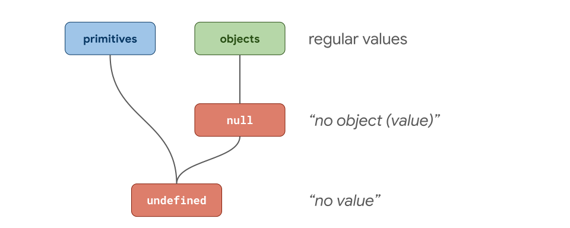

## JavaScript 类型

JavaScript 的值总共具有 8 种不同的类型：`Number, String, Symbol, BigInt, Boolean, Undefined, Null, Object` ，可以通过 `typeof` 关键字来校验值的类型。

```javascript
typeof 42;
// -> 'number'
typeof "foo";
// -> 'string'
typeof Symbol("bar");
// -> 'symbol'
typeof 42n;
// -> 'bigint'
typeof true;
// -> 'boolean'
typeof undefined;
// -> 'undefined'
typeof null;
// -> 'object' wtf?
typeof { x: 42 };
// -> 'object'
```

尽管 `Null` 有着它自身的一种类型，但 `typeof null` 却返回 `object` 而不是 `null` 。为了理解原因，我们首先把所有的类型分为两组：

- object (即 `Object` 类型)
- primitives (任何非 object 类型)

`null` 表示 `no object value` ，`undefined` 表示 `no value` 。



根据这条思路，Brendan Eich 在设计 JavaScript 语言时，使 `typeof` 所有右侧的值都返回 `object` ，即所有 object 和 null 的值，这也是 Java 的特点之一。尽管规范中存在 `Null` 类型，但这就是 `typeof null === 'object'` 的原因。


## 值的表示

JavaScript 引擎必须能够在内存中对任意类型的 JavaScript 值进行表示，并且不同类型的值的表示方式不同。

举例来说，`42` 是一个 `number` 类型，在内存中就有多种表示整型数字的方式：

| 表示                | 位                                                                              |
| ------------------- | ------------------------------------------------------------------------------- |
| 8 位                | 0010 1010                                                                       |
| 32 位               | 0000 0000 0000 0000 0000 0000 0010 1010                                         |
| 32 位 IEEE-754 浮点 | 0100 0010 0010 1000 0000 0000 0000 0000                                         |
| 64 位 IEEE-754 浮点 | 0100 0000 0100 0101 0000 0000 0000 0000 0000 0000 0000 0000 0000 0000 0000 0000 |

ECMAScript 标准中数字采用 64 位浮点数表示，即双精度浮点数或 `Float64` 。但考虑到性能问题，JavaScript 引擎并不会在任何时候都以 `Float64` 表示数字。只要外部表现的行为与 `Float64` 一致，引擎在内部可以选择其他的表示方式。

在现实世界中，JavaScript 应用中大部分的整数数字类型都在 0 - 2³²−2 范围内，这个范围也是[有效的数字索引值](https://tc39.es/ecma262/#array-index)的范围。

```javascript
array[0]; // 最小的有效索引值
array[42];
array[2 ** 32 - 2]; // 最大的有效索引值
```

JavaScript 引擎对这类整数可以选择一种最佳的内存表示方式来优化通过索引访问数组元素的代码。处理器在做内存读取操作时，数组索引必须为二级制补码。`Float64` 来表示索引显然是浪费的，并且引擎不得不在每次访问数组元素时来回切换 `Float64` 和二进制补码形式。

32 位二进制补码表示并不止对数组操作有帮助，实际上处理器在对整数操作时会比对浮点数操作更快。下面例子中第一个循环会是第二个循环的二倍之快：

```javascript
for (let i = 0; i < 1000; ++i) {}

for (let i = 0.1; i < 1000.1; ++i>) {}
```

再比如做模运算时，`const remainder = value % divisor;` 如果 `value` 和 `divisor` 都为整数时会比不是整数要快很多。如果操作数都是整数，CPU 在计算时会非常高效，对于 `divisor` 是 2 的幂的情况，V8 还有其他更快的计算方式。但如果出现了浮点数，那计算过程会变得复杂，花费的时间也会上升。

由于整数运算的执行速度通常比浮点运算快得多，因此看来，引擎可以始终对所有整数和整数运算的所有结果使用二进制补码。但 ECMAScript 在 Float64 上实现了标准化，因此某些整数运算实际上会产生浮点数。 在这种情况下，JS 引擎产生正确的结果非常重要。

```javascript
// Float64具有53位的安全整数范围。超出这个范围就会失去精度。
2 ** 53 === 2 ** 53 + 1;
// → true

-1 * 0 === -0;
// → true

1 / 0 === Infinity;
// → true
-1 / 0 === -Infinity;
// → true

0 / 0 === NaN;
```

即使左侧的值为整数，右侧的所有值为浮点数。使用 32 位二进制补码无法正确执行上述操作。 JavaScript 引擎需要确保整数运算能匹配 Float64 的结果。

对于 31 位有符号整数范围内的小整数，V8 使用一种称为 `Smi` 的特殊表示形式。 任何不是 `Smi` 的东西都表示为 `HeapObject`，这是内存中某个实体的地址。 对于数字，我们使用一种特殊的 `HeapObject`（即 `HeapNumber`）来表示不在 `Smi` 范围内的数字。

```javascript
-Infinity; // HeapNumber
-(2 ** 30) - 1; // HeapNumber
-(2 ** 30); // Smi
-42; // Smi
-0; // HeapNumber
0; // Smi
4.2; // HeapNumber
42; // Smi
2 ** 30 - 1; // Smi
2 ** 30; // HeapNumber
Infinity; // HeapNumber
NaN; // HeapNumber
```

如上面的示例所示，一些 JavaScript 数字表示为 `Smi` s，而其他 JavaScript 数字表示为 `HeapNumber`s。 V8 特别针对 `Smi`s 进行了优化，因为小整数在现实世界的 JavaScript 程序中非常常见。 不需要为 `Smi`s 在内存中分配特殊块，并且通常整数运算会更快。

这里重要的一点是，即使是具有相同 JavaScript 类型的值，作为优化在后台可能会以完全不同的方式表示。
