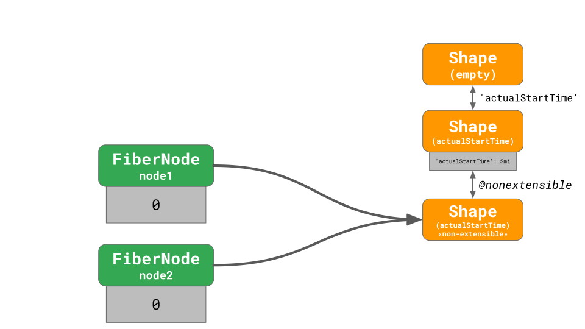

## JavaScript 类型

JavaScript 的值总共具有 8 种不同的类型：

```javascript
Number, String, Symbol, BigInt, Boolean, Undefined, Null, Object;
```

可以通过 `typeof` 关键字来校验值的类型。

```javascript
typeof 42;
// -> 'number'
typeof 'foo';
// -> 'string'
typeof Symbol('bar');
// -> 'symbol'
typeof 42n;
// -> 'bigint'
typeof true;
// -> 'boolean'
typeof undefined;
// -> 'undefined'
typeof null;
// -> 'object' wtf?
typeof { x: 42 };
// -> 'object'
```

尽管 `Null` 有着它自身的一种类型，但 `typeof null` 却返回 `object` 而不是 `null` 。为了理解原因，我们首先把所有的类型分为两组：

- object (即 `Object` 类型)
- primitives (任何非 object 类型)

`null` 表示 `no object value` ，`undefined` 表示 `no value` 。


根据这条思路，Brendan Eich 在设计 JavaScript 语言时，使 `typeof` 所有右侧的值都返回 `object` ，即所有 object 和 null 的值，这也是 Java 的特点之一。尽管规范中存在 `Null` 类型，但这就是 `typeof null === 'object'` 的原因。


## 值的表示

JavaScript 引擎必须能够在内存中对任意类型的 JavaScript 值进行表示，并且不同类型的值的表示方式不同。

举例来说，`42` 是一个 `number` 类型，在内存中就有多种表示整型数字的方式：

| 表示                | 位                                                                              |
| ------------------- | ------------------------------------------------------------------------------- |
| 8 位                | 0010 1010                                                                       |
| 32 位               | 0000 0000 0000 0000 0000 0000 0010 1010                                         |
| 32 位 IEEE-754 浮点 | 0100 0010 0010 1000 0000 0000 0000 0000                                         |
| 64 位 IEEE-754 浮点 | 0100 0000 0100 0101 0000 0000 0000 0000 0000 0000 0000 0000 0000 0000 0000 0000 |

ECMAScript 标准中数字采用 64 位浮点数表示，即双精度浮点数或 `Float64` 。但考虑到性能问题，JavaScript 引擎并不会在任何时候都以 `Float64` 表示数字。只要外部表现的行为与 `Float64` 一致，引擎在内部可以选择其他的表示方式。

在现实世界中，JavaScript 应用中大部分的整数数字类型都在 0 - 2³²−2 范围内，这个范围也是[有效的数字索引值](https://tc39.es/ecma262/#array-index)的范围。

```javascript
array[0]; // 最小的有效索引值
array[42];
array[2 ** 32 - 2]; // 最大的有效索引值
```

JavaScript 引擎对这类整数可以选择一种最佳的内存表示方式来优化通过索引访问数组元素的代码。处理器在做内存读取操作时，数组索引必须为二级制补码。`Float64` 来表示索引显然是浪费的，并且引擎不得不在每次访问数组元素时来回切换 `Float64` 和二进制补码形式。

32 位二进制补码表示并不止对数组操作有帮助，实际上处理器在对整数操作时会比对浮点数操作更快。下面例子中第一个循环会是第二个循环的二倍之快：

```javascript
for (let i = 0; i < 1000; ++i) {}

for (let i = 0.1; i < 1000.1; ++i>) {}
```

再比如做模运算时，`const remainder = value % divisor;` 如果 `value` 和 `divisor` 都为整数时会比不是整数要快很多。如果操作数都是整数，CPU 在计算时会非常高效，对于 `divisor` 是 2 的幂的情况，V8 还有其他更快的计算方式。但如果出现了浮点数，那计算过程会变得复杂，花费的时间也会上升。

由于整数运算的执行速度通常比浮点运算快得多，因此看来，引擎可以始终对所有整数和整数运算的所有结果使用二进制补码。但 ECMAScript 在 Float64 上实现了标准化，因此某些整数运算实际上会产生浮点数。 在这种情况下，JS 引擎产生正确的结果非常重要。

```javascript
// Float64具有53位的安全整数范围。超出这个范围就会失去精度。
2 ** 53 === 2 ** 53 + 1;
// → true

-1 * 0 === -0;
// → true

1 / 0 === Infinity;
// → true
-1 / 0 === -Infinity;
// → true

0 / 0 === NaN;
```

即使左侧的值为整数，右侧的所有值为浮点数。使用 32 位二进制补码无法正确执行上述操作。 JavaScript 引擎需要确保整数运算能匹配 Float64 的结果。

对于 31 位有符号整数范围内的小整数，V8 使用一种称为 `Smi` 的特殊表示形式。 任何不是 `Smi` 的东西都表示为 `HeapObject`，这是内存中某个实体的地址。 对于数字，我们使用一种特殊的 `HeapObject`（即 `HeapNumber`）来表示不在 `Smi` 范围内的数字。

```javascript
-Infinity; // HeapNumber
-(2 ** 30) - 1; // HeapNumber
-(2 ** 30); // Smi
-42; // Smi
-0; // HeapNumber
0; // Smi
4.2; // HeapNumber
42; // Smi
2 ** 30 - 1; // Smi
2 ** 30; // HeapNumber
Infinity; // HeapNumber
NaN; // HeapNumber
```

如上面的示例所示，一些 JavaScript 数字表示为 `Smi` s，而其他 JavaScript 数字表示为 `HeapNumber`s。 V8 特别针对 `Smi`s 进行了优化，因为小整数在现实世界的 JavaScript 程序中非常常见。 不需要为 `Smi`s 在内存中分配特殊块，并且通常整数运算会更快。

这里重要的一点是，即使是具有相同 JavaScript 类型的值，作为优化在后台可能会以完全不同的方式表示。

## Smi vs. HeapNumber vs. MutableHeapNumber

下面我们来看一下底层的实现。

```javascript
const o = {
  x: 42, //Smi
  y: 4.2, // HeapNumber
};
```

`42` 可以通过 `Smi` 来表示，它可以直接存在 object 中，而 `4.2` 需要一个独立的实体来保存，object 指向那个实体。


当我们执行以下代码时：

```javascript
o.x += 10;
// -> o.x = 52
o.y += 1;
// -> o.y = 5.2
```

因为新值 `52` 仍满足 `Smi` 表示的范围，所以 `x` 值会在原位置更新。


`y = 5.2` 不能用 `Smi` 表示，并且与 `4.2` 不同，所以 V8 只好分配一份新的 `HeapNumber` 实体给到 `y` 。


`HeapNumber`s 是不可变的，这可以带来一些明显的优化。如 `o.x = o.y` 操作，实际上只是将 `x` 的指针指向 `y` 指向的实体 `HeapNumber` ，而不需要重新创建。


`HeapNumber` 的一个劣势是更新数据会比 `Smi` 慢，考虑以下代码：

```javascript
// 创建`HeapNumber` 实体
const o = { x: 0.1 };

for (let i = 0; i < 5; ++i) {
  // 创建一个新 `HeapNumber` 实体
  o.x += 1;
}
```

这段代码总共生成了 6 个 `HeapNumber` 实体，但其中 5 个是没有必要的。为了避免这种情况， V8 将这种数据标记为 `Double` 字段，提供了一种原地更新非 `Smi` 的类型 `MutableHeapNumber` 来存储 `Float64` 数据。


当值更新时，V8 会简单原地更新 `MutableHeapNumber` 的数据。


但这中也有陷阱，当`y = o.x` 时，如果 `y` 也指向同一 `MutableHeapNumber` 那么下次 `o.x` 的值更新， `y` 也会跟着更新，这显然是违背 JavaScript 规范的。所以当 `o.x` 被访问时，首先需要将值转换为正常的 `HeapNumber` 。

## Shape 弃用和迁移

如果一个字段初始时是 `Smi` 后来变更为非 `Smi` 类型，底层是如何变更呢？

```javascript
const a = { x: 1 };
const b = { x: 2 };
// -> 两个对象的 x 是 Smi 类型
b.x = 0.2;
// -> b.x 现在是 Double 类型
y = a.x;
```


当 `b.x` 变为 `Double` 表示时，V8 分配了一个新的空 shape，并指向 x，也创建了一个 `MutableHeapNumber` 来存储新值 `0.2`。然后对象 `b` 指向新 shape ，对象的值指向偏移量为 0 的 `MutableHeapNumber`。最后把旧 shape 标记为弃用的，断开 transition 树。`x` 完成了从空 shape 到新创建的 shape 的过渡。


由于 a 对象还在指向旧的 shape，所以不能移除。V8 定义了任何取 a 中的属性或对 a 赋值之前先将 a 迁移至新的 shape。这样最终会使得标记为弃用的 shape 不可访问， 这时垃圾回收就可以释放这段内存了。


还有另一种情况：

```javascript
const o = {
  x: 1,
  y: 2,
  z: 3,
};

o.y = 0.1;
```

这时 V8 需要找到这条链路上 `y` 之前的 shape，即 `x`。


从分离的 shape 开始，我们创建了新的过渡链，并标记 `y` 为 `Double` 类型，旧的子树弃用。最后一步迁移对象 o 至新的 shape，`y` 的值保存在 `MutableHeapNumber` 中。一旦所有旧 shape 的引用全都消失，那这棵树上所有旧的 shape 也会被回收。

## 可扩展性和完整过渡

`Object.preventExtensions()` 可以阻止新的属性添加至一个对象中。
`Object.seal` 包含了 `Object.preventExtensions()` 的功能，并且它会标记所有属性为不可配置。
`Object.freeze` 与 `Object.seal` 类似，同时所有属性值不能更改。

考虑一个具体的情况：

```javascript
const a = { x: 1 };
const b = { x: 2 };

Object.preventExtensions(b);
```

像之前一样，从空 shape 过渡到新的存有 `x` 属性的 shape。当我们执行 `Object.preventExtensions()` 时，执行了一个特殊过渡至被标记为不可扩展的新 shape。这个过渡并不是因为新的属性，只是进行了标记。


注意我们不能直接在原地更新 `x` 的 shape，原因是对象 `a` 仍然是可扩展的。

## React 性能问题

让我们最终来看一个真实的问题，[react issue #14365](https://github.com/facebook/react/issues/14365)。当 React 团队对一个现实的程序执行 profile 时，他们发现了 V8 一个奇怪的性能问题影响了 React 核心代码。下面是简化过的代码：

```javascript
const o = { x: 1, y: 2 };
Object.preventExtensions(o);
o.y = 0.2;
```

对象 `o` 有两个值为 `Smi` 表示的属性，然后禁用了 `o` 的扩展性，并强制将第二个属性转换为 `Double` 表示。
根据前面的知识，代码的运行步骤如下：


两个属性为 `Smi` 表示，对象 `o` 指向最终过渡到 non-extensible 的 shape。

现在我们将 `y` 更新为 `Double` 表示，意味着我们需要从头开始找到分离的 shape `x`，但是 V8 出现了分歧，分离的 shape 是可扩展的，但是当前的 shape 被标记为非扩展的，V8 不知道如何正确进行过渡，实际上创建了一个独立的 shape。


可以想象当有很多这种对象时，会多糟糕。React 核心代码就产生了这一问题，`FiberNode` 有几个开启 profile 操作时记录时间戳的字段。

```javascript
class FiberNode {
  constructor() {
    this.actualStartTime = 0;
    Object.preventExtensions(this);
  }
}

const node1 = new FiberNode();
const node2 = new FiberNode();
```

这些字段如 `actualStartTime` 初始时赋值为 0 或 -1，即初始以 `Smi` 表示。但是后来执行[performance.now()](https://w3c.github.io/hr-time/#dom-performance-now)时返回的浮点数的时间戳保存至这些字段中，即变更为 `Double` 表示。

最初的表示：



当存储时间戳时，V8 产生了矛盾：


V8 为 node1 生成了 orphaned shape，在随后的某个节点为 node2 生成了不相交的另一个 orphaned shape。现实中 React 应用中 `FiberNode` 不止一两个，所以可想而知严重降低了 V8 的性能。

现在 V8 v7.4 版本已经修复了这个问题，并且使得字段表示的更新成本更低。


现在当 `actualStartTime` 赋值为 `Double` 表示时，会正确的产生一条新的过渡链，并将之前的标记为弃用，在未来的某个时间点回收。

React 团队的[解决方式](https://github.com/facebook/react/pull/14383)是初始化时将所有的 time 和 duration 字段以 `Double` 表示：

```javascript
class FiberNode {
  constructor() {
    // 强制以 Double 表示
    this.actualStartTime = Number.NaN;
    // 随后可以以 Smi 来真正初始化值
    this.actualStartTime = 0;
    Object.preventExtensions(this);
  }
}

const node1 = new FiberNode();
const node2 = new FiberNode();
```

可以使用任何不符合 `Smi` 范围的浮点值来代替 Number.NaN，如 `0.000001`， `Number.MIN_VALUE`， `-0`和 `Infinity`。

JavaScript 引擎在底层做了哪些神奇的操作，我们不得而知，但是记住不要混用类型，这样可以提交 V8 的性能。例如不要给数字类型的字段初始化 `null` 值，这会失去字段表示的优势，并且代码更易读：

```javascript
// 不要这么写!
class Point {
  x = null;
  y = null;
}

const p = new Point();
p.x = 0.1;
p.y = 402;
```

换句话说，**可读性高的代码性能更好！**

## 收获与总结

本文主要深入了以下内容：

- JavaScript 类型分为基本类型和引用类型，`typeof` 会有误导性；
- 即便是同一种数据类型，它背后的表示形式可能不同；
- V8 尽可能去寻找 JavaScript 应用中每个字段的最佳表示形式；
- V8 如何处理 shape 弃用和迁移，包括扩展性过渡。

基于以上知识，在编写 JavaScript 代码时以下注意事项可以提高性能：

- 总是以同一种方式初始化对象，shape 可以变得高效；
- 选择对字段类型合适的初始值来帮助 JavaScript 引擎选择表示形式。

## 参考

https://v8.dev/blog/react-cliff
