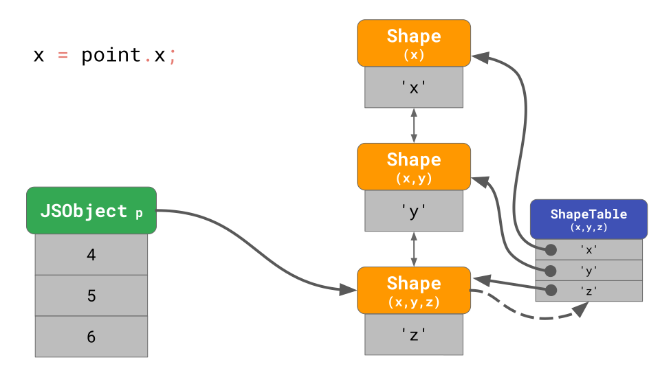
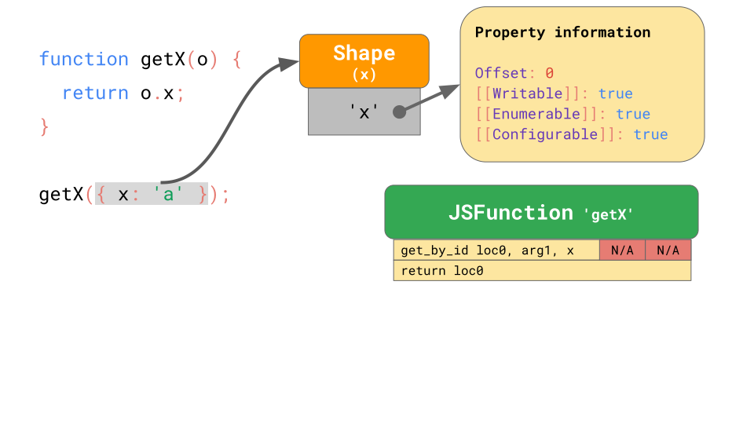

## JavaScript 引擎管道

当加载到我们所写的 JavaScript 代码，JavaScript 引擎开始解析源代码，并把它转换成抽象语法树（AST）。基于 AST，解释器开始工作并转换成字节码。此时引擎开始真正执行我们的 JavaScript 代码。


为了让代码运行得更快，字节码可以与分析数据一起发送到优化编译器，基于分析到的数据做出一些假设，然后编译出高度优化的机器码。

如果在某个节点的假设出错，优化编译器会造成负优化，并回退到解释器。

### 解释器/编译器 在 JavaScript 引擎中的管道

我们来放大管道流中真正执行 JavaScript 代码的部分，即代码被解释和优化，并解决主要引擎中存在的差异的地方。简单来讲，这里管道流包含解释器和优化编译器。解释器快速将源码生成未优化的字节码，优化编译器花更多一点的时间生成高度优化的机器码。


这种通用的管道流 V8 在 Chrome 和 Node.js 中是如何工作的：


解释器在 V8 中被称作点火器，它的作用是生成和执行字节码。当开始执行字节码时，它会收集分析的数据，用来加速未来的执行速度。当一个函数经常被执行，就会变成一个热函数，这部分字节码和分析的数据会被传递给涡轮风扇--我们的优化编译器，基于分析的数据来生成高度优化的机器码。

## JavaScript 对象模型

让我们来看一下 JavaScript 引擎共性的方面是如何实现的。例如，JavaScript 对象模型是如何实现的，有哪些方式来加快属性的访问。

ECMAScript 规范定义了所有对象都是字典，[属性的键值](https://tc39.es/ecma262/#sec-property-attributes)都是字符串类型。


除了 `[[Value]]` 以外，规范还定义了如下属性：

- `[[Writable]]` 决定了属性可以重新赋值，
- `[[Enumerable]]` 决定了属性可以通过 `for-in` 枚举，
- `[[Configurable]]` 决定了属性可以被删除。

双方括号看起来新颖，这是规范用来表示属性的并且不直接暴露给 JavaScript。可以通过 `Object.getOwnPropertyDescriptor` API 来获取对象的属性描述符。

```javascript
const object = { foo: 42 };
Object.getOwnPropertyDescriptor(object, 'foo');
// -> { value: 42, writable: true, enumerable: true, configurable: true }
```

数组又是如何定义的呢？可以把数组理解为一种特殊的对象。其中一个不同点是数组对索引有特殊的处理逻辑。数组索引在 ECMAScript 规范中是特殊术语。数组在 JavaScript 中允许最多 2³²−1 个元素。数组索引是在 0 至 2³²−2 的任意有效的整数。

另一个不同点是数组有一个魔法的`length`属性。

```javascript
const array = ['a', 'b'];
array.length; // -> 2
array[2] = 'c';
array.length; // -> 3
```

在这个例子中数组创建时 `length` 为 `2`，当我们给索引 `2` 赋值时，`length` 属性自动更新了。

JavaScript 定义数组和定义对象相似，所有键值包括索引值都是明确的字符串类型。数组的第一个元素存在键 `0` 的下面。


`length` 只是另一个不可枚举不可删除的属性而已。

一旦一个元素加入数组，JavaScript 会自动更新 `length` 属性的 `[[Value]]` 值。

一般来说，数组的行为与对象非常相似。

## 优化属性访问

现在让我们来看一下引擎如何让对象工作的高效。

在 JavaScript 程序中，访问对象属性是最常见的操作。对于引擎来说让属性更快访问至关重要。

```javascript
const object = {
  foo: 'bar',
  baz: 'qux',
};

// 这里我们访问 object 的 foo 属性。
doSomething(object.foo);
```

### Shapes

在 JavaScript 程序中，多个对象拥有相同的属性是非常常见的。这样的对象有相同的形状（shape）。

```javascript
const object1 = { x: 1, y: 2 };
const object2 = { x: 3, y: 4 };
// object1 和 object2 有同样的 shape
```

对同样 shape 的对象访问同一属性也是很常见的。

```javascript
function logX(object) {
  console.log(object.x);
}

const object1 = { x: 1, y: 2 };
const object2 = { x: 3, y: 4 };

logX(object1);
logX(object2);
```

考虑到这一点，JavaScript 引擎可以基于对象的 shape 来优化对象属性的访问速度。

假设一个对象上有属性 `x` 和 `y` ，它用之前讨论过的字典数据结构表示：包含了字符串的 key，这些 key 的指针指向对应的元属性。


如果访问 `object.y` ，引擎会在 `JSObject` 中寻找键 `y` ，然后加载对应的属性元数据，最后返回 `[[Value]]` 。

属性元数据在内存中是怎么存储的呢？我们应该把它们作为 `JSObject` 的一部分存储呢？如果我们在将来会有更多的同 shape 的对象，那么作为 `JSObject` 的一部分保存全部的字典数据是浪费的。作为优化，引擎会单独保存对象的 `Shape` 数据。


`Shape` 包含除了 `[[Value]]` 之外的所有的元属性数据，并且 `Shape` 会保存属性值在 `JSObject` 中的偏移量，因此 JavaScript 引擎知道去哪里找到这些值。每个同一 shape 的 `JSObject` 指向这个 `Shape` 实例。现在每个 `JSObject` 只需要保存对对象唯一的属性值。


当我们有多个对象时好处显而易见，无论有多少对象，只要它们拥有同样的 shape，我们只需要保存一次 shape 和属性信息。

### 过渡链和树（Transition chains and trees）

假设现在一个对象有一个确定的 shape，当我们此时在该对象上新增一个属性时，引擎该如何找到新的 shape？

```javascript
const object = {};
object.x = 5;
object.y = 6;
```

这种 shape 形式在引擎中称为过渡链（transition chains）感觉这里还是原生比较直观。


对象 `o` 开始时没有任何属性，所以最初指向空 shape。第二步将值为 `5` 的 `x` 属性添加到对象 `o` 时，JavaScript 引擎会过渡到一个包含属性 `x` 的 shape，并且值 `5` 会添加到 `JSObject` 偏移量 `0` 的位置。同理，当新增 `y` 属性时，引擎会过渡到包含 `x` 和 `y` 的另一个 shape，并将 `6` 添加到 `JSObject` 偏移量 `1` 的位置。

```
注意：属性添加的顺序会影响shape。如 { x: 4, y: 5 } 和 { y: 5, x: 4 } 的 shape 不同。
```

我们不需要为每个 `Shape` 保存全部的属性。相反，每个 `Shape` 只需要知道它自己新的属性。例如，我们不需要在最后一个 `Shape` 中存储 `x` 属性，因为它可以在之前的链上找到。为了达到这个目的，每个 `Shape` 需要指回之前的 shape ：


当代码中访问 `o.x` 时，引擎会向上遍历 transition chain 直到找到拥有 `x` 属性的 `Shape` 。

如果此时有两个空对象，我们分别向对象中添加不同的属性：

```javascript
const object1 = {};
object1.x = 5;
const object2 = {};
object2.y = 6;
```

这种情况我们会将树进行分叉形成 transition tree 而不再是一条链。


这里我们创建了空对象 `a` ， 并且向其添加了 `x` 属性。最终创建了包含一个值的 `JSObject` 和 两个 `Shape`s ：一个空 shape 和一个仅包含 `x` 属性信息的 shape。

我们也创建了对象 `b` ，并增加了属性 `y`。结果产生了两条 shape 链，总共三个 shape。

这是否意味着我们总是从空 shape 开始？并非如此。引擎会对已经拥有属性的对象字面量做优化。我们要么从空对象增加 `x` 属性，要么有对象已经存在 `x` 属性：

```javascript
const object1 = {};
object1.x = 5;
const object2 = { x: 6 };
```

在对象 `object1` 中，我们首先创建空 shape，并过渡到拥有 `x` 属性的 shape。
对象 `object2` 可以直接从之前已经包含 `x` 的 shape 创建，不需要从空对象开始然后过渡。


包含 `x` 属性的对象从包含 `x` 的 shape 开始，高效的跳过了空 shape。这个优化缩短了过渡链并使字面构造对象更加高效。

下面是一个三维点对象的表示：

```javascript
const point = {};
point.x = 4;
point.y = 5;
point.z = 6;
```

根据我们前面所讲的，这会在内存中创建 3 个 shape（不包括空 shape）。为了访问 `x` 属性，必须从链尾开始遍历寻找包含 `x` 的 shape。


如果我们经常作此操作，会变得很慢，尤其是当对象有很多属性时。寻找属性的时间复杂度是 O（n）,即线性的复杂度。为了加快查询效率，JavaScript 引擎增加了一个 `ShapeTable` 的数据结构。这个 `ShapeTable` 是一个字典，匹配键值和对应的 `Shape`s 。



现在我们又回到了字典表查找。这是我们开始添加 `Shape`s 的地方。所以我们为什么还要`Shape`s ？

原因是 shapes 可以启用另一个优化方案：`Inline Caches`。

### Inline Caches (ICs)

`Shape`s 背后真正的目的是内联缓存（ICs）。ICs 是使 JavaScript 快速运行的关键因素。JavaScript 引擎使用 ICs 来记录去哪里找对象的属性的信息，减少查询次数的开销。

```javascript
function getX(o) {
  return o.x;
}
```

当我们在编译器中执行时，生成如下的字节码：


`get_by_id` 指令从第一个参数 `arg1` 加载 `x` 属性，并将结果保存在 `loc0` 位置。第二条指令返回我们存在 `loc0` 中的数据。

JSC 还将内联缓存嵌入包含两个未初始化插槽的 `get_by_id` 指令中。



现在我们调用`getX` 函数，并传参 `{ x: 'a' }` ，这个对象有一个拥有 `x` 属性的 shape，并且该 `Shape` 保存了偏移量和 `x` 的元属性数据。当首次执行这个函数时，`get_by_id` 指令开始查找属性 `x`，最终找到该值保存在偏移量 `0` 的位置。


嵌入 `get_by_id` 指令的内联缓存会记录 shape 和属性被查到的偏移量：


在随后的运行，内联缓存只需要比较 shape，如果相同就会直接返回记录的偏移量的值。特别是如果 JavaScript 引擎发现对象的 shape 在内联缓存中已经记录，不再需要去查询属性信息，这步耗时的操作会完全跳过。

## 高效存储数组

数组保存的属性又称为索引，对应的值称为数组元素。在每个单个数组中保存每个数组元素的属性信息是浪费内存的，JavaScript 引擎默认情况下索引值的属性是可写、可遍历、可删除，并且将数组元素和其他命名属性分开存储。

```javascript
const array = ['#jsconfeu'];
```

引擎保存了数组长度 `1`，并指向包含偏移量和 `length` 属性的 `Shape`。


和之前看到的一样，但是数组的元素值存在哪里呢？


每个数组都有一个单独的元素备份库，包含了所有元素的值。JavaScript 引擎不需要为数组元素保存任何属性信息，因为通常它们都是可写、可枚举、可删除的。

## 收获与总结

我们学习到了 JavaScript 引擎是如何存储对象和数组的，`Shape`s 和 `ICs` 是如何对它们常用的操作做出优化的。基于这些知识，我们总结了以下可以提高性能的代码：

- 总是按同一种方式初始化对象，这样就不会产生多种不同的 shape；
- 不要试图修改数组的属性信息，否则存储和操作会降低性能。
