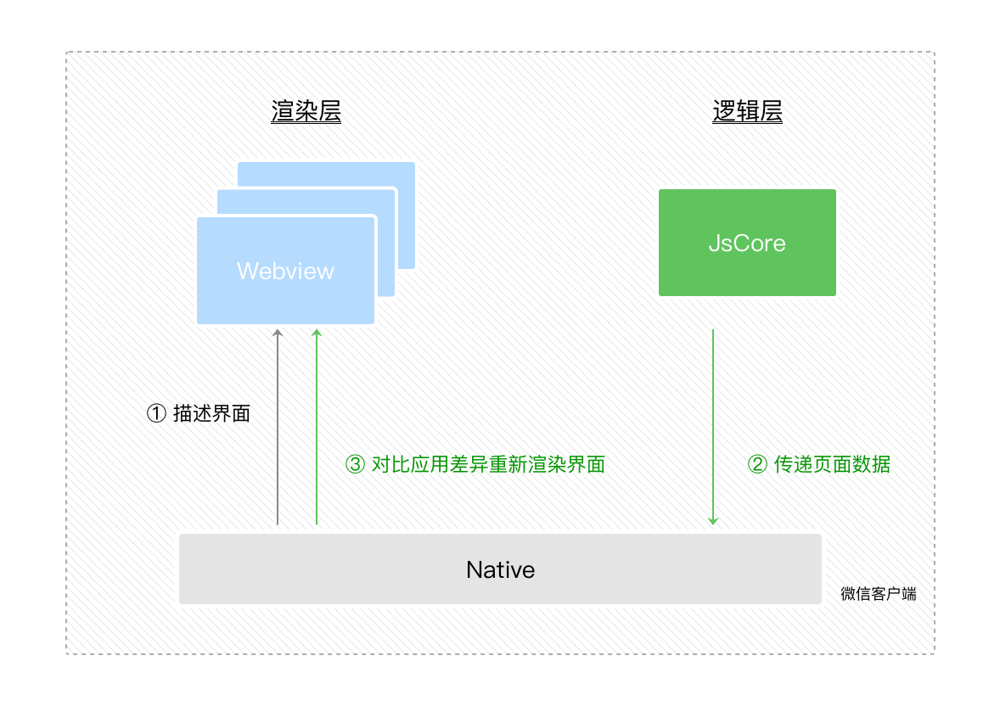

笔者之前接手过一些小程序的项目，不过当时时间紧任务重，基本上就是边看文档边撸代码，并没有真正好好的理解小程序的设计。今天准备花些时间来了解一下，小程序背后的故事。

### 前世今生

小程序这个概念应该是微信最早提出并推广应用的。当时发布之后我也尝试做过类似 Instagram 这样的支持上传，浏览图片的小程序，无奈当时刚发布时小程序的框架还有很多不完善的地方，比如像素单位在 Android 和 iOS 上不统一，开发工具体验差等，因此而弃坑。现在回过头来看小程序的发展已然非常成熟，各家大厂纷纷跟进，百花齐放。

回到正题，小程序是如何出现的？

据微信官方文档的介绍，在早期微信就封装过一个微信 JS-SDK，包含了很多拍摄，录音，二维码，支付等 API。记得当时做微信公众号的开发时，确实体会到了在 web 页面中调用微信原生功能的强大与便捷。但是，由于 web 应用会共享一个线程，即渲染线程和脚本线程是互斥的，所以当脚本执行时页面的渲染会卡住，给人不好的体验。所以微信开发者后面就给出了一个新的方案，既能够提供原生功能和体验，又能保障用户的安全前提下快速开发迭代。

### 设计理念

#### 选型

小程序的初衷就是要求渲染快，加载快。所以通常的渲染页面的技术：

1. 纯客户端原生渲染
2. 纯 Web 技术渲染
3. Hybrid 技术渲染

纯客户端渲染需要跟随宿主环境一起发布，这种会破环小程序开发者的发布，并且不能云端热更新。
纯 Web 渲染就像之前提到了在复杂交互页面上会存在性能问题。
所以最终采用 Hybrid 方式，轻量级的组件采用 Web 技术渲染，而复杂的应用则会采用客户端原生渲染（如地图），两者结合来提供更好的性能和体验。

#### 安全

不完全采用 Web 技术渲染小程序的另一大原因是由于 Web 技术的灵活性，可以通过 JavaScript 脚本随意跳转或修改页面上的内容。另外还有一些只允许展示的敏感数据是禁止 JavaScript 访问的。

所以需要提供一个单独的沙箱环境来运行 JavaScript 代码。这个沙箱环境中不能提供浏览器相关接口，只能用作解释执行 JavaScript。就像浏览器中的 Service Worker，WebWorker 一样，启用单独的 worker 线程来执行 JavaScript。这个沙箱环境在客户端有提供（iOS 下是内置的 JavaScriptCore 框架，Android 下是微信 x5 内核的 JsCore 环境），该环境就是小程序逻辑层。

### 宿主环境

所谓的宿主环境其实就是微信 APP，在小程序中，渲染线程和逻辑线程是分开执行的，渲染层的界面使用 WebView 进行渲染，逻辑线程运行在 JsCore 中。

一个小程序存在多个界面，即渲染层存在多个 WebView 线程。

#### 通信模型

渲染层和逻辑层的的通信是通过宿主环境（Native）进行中转的，逻辑层发送的网络请求也由 Native 转发。

#### 数据驱动

即逻辑层的 data 与渲染层的 view 是相对应的，当调用了 setData 时，逻辑层生成新的 DOM 树并与旧的树进行 diff，然后把有差异的部分通过中转传递到渲染层，从而完成 UI 更新。

### 参考

<https://developers.weixin.qq.com/ebook?action=get_post_info&docid=0008aeea9a8978ab0086a685851c0a>
