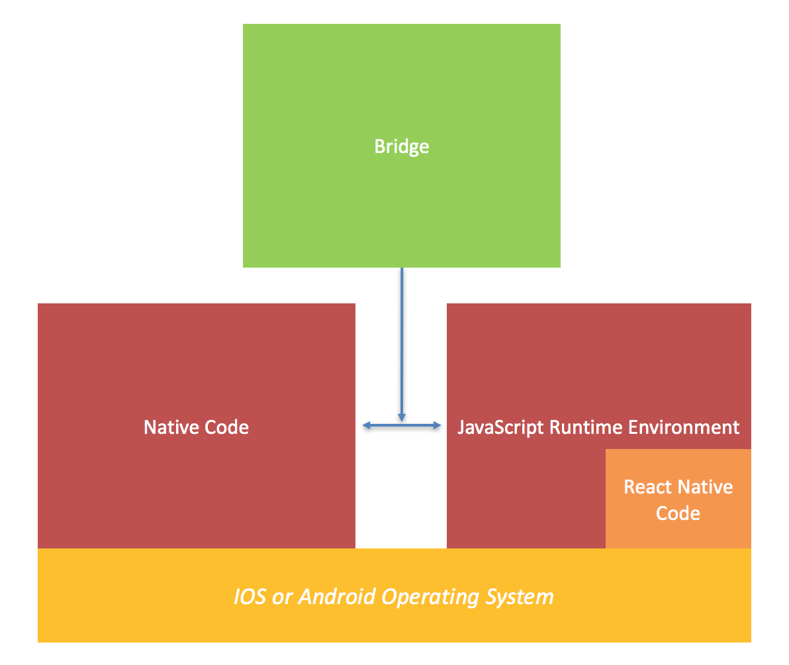

**React Native** 是一个能够允许 JavaScript 和 native 代码一样在 iOS 和 Android 设备上运行和交互的现代框架。它提供了一种编写一次多端运行的能力，有机会使我们统一应用的架构。对于新手而言了解 RN 是如何工作的比较让人困惑，因此本文将归结为理解以下三个架构：

1. JavaScript 运行环境架构
2. 构建流程架构
3. 调试架构

### JavaScript 运行环境架构（Bridge）

为了理解 RN 的原理，需要知道 javascript 在 iOS/Android 设备中是如何执行的。为了 javascript 的执行，react native 使用了称为 JavaScript Core 的运行环境，它其实是在操作系统上层的一些代码。

为了使 JavaScript 能够运行原生应用，必须仍然使用底层原生代码。从上图中，我们可以看到每个 RN 控件都会与对应的原生控件进行交互。RN 通过 bridge 来完成这两种方式的通信。所以原生代码实际上在它自己的线程操作，即如果 RN 的 JavaScript 代码执行了很长时间，并不会使 UI 卡住或者变慢。通过 bridge 传递事件来执行回调。

### 构建流程架构

在构建 react native 应用时，react native 做了下面两件事情：

- 它在本地运行一个 node web 服务器，来发布一个持有所有我们 RN JavaScript 代码的 payload 文件
- 然后它会构建一个原生的应用程序并部署到设备上。该程序中配置了拥有 JavaScript 运行环境，并下载之前生成好的 payload
- 这个 payload 文件随后直接被传递到 JavaScript 运行环境，这样就拥有了原生容器和支撑运行整个应用程序的 JavaScript 代码

### 调试架构

对于调试 react native 应用程序的过程，我们需要做以下事情：

- 设置源码的地址
- 开启浏览器使调试器可以输出调试信息
- 或者可以执行通过控制台打印日志来理解构建过程或调试程序

React Native 开启了快速开发原型应用的篇章。许多基础的功能可以很轻松的实现。如果需要，它们可以通过原生代码和视图进行扩展，并且也可以与其他视图控制器进行集成。由于 RN 使用了 javascript，开发者可以更快更高效的工作，并且不需要每次更新代码后重启，可以直接刷新视图。

### 参考

<http://jyaasa.com/blog/getting-started-with-react-native-core-architecture-of-react-native>
