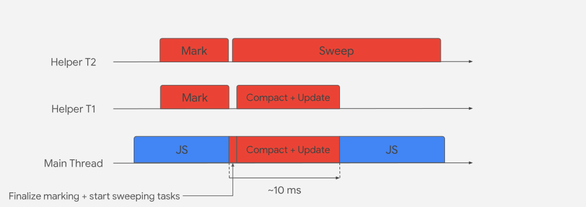

本文我们来看一下用于[ECMAScript](https://tc39.es/ecma262/)和[WebAssembly](https://webassembly.github.io/spec/core/)的[V8 引擎](https://v8.dev/)的内存管理。V8 引擎现在被 NodeJS，Deno 等运行时，Electron，还有 Chrome，Chromium，Brave，Opera 和 Microsoft Edge 等浏览器采用。由于 JavaScript 是一门解释型语言，需要引擎来解释并执行。V8 引擎解释 JavaScript 代码并将代码编译成原生的机器码。V8 引擎是通过 C++编写的，可以嵌套在任意的 C++程序中。

### V8 内存架构

由于 JavaScript 是单线程的，V8 会在每个 JavaScript 上下文中使用一个单独的进程，如果使用了 service worker，它会根据每个 worker 产生一个新的 V8 进程。每个运行中的应用程序总是被 V8 进程分配一些内存，被称为**常驻集（Resident Set）**。然后被进一步分为一下不同的片段：


#### 堆内存

这是 V8 存储对象或动态数据的地方。这是内存区域最大的块，这也是**垃圾回收（Garbage Collection）**发生的地方。并不是整个堆内存都会被回收，只有新生代和老生代会被垃圾回收管理。堆会进一步分为：

- **新生代（New Space）** 新生代或“**年轻代（Young generation）**”是新对象存储的地方，这些新对象通常都是短暂存活的。这块内存非常小，有两个 semi-space。这块内存被“清道夫（**Scavenger(Minor GC)**）”管理。新生代可以通过 `--min_semi_space_size(初始化)` 和 `--max_semi_space_size(最大)` 标志来控制大小。
- **老生代（Old Space）** 老生代或“**老年代（Old generation）**”是那些在新生代中在两次二级 GC 中存活下来的对象。这块内存是被“**主 GC（Major GC: Mark-Sweep & Mark-Compact）**”管理。老生代可以通过 `--initial_old_space_size(初始化)` 和 `--max_old_space_size(最大)` 标志来控制大小。这块内存又被分为两份：
  - **旧指针空间（Old pointer space）**：包含具有指向其他对象的幸存对象
  - **旧数据空间（Old data space）**：包含保存数据的对象（没有指向其他的对象）。字符串，包装过的数字等保存新生代中在两次二级 GC 中存活下来的对象。
- **大对象空间（Large object space）**：这是超过其他内存限制的更大的对象存活的地方。大对象不会被垃圾回收。
- **代码空间（Code-space）**：这是即时（**Just In Time: JIT**）编译器存储编译过的代码的地方。这是唯一可执行的内存空间（尽管代码可能被分配在“大对象空间”，这些也是可执行的）。
- **细胞空间，属性细胞空间，map 空间（Cell space, property cell space, and map space）**：这些空间分别包含：`Cells`, `PropertyCells`, 和 `Maps`。这些空间中的每个空间都包含相同大小的对象，并且对它们指向的对象有一些限制，从而简化了回收。

这些空间中的每一个都由一组 pages 组成。Page 是使用 mmap 从操作系统分配的连续内存块。除较大的对象空间外，每个页面的大小均为 1MB。

#### 栈内存

每个 V8 进程会有对应的栈。这里是静态数据，包含方法/函数帧，基本数据，指向对象的指针存放的地方。栈内存的大小限制可以通过 `--stack_size` 标志控制。

### V8 内存使用（栈 vs 堆）

现在我们已经清楚内存是如何管理的，我们来看一下当应用运行时内存是如何使用的。

我们来看下面这段代码，注意代码并未优化，主要来关注栈和堆的内存使用。

```javascript
class Employee {
  constructor(name, salary, sales) {
    this.name = name;
    this.salary = salary;
    this.sales = sales;
  }
}

const BONUS_PERCENTAGE = 10;

function getBonusPercentage(salary) {
  const percentage = (salary * BONUS_PERCENTAGE) / 100;
  return percentage;
}

function findEmployeeBonus(salary, noOfSales) {
  const bonusPercentage = getBonusPercentage(salary);
  const bonus = bonusPercentage * noOfSales;
  return bonus;
}

let john = new Employee('John', 5000, 5);
john.bonus = findEmployeeBonus(john.salary, john.sales);
console.log(john.bonus);
```

相关 slide 可以<a href="https://speakerdeck.com/deepu105/v8-memory-usage-stack-and-heap" target="_blank">点击新窗口打开</a>

可以看到：

- 全局作用域是存在于栈的“全局帧”中
- 每个函数调用都作为帧块被加入栈内存
- 所有的局部变量包括参数和返回值都在栈的函数帧块中
- 所有的原始数据如 `int` 和 `string` 都被直接存入栈中。这也适用全局作用域
- 所有的对象类型如 `Employee` 和 `Function` 都在堆中被创建，从栈中使用栈指针引用它们。在 JavaScript 中函数本质上是对象，这也适用全局作用域
- 从当前函数调用的函数被加入栈顶
- 当函数返回时，它的帧在栈中被移除
- 一旦主流程完成，堆中的内存没有栈中任何的指针指向会成为孤立对象
- 除非做了复制，其他对象内的所有对象引用都使用引用指针

栈就像看到的一样是操作系统而不是 V8 本身管理并结束的，因此我们不需要太关注栈。相反，堆内存不是操作系统自动管理的，由于它有最大的内存空间并存储动态数据，可能随着时间增长呈指数增长以至程序执行用光内存。这就是垃圾回收需要的原因。

对于垃圾回收区分堆中的指针和数据是非常重要的，V8 使用“**标记指针（Tagged pointer）**”的方式来回收，它在每个字母后面预留了一比特来标记是指针还是数据。这个方式需要有限的编译器支持，但实现起来很简单，而且效率很高。

### V8 内存管理：垃圾回收

现在我们知道 V8 是如何分配内存的，我们来看一下它又是如何自动管理对应用程序性能非常重要的堆内存的。当一个应用程序尝试分配超过堆剩余内存（取决于 V8 设置的标志大小）时，会造成**内存溢出的异常**。对堆不正确的管理也会造成内存泄露。

V8 通过垃圾回收管理堆内存。简单来说，它释放孤立对象的内存，即没有在栈中有直接或间接（在另一个对象中的引用）引用的对象会被回收来为新对象的创建提供空间。

> **Orinoco** 是 V8 垃圾回收项目的代号，通过并行，增量，并发的技术进行垃圾回收，来释放主线程。

在 V8 中垃圾回收器是回收未使用的内存来供 V8 进程重新利用。

V8 垃圾回收器是传代的（堆中的对象根据年代进行分组并在不同的阶段被清除）。V8 中有两个阶段，采用了三种不同的算法来进行垃圾回收：

#### 二级 GC（清道夫）

这种类型的 GC 保证年轻或新生代空间紧凑整洁。对象分配在新生代空间中，该空间很小（介于 1MB 至 8MB，取决于行为启发）。在“新空间”中分配内存很容易：只要想为新对象预留空间，可以直接增加分配的指针。当指针达到新空间的极限，二级 GC 就会被触发。这个过程也被称为**清道夫**，它实现了[Cheney 的算法](http://en.wikipedia.org/wiki/Cheney's_algorithm)。它发生的频率较高，通过使用平行的帮助线程执行非常快。

我们来看一下二级 GC 的过程：

新空间被分为均等的两份半空间：**到空间（to-space）**和**来空间（from-space）**。大多数的分配都是在到空间的（除了确切类型的对象，如可执行代码始终存储在老空间中）。当到空间填满时，二级 GC 就会被触发。

相关 slide 可以<a href="https://speakerdeck.com/deepu105/v8-minor-gc" target="_blank">点击新窗口打开</a>

1. 假设当我们开始时已经有一些对象存在于“到空间”（块 01 至 06 标记为已使用的内存）
2. 创建了一个新对象（07）
3. V8 尝试从到空间中获取内存，但是没有空余的空间来容纳，因此 V8 会触发二级 GC
4. 二级 GC 将“到空间”和“来空间”进行交换，所有的对象现在都在“来空间”，“到空间”现在是空的
5. 二级 GC 递归地遍历“来空间”的对象图开始从栈指针（GC 根）找出被使用的或存活的（使用了内存）对象。这些对象引用的任何对象也都在“到空间”中移动到此 page，并且它们的指针都更新了。这个过程会持续到所有“来空间”的对象都被扫描过。在最后，“到空间”自动压缩以减少碎片
6. 二级 GC 现在清空“来空间”，因为任何留下的对象都成为了垃圾
7. 新对象在“到空间”中分配内存
8. 我们假设一会儿时间过去了，“到空间”中现在有更多的对象（块 07 到 09 都被标记为已使用的内存）
9. 应用创建了一个新对象（10）
10. V8 尝试从“到空间”中获取内存，但是没有多余的内存来容纳，因此 V8 触发了第二次二级 GC
11. 以上的过程会重复，而任何在第二次二级 GC 中存活的对象被移动到“老生代空间”。第一次幸存者被移动到“到空间”，剩余的从“来空间”中被清除
12. 新对象在“到空间”中被分配内存

现在我们看到了二级 GC 从年轻代中回收空间，并保持紧凑。这是一个会中断其他过程的（stop-the-world）过程，但是由于它是很快的高效的，在大多数时间中都是微不足道的。由于此过程不会扫描“老生代”的对象来获取“新生代”中的任何引用，它使用从老生代到新生代的所有指针的寄存器。这通过一个[**写屏障（write barriers）**](https://www.memorymanagement.org/glossary/w.html#term-write-barrier)的过程记录到存储缓冲区中。

#### 主 GC（Major GC）

该类 GC 保证老生代空间的紧凑整洁。在它从二级 GC 循环中被填满时，它会基于一个动态计算出的内存限制在老生代没有额外空间时触发。

清道夫算法对小的数据非常契合，对大的堆难以处理。老生代内存有开销，主 GC 是通过**标记清除压缩（Mark-Sweep-Compact）**算法来完成的。它使用了三色（白-灰-黑）标记系统。因此主 GC 是一个三步执行的过程，第三步的执行取决于片段的启发式。


- **标记**：第一步，两种算法共同之处，垃圾回收器分辨哪些对象是在使用中的，哪些不是。使用中的或从 GC 根（栈指针）可访问的对象会被递归地标记为存活。它在堆中的深度优先查找，可以想象成为一个有向图
- **清除**：垃圾回收器遍历堆，对任何没有标记为存活的对象记录它们的内存地址。在空闲列表中这块空间被标记为空闲，可以被用来存储其他对象
- **压缩**：清除之后，如果需要，所有存活的对象会被移动到一起。这可以降低碎片化，增加分配新对象内存的性能

这种类型的 GC 在执行垃圾回收时也是会中断其他的执行，因为它引入了停止时间的特性。为了避免该问题，V8 使用了如下技术：



- **增量 GC**：垃圾回收执行多个增量的步骤来完成
- **并发标记**：通过使用多个帮助线程来并发标记而不干扰主要的 JavaScript 线程。写屏障（write barriers）被用来追踪 JavaScript 创建的对象的新引用
- **并发清除/压缩**：清除压缩是并发在帮助线程完成的，不干扰主要的 JavaScript 线程
- **惰性清除**：惰性清除可以在内存需要时再删除 pages 的垃圾

我们来看一下主要的 GC 过程：

1. 假设许多二级 GC 循环都通过了，老年代已经填满，V8 决定触发一次主 GC
2. 主 GC 递归地遍历对象图，从堆栈指针开始，以标记在旧空间中被用作活动对象（已用内存）和其余对象作为垃圾（孤立对象）的对象。 这是使用多个并发的帮助线程完成的，每个线程都基于一个指针。 这不会影响 JS 主线程。
3. 完成并发标记或达到内存限制后，GC 将使用主线程执行标记完成步骤。这会短暂暂停时间。
4. 现在，主要 GC 使用并发清除线程将所有孤立对象的内存标记为空闲。还会触发并行压缩任务，以将相关的内存块移至同一 page 以避免碎片。在这些步骤中将更新指针。

### 参考

[v8.dev/blog/trash-talk](https://v8.dev/blog/trash-talk)

[jayconrod.com](http://jayconrod.com/posts/55/a-tour-of-v8-garbage-collection)

[blog.codeship.com](https://blog.codeship.com/understanding-garbage-collection-in-node-js/)

[developer.mozilla.org](https://developer.mozilla.org/en-US/docs/Web/JavaScript/Memory_Management)

[blog.sessionstack.com](https://blog.sessionstack.com/how-javascript-works-memory-management-how-to-handle-4-common-memory-leaks-3f28b94cfbec)

[Visualizing memory management in V8 Engine (JavaScript, NodeJS, Deno, WebAssembly)](https://deepu.tech/memory-management-in-v8/)
