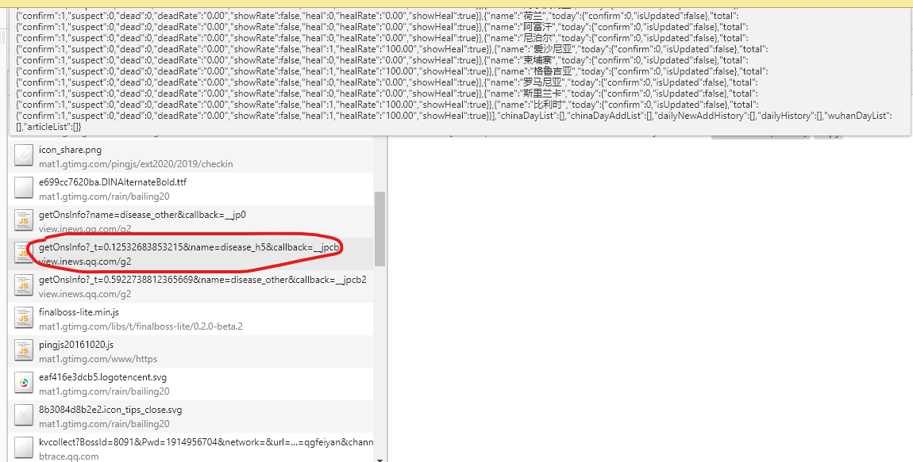
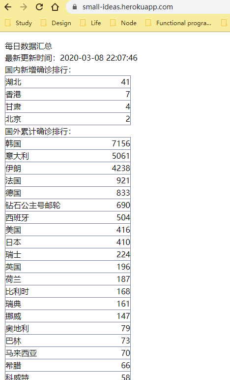
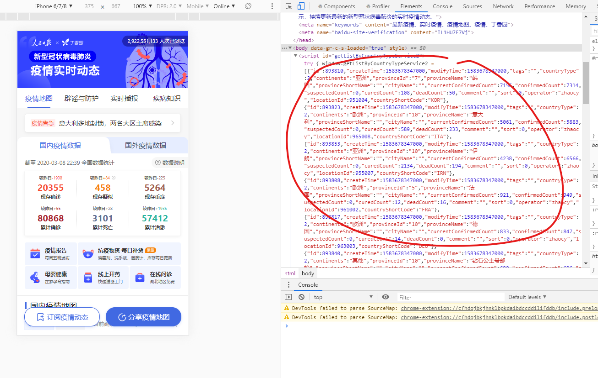

### 背景

我之前每天都会去腾讯新闻页面上去关注有关疫情发展的当日的数据状况，久而久之就感觉该页面不够精简，而且路径过长，需要二次点击才能看到主页面。那么就干脆直接去拿他们的数据来自己做个[页面](https://keisei.now.sh/)好了，仓库地址：前端[https://github.com/keisei77/small-ideas.git](https://github.com/keisei77/small-ideas.git)，后端[https://github.com/keisei77/micro-backend.git](https://github.com/keisei77/micro-backend.git)。
目前没有 UI，只是简单排了序。后续根据心情在做样式上的改进吧。

### 前期分析

当我开始想要去获取腾讯的数据时，首先在疫情动态主页面[https://xw.qq.com/act/qgfeiyan](https://xw.qq.com/act/qgfeiyan)上看了一下浏览器请求，找了一小会发现地图、列表所渲染的数据并不是通过异步的 Ajax 请求的。由于地图用的是 echarts 渲染的，这肯定不是服务端渲染的，所以数据一定藏在某个地方。那么可以尝试通过全局搜索该页面上的唯一数值，如果没有找到，就有可能是在某个文件请求返回的。

经过逐个排查，终于找到原来是通过 JSONP 方式请求的数据[https://view.inews.qq.com/g2/getOnsInfo?\_t=0.12532683853215&name=disease_h5&callback=\_\_jpcb1](https://view.inews.qq.com/g2/getOnsInfo?_t=0.12532683853215&name=disease_h5&callback=__jpcb1)，可以看到通过这种方式解决了跨域问题：


注意截图中的\_t 参数为类似时间戳的数据，callback 为回调函数。由于我们只是需要他返回的数据，而不关心回调函数的执行，所以我索性去掉了 callback 参数，发现该请求仍能返回数据，并且是 json 格式！正好符合了我们的预期。

### 搭建应用

有了接口，那么开发页面就是信手拈来的事情。在之前曾经了解过 [Next.js](https://nextjs.org/) 这个 React SSR 框架，并且了解到该公司还免费部署个人应用，并提供免费的域名使用。于是就开始了轻松的开发之旅。

Next.js 提供了一个页面渲染前先获取初始化数据的 API：[getInitialProps](https://nextjs.org/docs/api-reference/data-fetching/getInitialProps)，该函数会在 nodejs 环境下运行，把请求的数据通过 props 的方式注入到调用该 API 的组件内。

```javascript
import fetch from 'isomorphic-unfetch';

function Page({ stars }) {
  return <div>Next stars: {stars}</div>;
}

Page.getInitialProps = async ctx => {
  const res = await fetch('https://api.github.com/repos/zeit/next.js');
  const json = await res.json();
  return { stars: json.stargazers_count };
};

export default Page;
```

来自官网的例子，通过几行代码我们就可以拿到需要的数据，然后简简单单的做个表格就可以直观看到疫情发展啦。



### 新的挑战

上线几天后，发现国内的数据是每日更新的，但是国外的数据却停留在了某一天。感觉腾讯耍了一点小心机。于是我投身另一平台：丁香园疫情动态页面[https://ncov.dxy.cn/ncovh5/view/pneumonia_peopleapp?from=timeline&isappinstalled=0](https://ncov.dxy.cn/ncovh5/view/pneumonia_peopleapp?from=timeline&isappinstalled=0)。该页面也是类似腾讯展示了国内和国外的疫情发展状况。而我所需要的数据正是国外的数据，那么对丁香园的页面，我们有需要重新去查找他们的数据来源情况。

经过一番查找，发现该页面既没有通过 Ajax 请求，也没有通过 JSONP 的方式，最终确认数据是服务端直接输出到 html 中了。



那么这种直接写在 html 中的数据该如何获取呢？

我考虑了几种方式：

- 获取 html 的 text 文本然后通过正则匹配
- 通过[cheerio](https://github.com/cheeriojs/cheerio)来根据 script 标签来获取
- 使用无头浏览器直接访问该 html

正则匹配比较原始，而且应该会有性能问题，暂不考虑。cheerio 以类似 jQuery 的方式来获取节点，我有做过尝试但是感觉不够新颖，因此也未继续实践。
正巧之前也关注过无头浏览器相关的概念，即在服务端运行一个没有界面的浏览器，业内最知名的应该是[phantomjs](https://phantomjs.org/)。[Puppeteer](https://pptr.dev/)最近是越来越火，毕竟谷歌家的东西比较有保障，所以采用了 Puppeteer 来跑丁香园的页面。

```javascript
const puppeteer = require('puppeteer');

(async () => {
  const browser = await puppeteer.launch();
  const page = await browser.newPage();
  await page.goto('https://ncov.dxy.cn/ncovh5/view/pneumonia_peopleapp');
  const data = await page.evaluate(() => {
    return {
      overseas: getListByCountryTypeService2,
      homeland: getAreaStat,
    };
  });
  await browser.close();
})();
```

核心代码就这么多，不过要注意里面有几个需要注意的地方：

1. `puppeteer.launch()` 为初始化启动，可以传入必要的参数（`args`，`executablePath` 等）
2. 因为数据直接是放在 script 标签内的，所以可以使用 `page.evaluate()` API 来在当前页面上下文中执行传入的回调，所以可以直接获取到 window 对象下的 getListByCountryTypeService2，getAreaStat 等
3. `browser.close()` 用来释放浏览器

拿到数据后，根据 Next.js 的文档，可以注册为接口供前端请求，相应的 API 需要以单文件为单位放在 `/pages/api` 目录下。当完成这一切后，却发现前端不能请求到接口 `/api/ncov` ，原因是 Next.js 官方提供的应用部署服务 zeit 目前是以 serverless 方式部署的，每个 API 都被转换成单独的函数，而我们的 API 需要依赖 puppeteer 包，获取不到因而无法执行。转而去寻求支持 puppeteer 的方案，在根目录下创建 server.js 文件，结果可惜官方聊天间现在不再支持 [custom server](https://spectrum.chat/zeit/general/next-js-custom-server-now-v2-deployments~ebd1f14e-cacb-48cb-9df1-97b4ceca6b87?m=MTU2Nzk1NjI2ODY2NQ==)。

### 绝境逢生

之前曾了解过 salesforce 旗下的 heroku 这个平台，提供免费的部署服务，而该平台应该是可以支持任意架构的服务。因此，把之前的代码部署到了 heroku 平台，而且该平台提供了命令行工具，如查看 logs `heroku logs --tail`，远程 SSH `heroku run bash` 等。在我们的 server.js 中，使用了 express.js 并定义了 `/api/ncov`：

```javascript
const next = require('next');
const express = require('express');
const port = parseInt(process.env.PORT, 10) || 3000;
const dev = process.env.NODE_ENV !== 'production';
const app = next({ dev });
const handler = app.getRequestHandler();
const ncovHandler = require('./pages/api/ncov');

app.prepare().then(() => {
  const server = express();
  server.use(handler);
  server.get('/ncov', ncovHandler);
  server.listen(port, err => {
    if (err) {
      throw err;
    }
    // eslint-disable-next-line no-console
    console.log(`> Ready on http://localhost:${port}`);
  });
});
```

部署完开始测试 [https://small-ideas.herokuapp.com/api/ncov](https://small-ideas.herokuapp.com/api/ncov)，结果发现 node modules 虽然安装了 puppeteer 却仍然没有执行， 具体报错 Error: Browser is not downloaded. Run "npm install" or "yarn install"。具体原因目前仍不得而知，转而去平台搜索 buildpack（构建脚本），发现有个比较好用的 [puppeteer 安装脚本：heroku buildpacks:add https://github.com/jontewks/puppeteer-heroku-buildpack.git](https://elements.heroku.com/buildpacks/jontewks/puppeteer-heroku-buildpack)。
该作者提醒需要在 `puppeteer.launch()` 中传入 `{ args: ['--no-sandbox'] }`。

再次测试 API 时，发现仍有报错，根据 [stackoverflow 的解答](https://stackoverflow.com/questions/53997175/puppeteer-error-chromium-revision-is-not-downloaded)，可以通过在`puppeteer.launch()` 中传入指定的 `executablePath`，这就需要我们连接远程服务器，找出当前目录下可执行的 chrome 文件，`./node_modules/puppeteer/.local-chromium/linux-722234/chrome-linux/chrome`。

配置完成再测试后终于成功。

### 辅助工作

配置 sentry 来记录线上问题，不过目前来说因为只有遇到了问题才会上报。

`cross-env` 可以跨系统配置 node 环境变量，但是如果安装在 devDependencies 中，则线上运行会报 cross-env: not found，因此我暂时放到了 dependencies 中。

### 将来打算

希望能把后端独立出一个仓库，这样前后端可以分开部署。
