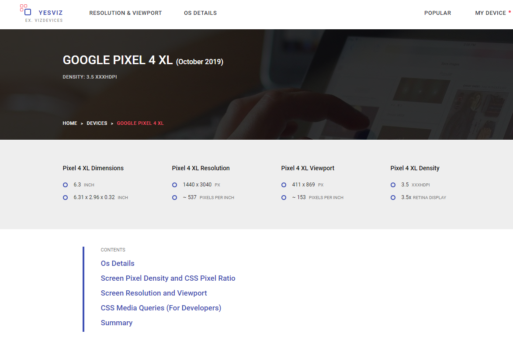

## 前言

作为 Web 开发人员，我们在工作中可能会接触移动端 Web 应用的开发。近年来移动端设备都是高分屏/视网膜屏，而且我们有各种尺寸的屏幕需要兼容：手机，平板，桌面端。在我们面前需要理解并运用的就是分辨率这个关键问题。
我们需要处理两种分辨率：一个是真正的设备屏幕分辨率，另一个便是 CSS 可测量的分辨率。

## 高分屏的新时代

在过去，这两种分辨率本质上是一致的。在现在，越来越多的手机、平板，甚至桌面端都采用了高分辨率的屏幕。CSS 分辨率和设备分辨率开始出现认知上的差异。

### 真正的不同之处

CSS 分辨率是在 CSS 样式中用来测量的单位，屏幕设备分辨率是实际的屏幕像素的数量。

除了两种分辨率的不同，还有密度显示比（DPR）--屏幕分辨率/CSS 分辨率，如：

- iPhone 11，每个 CSS 像素有 2 个设备像素，即 DPR 是 2x
- iPhone 11 Pro，每个 CSS 像素有 3 个设备像素，DPR 为 3x
- 三星 Galaxy S10，每个 CSS 像素有 4 个设备像素，DPR 为 4x

三星 Galaxy S10 的分辨率：

**设备分辨率**：1440px × 3040px

**CSS 分辨率**：360px × 760px

**密度显示比**：4x

### 为什么 CSS 像素与设备像素不同

为什么 Web 会出现两种不同的分辨率？答案其实是不得不这么做。

我们继续以 Galaxy S10 为例，它的屏幕分辨率为 1440px × 3040px。这个分辨率大小已经超过了部分桌面版的屏幕分辨率，而却被塞入非常小的设备中。如果不区分 CSS 分辨率和设备分辨率，桌面端的网站在手机上显示就会展现真实的宽度，我们就没有办法来创造手机和电脑不同样式的响应式网站。

### 设备分辨率的目的是什么

设备分辨率的主要针对的是多媒体，即图片，视频。在高分屏下，我们可以提供更清晰的图片和视频。如在 Galaxy S10 中，我们在 CSS 分辨率 300 像素下，可以加载宽度 1200 像素的图片：

```html

```

### 我们如何知道 CSS 分辨率是多少

我们可以通过 [yesviz](https://yesviz.com/) 来获取某一设备的具体分辨率信息。



## 写在最后

了解 CSS 分辨率和设备分辨率的区别可以让我们更好地理解响应式，针对不同分辨率提供不同尺寸地图片、视频充分发挥高分辨率地优势，为用户带来更好的体验。

## 参考

<https://medium.com/@elad/understanding-the-difference-between-css-resolution-and-device-resolution-28acae23da0b>
