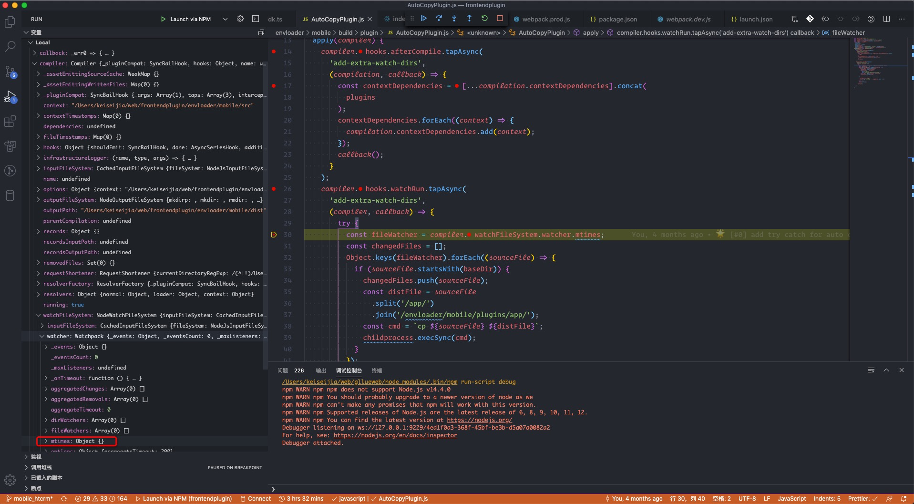
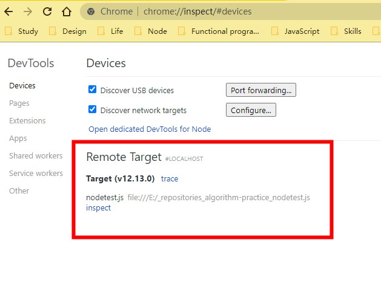

### 引言

作为前端工程师经常打交道的开发工具无非 IDE 编辑器 和 Chrome，在 Chrome 中调试是非常方便的，直接在 开发者工具的 `source` 栏打断点就可以了。那么，如果遇到需要写 node 相关的代码，比如 webpack 配置项，应该怎么调试来实现我们的需求呢？

### VS Code 配置

在 VS Code 中单独有 debug 的菜单，需要指定 `launch.json` 文件，该文件为 VS Code 提供启动调试所需的各项配置。

```json
// launch.json
// 使用 IntelliSense 了解相关属性。
// 悬停以查看现有属性的描述。
// 欲了解更多信息，请访问: https://go.microsoft.com/fwlink/?linkid=830387

{
  "version": "0.2.0",
  "configurations": [
    {
      "type": "node",
      "request": "launch",
      "name": "Launch via NPM",
      "runtimeExecutable": "npm",
      "runtimeArgs": ["run-script", "debug"],
      "cwd": "${workspaceFolder}/envloader/mobile",
      "port": 9229
    }
  ]
}
```

上面是我们项目的调试配置，`runtimeExecutable` 指明调试方式是 `npm` 方式，`runtimeArgs` 为执行调试传的参数，`cwd` 指定工作目录。

```json
// package.json

"scripts": {
    "debug": "node --max_old_space_size=12288 --inspect-brk node_modules/webpack/bin/webpack.js --config build/webpack.dev.js --watch"
  },
```

注意 `debug` 脚本要传入 `--inspect-brk`，这样才可以开启 node 的调试功能。

VS Code 调试菜单点击执行按钮，我们就可以愉快的调试 `webpack.dev.js` 代码了。



可以看到，webpack 内部的数据结构尽收眼底。

### Chrome 开发者工具风格

刚才的 `launch.json` 中，有 `port: 9229` 这个属性，我们可以在浏览器访问 `chrome://inspect` ，就能以我们熟悉的 chrome 风格来调试 node 程序了。



### 总结

调试程序能够帮助我们对代码有更深刻的了解，能够提供运行时的执行上下文、调用栈等信息。此外，在调试线上混淆后的代码时，对各种 a、o、f 等难以理解的变量名参数名也能通过运行时的变量数据轻易分析出代码的基本逻辑。
