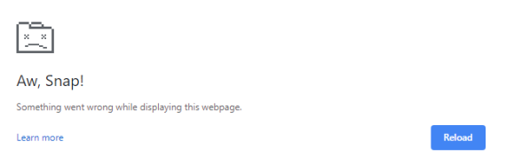
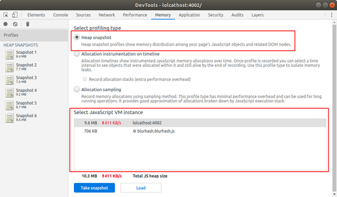

当我们从构建服务端渲染的网站切换到构建客户端渲染的单页面应用时，我们需要对用户设备上的资源格外小心。不能阻碍 UI 线程，不要使笔记本风扇快速旋转，不要榨干手机的电池等等。我们为了更好的交互和类似原生应用的体验而带来的这些问题是服务端渲染所不存在的。

其中一个很重要的问题是内存泄漏。一个糟糕实现的 SPA 可以轻松吃掉 MB 级内存甚至 GB 级的内存，甚至在后台 tab 中也会持续吞噬资源。这时页面开始变慢，甚至浏览器直接终结这个 tab：



当然，服务端渲染的网站也可能会在服务端出现内存泄漏。但它完全不像客户端的内存泄漏，因为浏览器在每次切换页面时都会清除内存。

关于内存泄漏的主题在 web 开发文献中并没有很好地覆盖。可以肯定的是，大多数的 SPA 应用都存在内存泄漏，除非这些团队有健壮的基础设施来捕获并修复内存泄漏。在 JavaScript 中太容易分配了内存却疏忽清理。

为什么没有多少人写有关内存泄漏的文章呢？大概如下：

- **没有多少抱怨**：没有多少用户在浏览网页时去用心关注任务管理器。通常，我们不会听到用户的抱怨，除非泄露非常严重使 tab 直接崩溃或应用变慢
- **缺少数据**：没有团队或应用提供测量网站存在多少内存泄露的功能
- **缺少工具**：现有的工具也很难简单去检查或修复内存泄漏
- **缺少关注**：浏览器会扼杀那些占用内存过多的 tab 页，用户更可能去抱怨浏览器而不是网站

在本文将来介绍一些修复内存泄漏的经验，并提供一些例子来高效鉴别它们。

### 内存泄漏剖析

现代 web 应用框架像 React，Vue 和 Svelte 都是基于组件的模型。在这种模型下，最常见的一种内存泄漏是：

```javascript
window.addEventListener('message', this.onMessage.bind(this));
```

这就会造成内存泄漏。如果在全局对象（`window`，`<body>` 等）上调用 `addEventListener` 却忘记在组件卸载时通过 `removeEventListener` 清除，那么就造成了内存泄漏。

更坏的是，我们直接泄露了整个组件。因为 `this.onMessage` 是绑定在 `this` 上，这个组件被泄露了。它的子组件也被泄露了，而且很有可能所有有关这些组件的 DOM 节点也被泄露了。这会很快变得糟糕。

可以通过下面来解决：

```javascript
// 挂载阶段
this.onMessage = this.onMessage.bind(this);
window.addEventListener('message', this.onMessage);

// 卸载阶段
window.removeEventListener('message', this.onMessage);
```

注意我们缓存了对绑定的 `onMessage` 函数的引用。必须向 `removeEventListener` 传入和 `addEventListener` 完全一样的函数，否则不会生效。

### 内存泄漏常见情况

常见的造成内存泄漏的 API：

1. `addEventListener`，最常见的一种。调用 `removeEventListener` 来清除。
2. [`setTimeout`](https://developer.mozilla.org/en-US/docs/Web/API/WindowOrWorkerGlobalScope/setTimeout) / [`setInterval`](https://developer.mozilla.org/en-US/docs/Web/API/WindowOrWorkerGlobalScope/setInterval)，如果创建了递归的计时器（如每 30 秒执行一次），那么需要通过 [`clearTimeout`](https://developer.mozilla.org/en-US/docs/Web/API/WindowOrWorkerGlobalScope/clearTimeout) 或 [`clearInterval`](https://developer.mozilla.org/en-US/docs/Web/API/WindowOrWorkerGlobalScope/clearInterval) 来清除。（如果 `setTimeout` 像 `setInterval` 那么使用会造成泄漏，即在 `setTimeout` 回调内部调用 `setTimeout`）。
3. [`IntersectionObserver`](https://developer.mozilla.org/en-US/docs/Web/API/IntersectionObserver)，[`ResizeObserver`](https://developer.mozilla.org/en-US/docs/Web/API/ResizeObserver)，[`MutationObserver`](https://developer.mozilla.org/en-US/docs/Web/API/MutationObserver)等。这些新的 API 非常方便，但是它们很容易造成泄漏。如果在一个组件中创建了它们，并且它绑定到了一个全局可见的元素上，那么需要调用 `disconnect()` 来清理。（注意垃圾回收 DOM 节点时，也会回收它们的监听器和 observer。所以通常只需要关心全局的元素，如 `<body>`，`document` 以及全局可见的 header/footer 元素等）。
4. [`Promises`](https://developer.mozilla.org/en-US/docs/Web/JavaScript/Reference/Global_Objects/Promise)，[`Observables`](https://rxjs.dev/guide/observable)，[`EventEmitters`](https://nodejs.org/api/events.html#events_class_eventemitter)等。如果忘记停止监听，那么任何模型上设置的监听器都可能泄漏。（一个 Promise 如果永远没有 resolved 或 rejected，那么任何附着的 `.then()` 回调都会泄漏。）
5. 全局保存的对象。像 [Redux](https://redux.js.org/) 的状态是存在全局对象下的，所以如果不加小心，可能会不断增加内存消耗，而它永远不会被清理。
6. 无尽的 DOM 增长。如果实现了一个无线滚动的功能而没有使用[虚拟化](https://github.com/WICG/virtual-scroller#readme)，那么 DOM 节点的数量会无限制的增长。

当然还有很多其他泄漏内存的方式，以上是比较常见的类型。

### 鉴别内存泄漏

在 Chrome 开发者工具中，我们主要使用 “Memory tab” 下面的 “Heap snapshot”：



当我们点击 “Take snapshot” 按钮，在页面的 JavaScript 虚拟机上就开始捕获所有的存活对象。包括被 `window` 引用的对象，被 `setInterval` 回调函数引用的对象等。将它看作该网页使用的所有内存的停滞时刻。

下一步是重现某些你认为会造成泄露的场景，例如，打开然后关闭一个对话框。一旦关闭对话框，期望内存会回到之前的水平。所以再记录一个快照，然后与之前的快照进行对比。

然而，需要意识到这个工具有一些限制：

1. 尽管点击了 “collect garbage” 按钮，可能也需要连续几次快照才能真正清除未引用的内存。（检查每次快照的总内存，它应该保持一样稳定。）
2. 如果存在 web workers，service workers，iframes，shared workers 等。那这些内存不会出现在 heap 快照中，因为它们存在于另一个 JavaScript 虚拟机中。可以捕获这部分内存，但是要确保你知道在测量哪一部分。
3. 有时候快照会卡住或崩溃。需要关闭浏览器 tab 然后重新开始。

看到这里，你或许会去看两个快照之间有哪些对象是被泄露了。这会变得有些棘手，因为那些对象不是所有的都是真的泄漏。许多只是正常的使用 -- 有些对象会因为是被另一个对象引用而再次被分配，有些是被某种方式缓存起来在将来被清除等。

### 参考

<https://nolanlawson.com/2020/02/19/fixing-memory-leaks-in-web-applications/>
