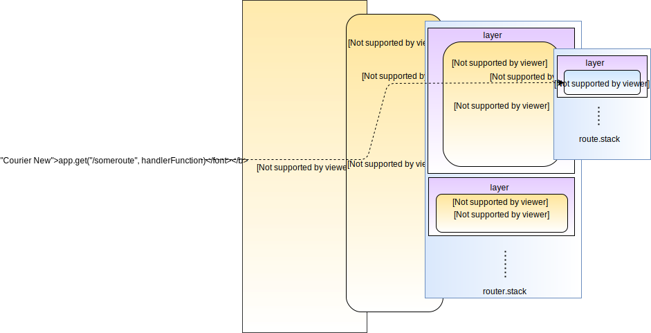
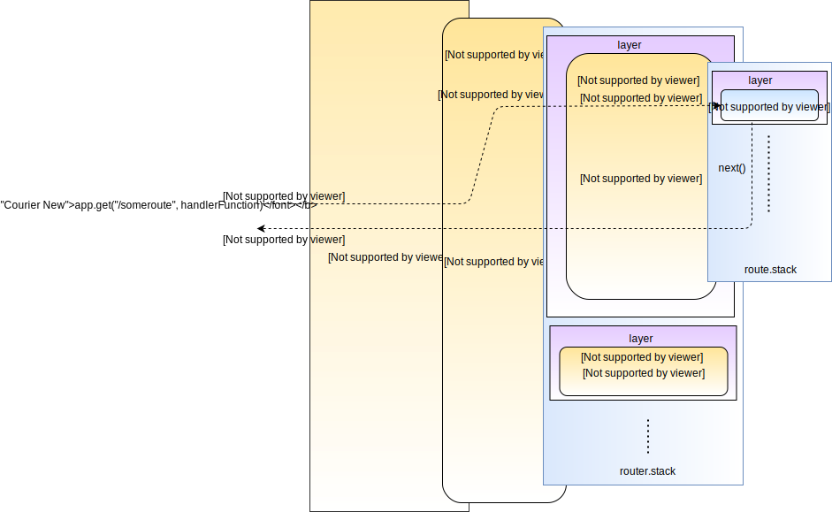

web 开发者想必都一定听说过 [express.js](https://expressjs.com/)。Express 是 node 中比较受欢迎的轻量的 web 服务器框架。

本文我们将通过分析 express 源码来了解在底层它是如何工作的。学习一个流行框架的原理，可以帮助我们更好地使用它们来构建应用程序，减少引入它们带来的“魔法”问题。

本文目录：

1. [“Hello World” 例子](#hello-world-example)
2. [创建新的 express 应用](#create-new-express-app)
3. [创建新的路由](#create-new-route)
   1. [分层](#layers)
4. [启动 HTTP 服务](#start-http-server)
5. [处理 HTTP 请求](#handle-http-request)
6. [其他](#everything-else)

> 为了更好地理解源码，将它 clone 到本地是比较好地方式，本文[使用的版本](https://github.com/expressjs/express/tree/c0136d8b48dd3526c58b2ad8666fb4b12b55116c)。
> 评论中的 `// ...` 是部分源码为了简洁做了省略。

### <a name="hello-world-example"></a>“Hello World” 例子

我们从官网的“Hello world”例子开始深入源码：

```javascript
const express = require('express');
const app = express();

app.get('/', (req, res) => res.send('Hello World!'));

app.listen(3000, () => console.log('Example app listening on port 3000!'));
```

上述代码启动了端口号 3000 的 HTTP 服务器，并在命中 `GET /` 路由后发送“Hello World!”文本响应。笼统地来讲，我们可以从以下四个阶段来分析：

1. 创建一个新的 express 应用
2. 创建一个新的路由
3. 基于给定的端口号启动 HTTP 服务器
4. 当有请求进来时做出对应处理

### <a name="create-new-express-app"></a>创建新的 express 应用

`const app = express()` 这个表达式可以创建一个新的 express 应用。在 [lib/express.js](https://github.com/expressjs/express/blob/c0136d8b48dd3526c58b2ad8666fb4b12b55116c/lib/express.js#L37) 中的 `createApplication` 函数是默认导出的对象，就是我们看到的 `express()` 函数调用。

比较关键的代码是：

```javascript
// ...
var mixin = require('merge-descriptors');
var proto = require('./application');

// ...

function createApplication() {
  // 这个是该函数返回的变量，具体我们会在后面讲到，重要的是要记住它的签名：function(req, res, next)
  var app = function(req, res, next) {
    app.handle(req, res, next);
  };

  // ...

  // `mixin` 函数将所有 `proto` 的方法合并至 `app`，我们例子中用到的 `get` 方法就是合并进来的
  mixin(app, proto, false);

  // ...

  return app;
}
```

从这个函数中返回的`app` 对象就是我们程序中用到的。`app.get` 方法通过 [merge-descriptors](https://github.com/component/merge-descriptors) 库中的 `mixin` 函数从 `proto` 中获取并添加的。

`proto` 它是从 [lib/application](https://github.com/expressjs/express/blob/c0136d8b48dd3526c58b2ad8666fb4b12b55116c/lib/application.js) 中导入的。

### <a name="create-new-route"></a>创建新的路由

我们下面来简单看一下 `app.get` 方法在[源码](https://github.com/expressjs/express/blob/c0136d8b48dd3526c58b2ad8666fb4b12b55116c/lib/application.js#L472)中的实现：

```javascript
var slice = Array.prototype.slice;

// ...
/**
 * Delegate `.VERB(...)` calls to `router.VERB(...)`.
 */

// `methods` 是一个包含 ['get', 'post', ...] 等 HTTP 方法的数组
methods.forEach(function(method) {
  // 这应该是 app.get 方法的签名
  app[method] = function(path) {
    // 一些初始化的代码

    // 在应用的 router 内部根据 path 创建一个 route
    var route = this._router.route(path);

    // 根据从第二个参数开始后续的参数来调用 handler
    route[method].apply(route, slice.call(arguments, 1));

    // 返回 `app` 实例，来使方法可以链式调用
    return this;
  };
});
```

这里实现比较巧妙的是，所有的 HTTP 动词方法，如 `app.get`，`app.post`，`app.put` 本质上功能都是类似的。如果我们只关注 `get` 方法，可以简化为：

```javascript
app.get = function(path, handler) {
  // ...
  var route = this._router.route(path);
  route.get(handler);
  return this;
};
```

尽管上面的函数有两个参数，它实际和 `app[method] = function(path){...}` 定义是相似的。第二个参数 `handler` 是在 slice.call(arguments, 1) 中获取的。

> 长话短说，`app.<method>` 只是在应用 router 中使用 `route` 方法保存 route，然后传递 `handler` 到 `route.<method>`

router 的 `route()` 方法在 [lib/router/index.js](https://github.com/expressjs/express/blob/c0136d8b48dd3526c58b2ad8666fb4b12b55116c/lib/router/index.js#L491) 中定义：

```javascript
// proto 是 `_router` 对象的原型定义
proto.route = function route(path) {
  var route = new Route(path);

  var layer = new Layer(
    path,
    {
      sensitive: this.caseSensitive,
      strict: this.strict,
      end: true,
    },
    route.dispatch.bind(route)
  );

  layer.route = route;

  this.stack.push(layer);
  return route;
};
```

`route.get` 方法的定义与 `app.get` 类似，在 [lib/router/route.js](https://github.com/expressjs/express/blob/c0136d8b48dd3526c58b2ad8666fb4b12b55116c/lib/router/route.js#L192) 中：

```javascript
methods.forEach(function(method) {
  Route.prototype[method] = function() {
    // `flatten` 将嵌套的数组转换成一维的数组
    var handlers = flatten(slice.call(arguments));

    for (var i = 0; i < handles.length; i++) {
      var handle = handles[i];

      // ...
      // 传给 route 的每个 handler 都会创建一个 layer，并添加到 route 栈中
      var layer = Layer('/', {}, handle);

      // ...

      this.stack.push(layer);
    }

    return this;
  };
});
```

每个 route 可以有多个 handler，并基于每个 handler 构造 `Layer` 并压入栈中。

#### <a name="layers"></a>分层

`_router` 和 `route` 都使用了同一类型的对象 `Layer`。我们可以从[构造函数的定义](https://github.com/expressjs/express/blob/c0136d8b48dd3526c58b2ad8666fb4b12b55116c/lib/router/layer.js#L33)来观察 layer 是用来做什么的：

```javascript
function Layer(path, options, fn) {
  // ...
  this.handle = fn;
  this.regexp = pathRegexp(path, (this.keys = []), opts);
  // ...
}
```

每个 layer 都有一个 path，一些 option 和一个待处理的函数。在我们的 router 中，这个函数是 `route.dispatch`(我们会在下面的章节介绍用途，它类似于将请求传递到单个路由)。在 route 中，这个函数就是我们定义的 handler 函数。

每个 layer 也有一个[处理请求](https://github.com/expressjs/express/blob/c0136d8b48dd3526c58b2ad8666fb4b12b55116c/lib/router/layer.js#L86)的函数：`handle_request`，在 Layer 初始化阶段真正执行传入的函数。

我们来回顾一下通过 `app.get` 方法创建一个 route：

1. 在应用的 router(`this._router`) 上创建一个 route
2. route `dispatch` 方法作为 handler 方法传递给 layer，这个 layer 压入 router 栈中
3. 请求的 handler 本身作为 handler 方法传递给 layer，这个 layer 压入 route 栈

在最后，所有的 handler 以在 route 栈内部的 layer 的形式存储到 `app` 中，`dispatch` 方法传递给 layer 并存储在 router 栈上。



处理 HTTP 请求也与此类似，我们随后来[了解](#handle-http-request)。

### <a name="start-http-server"></a>启动 HTTP 服务

在配置好路由之后，服务器开始启动。在我们的例子中调用了 `app.listen` 方法，传入了端口号和回调函数。可以通过 [lib/application.js](https://github.com/expressjs/express/blob/c0136d8b48dd3526c58b2ad8666fb4b12b55116c/lib/application.js#L616) 来了解：

```javascript
app.listen = function listen() {
  var server = http.createServer(this);
  return server.listen.apply(server, arguments);
};
```

看起来 `app.listen` 只是包装了一下 `http.createServer`。这是说的通的，回想一下[第一章](#create-new-express-app)，`app` 实际上是 function(req, res, next){...} 签名的函数，与 `http.createServer` 所需要的函数签名 function(req, res) {...} 是兼容的。

当意识到这些时你会发现这样非常简洁，express.js 所提供的所有能力可以总结为是一个非常高明的处理函数。

### <a name="handle-http-request"></a>处理 HTTP 请求

现在我们知道 `app` 实际是一个普通的请求处理对象，我们下面通过定位一个 HTTP 请求来最终定位到内部 handler 的位置。

从 [lib/express.js](https://github.com/expressjs/express/blob/c0136d8b48dd3526c58b2ad8666fb4b12b55116c/lib/express.js#L38) 中的 `createApplication` 函数：

```javascript
var app = function(req, res, next) {
  app.handle(req, res, next);
};
```

请求传递到 `app.handle` 的方法在 [lib/application.js](https://github.com/expressjs/express/blob/c0136d8b48dd3526c58b2ad8666fb4b12b55116c/lib/application.js#L158) 中定义：

```javascript
app.handle = function handle(req, res, callback) {
  // `this._router` 是我们从 `app.get` 处定义的路由
  var router = this._router;

  // ...

  // 请求进一步传递到 `handle` 方法
  router.handler(req, res, done);
};
```

`router.handler` 方法在 [lib/router/index.js](https://github.com/expressjs/express/blob/c0136d8b48dd3526c58b2ad8666fb4b12b55116c/lib/router/index.js#L136) 中定义：

```javascript
proto.handle = function handle(req, res, out) {
  var self = this;
  // ...
  // self.stack 是在调用时压入的所有layer
  var stack = self.stack;
  // ...
  next();

  function next(err) {
    // ...
    // 根据请求获取path name
    var path = getPathname(req);
    // ...
    var layer;
    var match;
    var route;

    while (match !== true && idx < stack.length) {
      layer = stack[idx++];
      match = matchLayer(layer, path);
      route = layer.route;

      // ...
      if (match !== true) {
        continue;
      }
      // ... 一些验证 HTTP 方法，headers 的校验代码
    }

    // ... 一些验证

    // 为 layer 处理所有参数
    self.process_params(layer, paramcalled, req, res, function(err) {
      if (route) {
        // 一旦参数处理完成， 就会调用 `layer.handler_request` 方法
        return layer.handle_request(req, res, next);
      }
    });
  }
};
```

简单来讲，`router.handle` 函数在它的栈上遍历所有的 layer，直到找到匹配 path 的请求。最终会调用 layer 的 `handle_request` 方法，执行先前定义过的 handler 函数。这个 handler 函数就是在 [lib/router/route.js] 中定义的 `dispatch` 方法：

```javascript
Route.prototype.dispatch = function dispatch(req, res, done) {
  var stack = this.stack;
  // ...
  next();

  function next(err) {
    // ...
    var layer = stack[idx++];

    // ... 一些校验和错误检查
    layer.handle_request(req, res, next);
    // ...
  }
};
```

与 router 类似，每个 route 遍历所有的 layer，调用它们的 `handle_request` 方法，即执行传递给 layer 的 handler 方法。最后，HTTP 请求到达应用的底层。



### <a name="everything-else"></a>其他

尽管我们看到了 express 来使 web 服务器工作的的核心代码，它还提供了很多其他的功能。我们跳过了许多必要的验证和所有的帮助函数。最后，一个非常关键的中间件功能，它能够帮助我们劫持所有请求并做出对应的处理。

### 参考

<https://www.sohamkamani.com/blog/2018/05/30/understanding-how-expressjs-works/>
