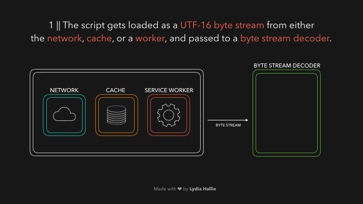

作为 JavaScript 开发人员，我们有必要了解关于 JavaScript 引擎的基础，它是如何将 JS 代码编译成机器码的。以下内容会以 V8 引擎为主。

---

HTML 解析器当遇到 `script` 标签时，源代码会从该 source 路径从**网络**，**缓存**或者安装的 **service worker** 中获取。响应的内容为字节流，将由字节流解码器接管，在下载时就开始进行解码。



解码器根据解码的字节生成**令牌（tokens）**。例如，`0066` 解码为 `f`，`0075` 解码为 `u`，`006e` 解码为 `n`，`0063` 解码为 `c`，`0074` 解码为 `t`，`0069` 解码为 `i`，`006f` 解码为 `o`，`006e` 解码为 `n` 并附带一个空格。就像编写的 `function`，这是一个保留的关键字，口令生成后会被发送至解析器（还有预解析器，将在后面解释）。其余的字节流也如此解码。


引擎使用两种解析器：预解析器和解析器。为了减少加载网站的时间，引擎尽量避免立即解析非必要的代码。预解析器处理将来可能用到的代码，解析器处理当前用到的代码。如果一个函数只在用户点击按钮后调用，那么在网站加载时就不需要立即去编译这部分代码。如果用户最终按下按钮并请求该段代码，它会被发送至解析器。

解析器基于从字节流解码器接受的令牌来创建节点。通过这些节点来创建抽象语法树（Abstract Syntax Tree）。


下一步是**解释器（interpreter）**的工作。解释器遍历 AST 并基于 AST 包含的信息生成**字节码**。一旦字节码完全生成，AST 会被删除，在内存中释放。最终我们得到了机器可运行的代码。


尽管机器码很快，但它还可以更快。在机器码运行时，某些信息也会随之生成。引擎可以检测出哪些行为是经常发生的，哪些数据类型被使用。可能有一个函数被调用了很多次，那么引擎就可以对此进行优化使其执行更快。

机器码和生成的类型反馈信息会被发送至**优化编译器（optimizing compiler）**。该编译器根据这些数据生成高度优化过的机器码。


JavaScript 是一种动态类型语言，意味着数据的类型可以不断变化。如果 JavaScript 引擎每次都要检查某个值的数据类型无疑是非常低效的。

为了减少解释代码的时间，优化过的机器码只处理引擎之前遇到的运行的字节码的情况。如果我们重复使用那段代码并返回相同的数据类型，优化过的机器码可以直接重复使用来加快运行。然而，当同一段代码返回了不同类型的数据，机器码未优化，引擎只能回退到解释生成的字节码的阶段。

例如下面的 sum 函数，它每次调用接收数字类型的参数：

```javascript
function sum(a, b) {
  return a + b;
}

sum(1, 2);
```

结果返回了 `3`，下次我们调用，它会假设我们仍然传入两个数字的值。

如果是这样的，不需要动态检索，引擎可以直接使用优化过的机器码。否则，如果假设是错误的，它会回退到最初的字节码而不是优化过的机器码。

例如，下次我们调用时传入了一个字符串参数：

```javascript
function sum(a, b) {
  return a + b;
}

sum('1', 2);
```

这会使数字 `2` 强制转换成字符串，函数最终会返回字符串 `"12"`。引擎会执行解释过的字节码并更新类型反馈。

### 相关推荐

[V8 文档](https://v8.dev/) | [V8 Github](https://github.com/v8/v8) | [Chrome University 2018: Life Of A Script](https://www.youtube.com/watch?v=voDhHPNMEzg&t=729s%3Cbr%3E%0A)

### 参考

<https://dev.to/lydiahallie/javascript-visualized-the-javascript-engine-4cdf>
