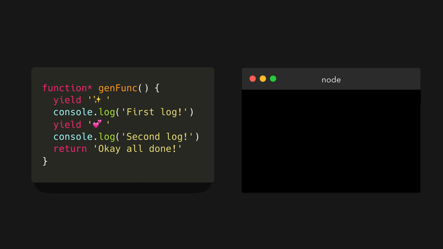

generator 函数不同于通常的函数，运行就结束。我们可以任意暂停函数的执行，并在合适时机输出。

通过在 `function` 关键字后面添加 `*` 创建 generator 函数。

```javascript
// function *generatorFunction() {} 这样也是可以的
function* generatorFunction() {}
```

generator 函数与普通函数实际上工作方式完全不同：

- 调用 generator 函数返回**生成器对象**，实际上是一个迭代器
- 我们可以使用 `yield` 关键字来“暂停”执行


```javascript
function* genFunc() {
  yield ':sparkles:';
  console.log('First log!');
  yield ':two_hearts:';
  console.log('Second log!');
  return 'Done!';
}
```

当遇到 `yield` 关键字时，generator 函数的执行会暂停。下次我们再运行该函数时，它会记住上次暂停的位置，并从该位置开始执行：

1. 第一次执行，它在第一行暂停，并 _产出_ 字符串:sparkles:
2. 第二次执行，从上一个 `yield` 关键字的行开始，直到遇到第二个 `yield` 关键字并 _产出_ :two_hearts:
3. 第三次执行，从上一个 `yield` 关键字的行开始，直到遇到 `return` 关键字，并 _返回_ `Done!`

当调用 generator 函数返回了生成器对象，我们下次该如何调用呢？生成器对象在原型链上拥有一个 `next` 方法，这个方法是用来迭代生成器对象的。




调用 `next` 方法返回值为一个对象，包含 `value` 属性和 `done` 属性，`value` 的值就产出的值，`done` 是一个布尔值，只有遇到 _return_ 时才会置为 `true`。


当 `done` 为 `true` 时，再次调用 next()，返回的 `value` 会永远为 `undefined`。

---

那什么是迭代器呢？它可以在 `for ... of` 循环和扩展运算符中使用。


为什么迭代器如 array，string，map 和 set 可以迭代呢？实际上它们都实现了 _迭代器协议_ ：`[Symbol.iterator]`。


---

生成器一个最大的优势是它们可以**惰性求值**。这意味着每次调用 `next` 方法才返回值，只在我们需要是才会计算。


### 参考

<https://dev.to/lydiahallie/javascript-visualized-generators-and-iterators-e36>
