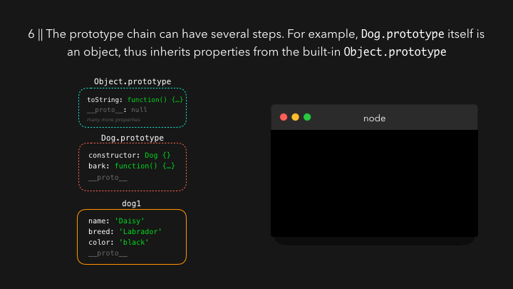

当我们对字符串，数组或对象使用内置的方法或属性如 `.length`，`.split()`，`.join()` 等时，这是通过 _原型继承（prototypal inheritance）_ 的方式使得我们可以直接调用。

我们经常创建相同类型的多个对象。比方说我们有一个展示宠物狗的网站。对于每个宠物狗，我们需要对应的对象来表示。我们可以通过使用 `new` 关键字调用构造函数来创建 Dog**实例**。每个 Dog 都有一个 name，breed，color 和 bark 方法。

```javascript
function Dog(name, breed, color) {
  this.name = name;
  this.breed = breed;
  this.color = color;
  this.bark = function() {
    return 'Woof!';
  };
}
```

当我们创建 `Dog` 这个构造函数时，它并不是唯一被创建的。相应的，还自动创建了另一个称为 _prototype_ 的对象。默认情况下，该对象有一个 _constructor_ 属性，是指向原始构造函数的引用，本例中指向 `Dog`。


在 Dog 构造函数上的 `prototype` 属性不可枚举。

```javascript
const dog1 = new Dog('Daisy', 'Labrador', 'black');

const dog2 = new Dog('Jack', 'Jack Russell', 'white');
```


我们看到除了 `name`, `breed`, `color`, `bark` 之外还有一个 `__proto__` 属性，它也是不可枚举的，就是说我们访问对象时它通常不可见。我们来展开一下：


可以看到 `__proto__` 实际上是 `Dog.prototype` 对象的引用。这就是**原型继承**：每个构造函数的实例都能够访问构造函数的原型。


每个 Dog 都有 `bark` 方法，为了节省每创建一个实例时都要添加该方法消耗的内存，我们可以把它添加到 `Dog.prototype` 对象上。


当我们在实例上访问属性时，引擎会先在当前实例上查找，如果没有找到，引擎会继续通过 `__proto__` 属性向上层原型链来查找。


`Dog.prototype` 本身也是一个对象，就是说它本身是 `Object` 构造函数的实例，`Dog.prototype` 上也有 `__proto__` 属性，它是指向 `Object.prototype` 的引用。


现在我们知道了所有内置的方法都是来自原型链。

例如 `.toString()` 方法，它不是定义在 `dog1` 上，也不在 `dog1.__proto__` 指向的 `Dog.prototype` 上，而是在 `Dog.prototype.__proto__` 对象指向的 `Object.prototype` 上。



目前为止我们使用的构造函数（`function Dog() { ... }`）都是基本的 JavaScript 语法。ES6 引入了新的语法来创建构造函数：class。

> Class 只是构造函数的语法糖。底层还是原型链的方式工作。

我们通过 `class` 关键字创建 classes，每个 class 都有一个 `constructor` 函数，就像之前 ES5 的语法，添加到原型上的属性可以直接在 classes 体上定义。


classes 另一个好处是可以方便**继承**其他 classes。

```javascript
class Dog {
  constructor(name) {
    this.name = name;
  }

  bark() {
    return 'Woof!';
  }
}

class Chihuahua extends Dog {
  constructor(name) {
    super(name);
  }

  smallBark() {
    return 'Small woof!';
  }
}

const myPet = new Chihuahua('Max');
```

`myPet` 能够访问 `Chihuahua.prototype` 和 `Dog.prototype` 对象（还有 `Object.prototype`）。


原型链也是有尽头的， `Object.prototype.__proto__` 的值为 `null`。当我们尝试访问未出现在原型链上的属性时，返回 `undefined`。


我们还可以通过 `Object.create` 方法创建对象，通过传入对象参数，返回的对象的原型指向传入的参数。

```javascript
const person = {
  name: 'Lydia',
  age: 21,
};

const me = Object.create(person);
```

通过控制台来看：


我们没有向 `me` 对象上添加任何属性，它只有一个 `__proto__` 属性，`__proto__` 属性指向了我们定义作为原型的对象：`person`，它有 `name` 和 `age` 属性。

### 参考

<https://dev.to/lydiahallie/javascript-visualized-prototypal-inheritance-47co>
