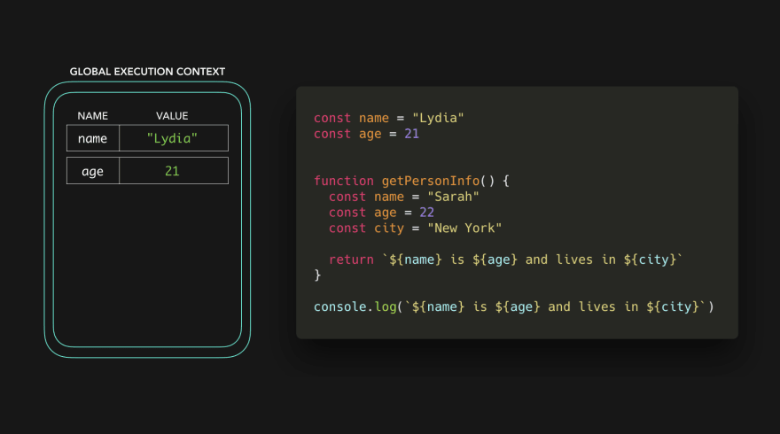

本文假设读者已了解执行上下文的基本概念。

我们首先来看以下代码：

```javascript
const name = 'Lydia';
const age = 21;
const city = 'San Francisco';

function getPersonInfo() {
  const name = 'Sarah';
  const age = 22;

  return `${name} is ${age} and lives in ${city}`;
}

console.log(getPersonInfo());
```

我们调用 `getPersonInfo` 函数时，返回了一串包含 `name`, `age` 和 `city` 变量的字符串：`Sarah is 22 and lives in San Francisco`。但是 `getPersonInfo` 函数内并没有声明变量 `city，它是怎么得到的呢？

JavaScript 引擎为不同上下文设置了内存空间。我们有默认的**全局上下文**（浏览器中为`window`，Node 中为`global`），调用 `getPersonInfo` 函数的**本地上下文**。每个上下文都有一个作用域链。

对于 `getPersonInfo` 函数，作用域链看起来如下：


作用域链本质上来说是对对象的引用链，这些对象包含对该执行上下文中可引用的值（和其他作用域）的引用。作用域链在执行上下文创建时一同创建，就是说是在运行时创建的。

在本文中对活动对象（activation object）、执行上下文不做过多描述，只来聚焦于作用域。在下面的例子中，执行上下文中的键值对代表作用域链对变量的引用。


全局执行上下文中的作用域链中有 3 个变量的引用：`name: Lydia`，`age: 21` 和 `city: San Francisco`。在本地上下文中，我们有两个变量的引用：`name: Sarah` 和 `age: 22`。

当我们在 `getPersonInfo` 函数中访问这些变量时，引擎会首先去检查本地作用域链。


在本地作用域链中只找到了 `name` 和 `age`，那么 `city` 应该去哪获取呢？实际上 JavaScript 引擎如果在当前作用域找不到，会跳到上层作用域直至找到或者返回 `ReferenceError`，本例中在全局对象中找到了 `city` 变量。


在全局上下文中，我们声明了值为 `San Francisco` 的 `city` 变量，`getPersonInfo` 函数得以找到该变量。

---

我们可以向外层作用域链但不能向内部去寻找。


或者更高层：


---

我们再来看下面的例子：



和一开始的例子类似，不过有个最大的不同点：我们只在 `getPersonInfo` 函数内部声明了 `city` 变量。我们没有调用 `getPersonInfo` 函数，所以没有本地上下文被创建。我们尝试在全局上下文中获取 `name`, `age` 和 `city` 变量。


在全局作用域中找不到 `city` 变量，没有更外层的作用域来查找，抛出了 `ReferenceError`。

---

除了全局和本地作用域，还有**块级作用域**。通过 `let` 或 `const` 关键字声明的变量的作用域在距`{}`最近的内部。

```javascript
const age = 21;

function checkAge() {
  if (age < 21) {
    const message = 'You cannot drink!';
    return message;
  } else {
    const message = 'You can drink!';
    return message;
  }
}
```


我们创建了一个全局作用域，函数作用域和两个块级作用域。我们能够声明两次 `message`，因为该变量的作用域是在大括号内的。

---

快速回顾：

- 作用域链实际是对我们在当前上下文中访问的值的链式的引用。
- 得益于作用域链向上查找的规则，我们可以使用上层作用域已声明过的变量。

### 参考

<https://dev.to/lydiahallie/javascript-visualized-scope-chain-13pd>
