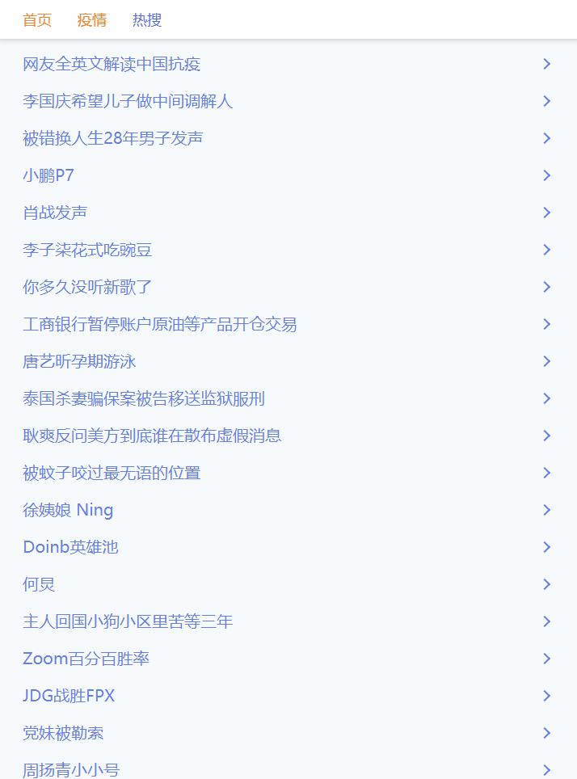
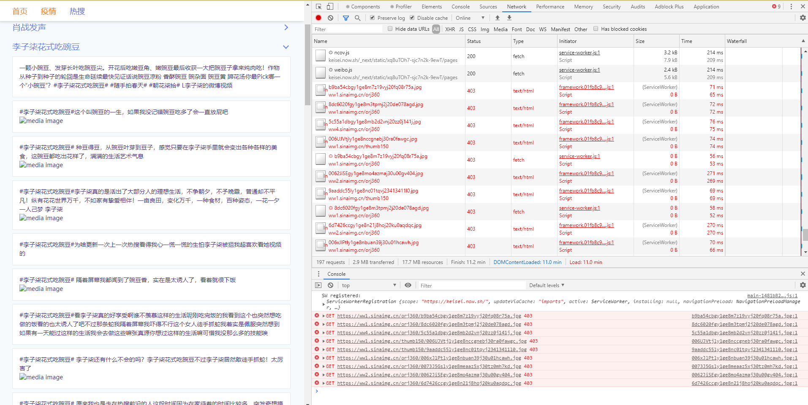
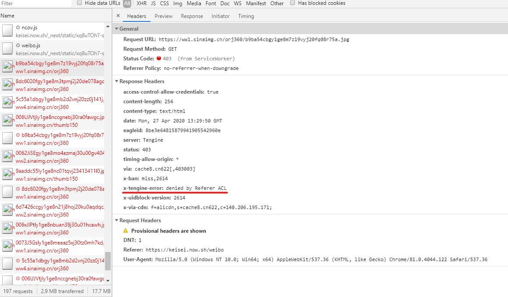
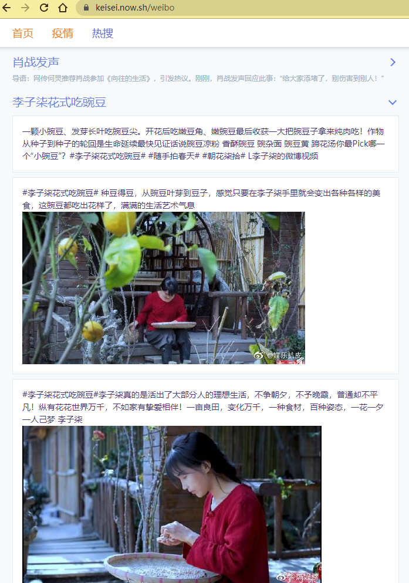
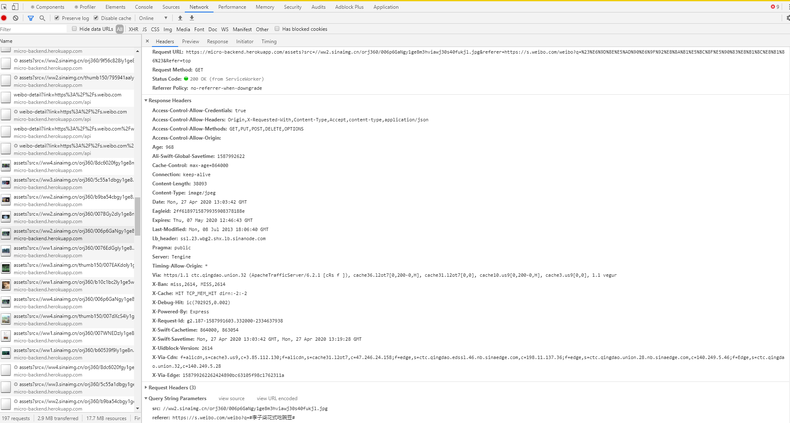

### 前言

最近笔者利用休息时间仿了一波[微博热搜](https://keisei.now.sh/weibo)页面，简单来讲就是在[服务端](https://github.com/keisei77/micro-backend/blob/master/route/weibo.js)利用 [cheerio](https://cheerio.js.org/) 解析页面 html，提取热搜标题，并根据标题展开每个热搜的详细内容。



文字内容可以很简单的提取，但是热搜中出现的图片想要直接拿来显示并非易事。

### 遇到问题

图片的 src 直接可以通过解析提取，如果直接拿来在我们的域名上显示会出现一个奇怪的问题：



所有的图片都没有显示。

具体来看图片的请求：



结果发现 403 被禁用，response header 中有一个 `x-tengine-error: denied by Referer ACL`，经过[网上的搜索发现](https://blog.csdn.net/johnny_mu/article/details/105166878)应该是微博为了图片不被他人使用做了防盗链的校验，但是这个措施只是相当于校验了白名单中的 referer。那么我们有没有可能为图片的请求加上 referer 这个 header 呢？

### 解决方案

由于使用了免费的后端服务，所以我们没办法添加 nginx 做反向代理。但我们还可以通过服务器来劫持对图片发起的请求：

我们指定图片的 src 是一串我们自己服务器的请求，把图片真实的地址和 referer 地址通过 query 的方式带入：

```html

```

在服务器端我们解析 query 并通过 req.pipe 来还原真实请求结果：

```javascript
const request = require('request');

const weiboAssetsHandler = async (req, res) => {
  try {
    const { src, referer } = req.query;
    const options = {
      url: src,
      headers: {
        Referer: encodeURI(referer),
      },
    };
    req.pipe(request(options)).pipe(res);
  } catch (error) {
    res.status(400).json({
      error: error.message,
    });
  }
};

server.get('/assets', weiboAssetsHandler);
```

通过这番操作，我们再来看请求：



可以看到，图片真实的出现在了我们自己的网站。

再看一下我们的请求已经可以成功返回 200：



### 总结

虽然说这么做会有损微博的利益，但是我们也从中学到了一些处理请求转发的小技巧。
正所谓道高一尺魔高一丈，正是有了互联网的攻防才能促进我们的行业更加安全，更能保障用户的权益。
