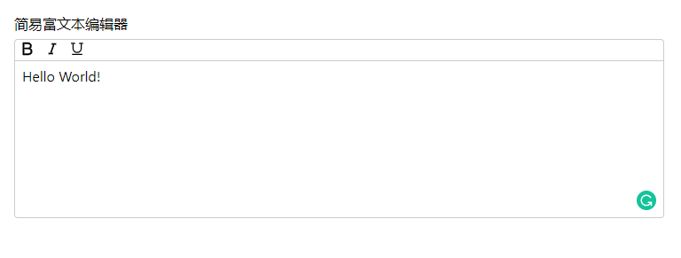
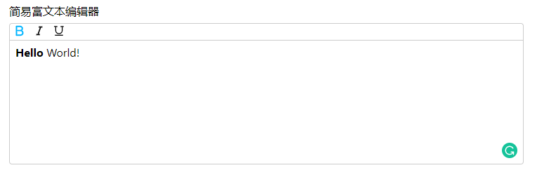
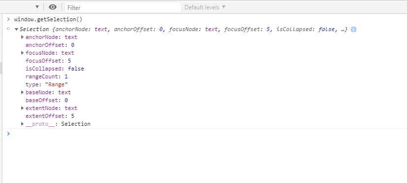
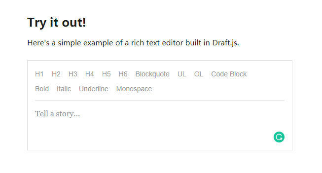
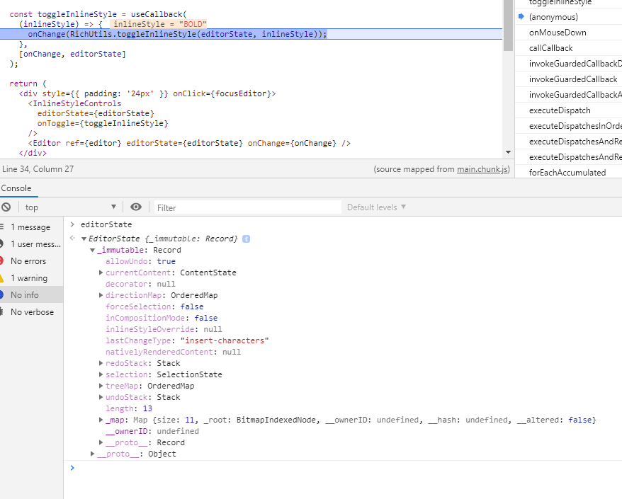

### 前言

之前曾有打算做一个富文本编辑器，最近花了一些时间开始开发，目前处于原型开发阶段。这其中遇到了一些棘手的问题，在此先记录一下。

### 初步构建

通过 CRA（[create-react-app](https://github.com/facebook/create-react-app)）快速搭建项目。
根据常见的编辑器样式，确定分为工具栏和输入框组件。



#### 工具栏

工具栏暂定加粗、斜体、下划线三种样式。

```jsx
const Toolbar = (props: Toolbar) => {
  const { toolbarState, toolbarDispatch } = props;

  return (
    <>
      <Toggle
        type="bold"
        label="粗体"
        enabled={toolbarState.bold}
        onClick={() =>
          toolbarDispatch({ type: 'bold', payload: toolbarState.content })
        }
      >
        <BoldSvg enabled={toolbarState.bold} />
      </Toggle>
      <Toggle
        type="italic"
        label="斜体"
        enabled={toolbarState.italic}
        onClick={() =>
          toolbarDispatch({ type: 'italic', payload: toolbarState.content })
        }
      >
        <ItalicSvg enabled={toolbarState.italic} />
      </Toggle>

      <Toggle
        type="underline"
        label="下划线"
        enabled={toolbarState.underline}
        onClick={() =>
          toolbarDispatch({ type: 'underline', payload: toolbarState.content })
        }
      >
        <UnderlineSvg enabled={toolbarState.underline} />
      </Toggle>
    </>
  );
};
```

工具栏部分主要是各种按钮，以及点击时应该执行的 action。

这里工具栏 Icon 采用了 svg 文件，这样我们可以修改它的 fill 属性来向用户表明是否是选中的：



#### 输入框

输入框部分，我们不能使用 textarea 标签来渲染的原因是不能对它的内容改变样式。我们使用了 `contentEditable` 属性来使 div 变为可编辑状态。

另外，我们需要在输入时重置光标的位置，否则光标会一直在文本首位闪烁。

```jsx
const resetCaret = (el: HTMLElement) => {
  const tailNode = document.createTextNode('');
  el.appendChild(tailNode);

  const isTargetFocused = document.activeElement === el;

  if (tailNode !== null && tailNode.nodeValue !== null && isTargetFocused) {
    const selection = window.getSelection();

    if (selection) {
      const range = document.createRange();
      range.setStart(tailNode, tailNode.nodeValue.length);

      range.collapse(true);

      selection.removeAllRanges();
      selection.addRange(range);
    }

    if (el instanceof HTMLElement) el.focus();
  }
};

const Textarea = (props: Textarea) => {
  const { content, changeHandler } = props;
  const elRef = useRef < HTMLDivElement > null;

  const isMount = !!elRef.current;
  useEffect(() => {
    if (!elRef.current) return;
    if (content !== elRef.current.innerHTML) {
      elRef.current.innerHTML = content;
    }
    resetCaret(elRef.current);
  }, [content, isMount]);

  return (
    <div
      id="textarea"
      contentEditable
      ref={elRef}
      onInput={event => changeHandler(event)}
      onBlur={event => changeHandler(event)}
      onKeyUp={event => changeHandler(event)}
      onKeyDown={event => changeHandler(event)}
    >
      {content}
    </div>
  );
};
```

#### 那么我们是如何知道用户选择了哪些文本呢？

我们可以通过 `window.getSelection()` 这个函数来获取用户选择的文本对象。



当选择上面的 `Hello` 时，可以看到输出了各种 Node 和各种 Offset，我们可以简单通过这些 Offset 来确定当前选中的文本。

```javascript
  function reducer(state: ToolbarState, action: ToolbarAction) {
    const currentSelection = window.getSelection();
    if (currentSelection) {
      const selectedContent = currentSelection.toString();
      let currentContent = null;
      switch (action.type) {
        case 'bold':
          currentContent = state.content.replace(
            selectedContent,
            `<span style="font-weight: 700;">${selectedContent}</span>`
          );
          return { ...state, bold: !state.bold, content: currentContent };
        case 'italic':
          currentContent = state.content.replace(
            selectedContent,
            `<span style="font-style: italic;">${selectedContent}</span>`
          );
          return { ...state, italic: !state.italic, content: currentContent };
        case 'underline':
          currentContent = state.content.replace(
            selectedContent,
            `<span style="text-decoration: underline;">${selectedContent}</span>`
          );
          return {
            ...state,
            underline: !state.underline,
            content: currentContent,
          };
        case 'change':
          return { ...state, payload: action.payload };
      }
    } else if (action.type === 'change') {
      return { ...state, payload: action.payload };
    } else {
      return state;
    }
  }

  const [toolbarState, toolbarDispatch] = useReducer<
    Reducer<ToolbarState, ToolbarAction>
  >(reducer, {
    content: '<div>Hello World!</div>',
    bold: false,
    italic: false,
    underline: false,
  });
```

这部分是目前实现比较挫的地方，简单使用了 `useReducer` 来简化 setState 操作。可以看到这部分代码存在一些问题，首先由于 `contentEditable` 存在的缘故，用户输入的任何内容其实 React 并不能控制，我们只能通过各种事件的回调拿到 target 中的 innerHTML(TODO: innerText 是不是更好)

当然我们可以通过 `document.execCommand()` 方法来传入对应的命令生成格式化的文本，但为了更深入地实现文本的可编辑性，我们暂时不考虑这种现成的 API。

### 开源 draft.js 体验

[draft.js](https://draftjs.org/) 是 facebook 团队开源的 React 版富文本编辑器库，官方提供了一个简易的 Demo：



```html
<div class="RichEditor-editor">
  <div class="DraftEditor-root">
    <div class="DraftEditor-editorContainer">
      <div
        aria-describedby="placeholder-7k0cv"
        class="notranslate public-DraftEditor-content"
        contenteditable="true"
        role="textbox"
        spellcheck="false"
        style="outline: none; user-select: text; white-space: pre-wrap; overflow-wrap: break-word;"
      >
        <div data-contents="true">
          <div
            data-block="true"
            data-editor="7k0cv"
            data-offset-key="b6so6-0-0"
          >
            <div
              data-offset-key="b6so6-0-0"
              class="public-DraftStyleDefault-block public-DraftStyleDefault-ltr"
            >
              <span data-offset-key="b6so6-0-0" style="font-weight: bold;">
                <span data-text="true">hello</span>
              </span>
            </div>
          </div>
        </div>
      </div>
    </div>
  </div>
</div>
```

当实现粗体时，可以看到生成的 html 中，多出了一段`font-weight: bold;`的 span，其中很关键的一处是节点上有 offset-key 的 dataset，`b6so6-0-0` 第一段为标识文本片段的随机字符串，第二段目的不明，第三段为各种样式的索引值。

那么是如何实现的呢？

首先我们来创建编辑器：

```jsx
import React, { useState, useEffect, useCallback } from 'react';
import { Editor, RichUtils, EditorState } from 'draft-js';
import InlineStyleControls from './InlineStyleControls';
import 'draft-js/dist/Draft.css';

function DraftEditor() {
  const [editorState, setEditorState] = useState(EditorState.createEmpty());

  const editor = React.useRef(null);

  function focusEditor() {
    if (editor.current) {
      (editor as any).current.focus();
    }
  }

  useEffect(() => {
    focusEditor();
  }, []);

  const onChange = useCallback((editorState) => {
    return setEditorState(editorState);
  }, []);

  const toggleInlineStyle = useCallback(
    (inlineStyle) => {
      onChange(RichUtils.toggleInlineStyle(editorState, inlineStyle));
    },
    [onChange, editorState]
  );

  return (
    <div style={{ padding: '24px' }} onClick={focusEditor}>
      <InlineStyleControls
        editorState={editorState}
        onToggle={toggleInlineStyle}
      />
      <Editor ref={editor} editorState={editorState} onChange={onChange} />
    </div>
  );
}

export default DraftEditor;
```

我们以加粗为例，当点击加粗按钮时，实际上会调用 `RichUtils.toggleInlineStyle()` 方法：


这里 `editorState` 是我们通过 `EditorState.createEmpty()` 创建的 immutable 的初始状态，可以看到初始化了 currentContent,redoStack,selection,treeMap,undoStack 等属性。

`toggleInlineStyle`内部实现：

```javascript
function toggleInlineStyle(editorState, inlineStyle) {
  // 首先获取用户选择的文本
  var selection = editorState.getSelection();
  // 获取当前 style
  var currentStyle = editorState.getCurrentInlineStyle();

  // ...

  // 获取当前文本内容
  var content = editorState.getCurrentContent();
  var newContent;

  // 如果当前 style 中已有需要设置的 style，那直接去除，否则新增样式。
  // 这里调用了 DraftModifier 模块来更新样式
  if (currentStyle.has(inlineStyle)) {
    newContent = DraftModifier.removeInlineStyle(
      content,
      selection,
      inlineStyle
    );
  } else {
    newContent = DraftModifier.applyInlineStyle(
      content,
      selection,
      inlineStyle
    );
  }

  return EditorState.push(editorState, newContent, 'change-inline-style');
}
```

`DraftModifier.applyInlineStyle` 内部简单调用了 `ContentStateInlineStyle.add(contentState, selectionState, inlineStyle);`

```javascript
var ContentStateInlineStyle = {
  add: function add(contentState, selectionState, inlineStyle) {
    return modifyInlineStyle(contentState, selectionState, inlineStyle, true);
  },
  remove: function remove(contentState, selectionState, inlineStyle) {
    return modifyInlineStyle(contentState, selectionState, inlineStyle, false);
  },
};

function modifyInlineStyle(
  contentState,
  selectionState,
  inlineStyle,
  addOrRemove
) {
  var blockMap = contentState.getBlockMap();
  var startKey = selectionState.getStartKey();
  var startOffset = selectionState.getStartOffset();
  var endKey = selectionState.getEndKey();
  var endOffset = selectionState.getEndOffset();

  // 这里 blockMap 为 immutable 类型，skipUntil，takeUntil，concat 可以简单理解为跳过某部分，获取某部分，最终获取 startKey，endKey 之间的内容。
  var newBlocks = blockMap
    .skipUntil(function(_, k) {
      return k === startKey;
    })
    .takeUntil(function(_, k) {
      return k === endKey;
    })
    .concat(Map([[endKey, blockMap.get(endKey)]]))
    .map(function(block, blockKey) {
      var sliceStart;
      var sliceEnd;

      // 这里是确定分片的起止位置
      if (startKey === endKey) {
        sliceStart = startOffset;
        sliceEnd = endOffset;
      } else {
        sliceStart = blockKey === startKey ? startOffset : 0;
        sliceEnd = blockKey === endKey ? endOffset : block.getLength();
      }

      var chars = block.getCharacterList();
      var current;

      // 针对每个字符确定样式
      while (sliceStart < sliceEnd) {
        current = chars.get(sliceStart);
        chars = chars.set(
          sliceStart,
          addOrRemove
            ? CharacterMetadata.applyStyle(current, inlineStyle)
            : CharacterMetadata.removeStyle(current, inlineStyle)
        );
        sliceStart++;
      }

      return block.set('characterList', chars);
    });
  return contentState.merge({
    blockMap: blockMap.merge(newBlocks),
    selectionBefore: selectionState,
    selectionAfter: selectionState,
  });
}
```

### 总结

在线编辑器虽然目前是非常常见的一个功能，但是想要做到优秀的体验和强大的能力，并不是那么容易实现的。此外，通过阅读优秀项目的源码，可以为我们的工作提供一些新的思路，也能提高阅读源码的能力和速度。
