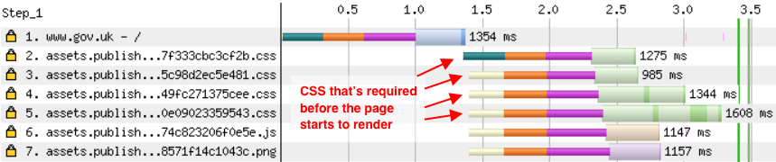
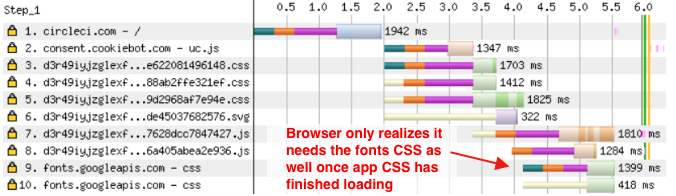
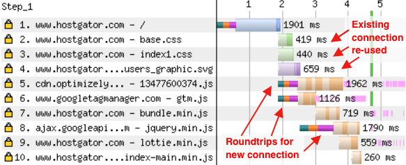
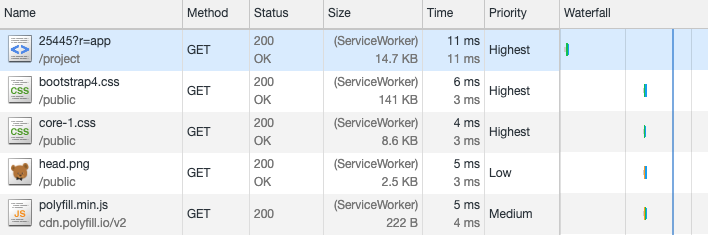
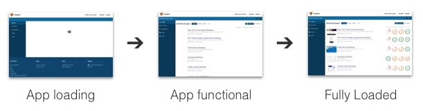
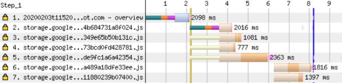
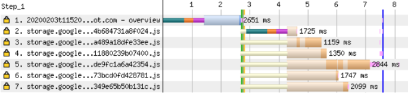
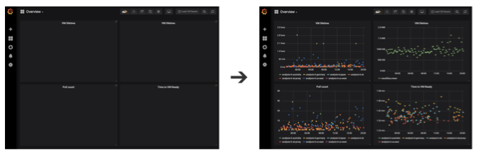

本文来介绍一些能够使 Web 应用加载更快，用户体验更好的技术。

从整个前端架构来看，如何能够第一时间加载最需要的资源，最大化利用已经缓存过的资源？

在此我们不会阐述过多如何优化渲染时间以及后端应如何分发资源。

### 概览

我们将应用的加载分为三个不同的阶段：

1. 初始化渲染 - 在用户看到任何画面之前需要加载多长时间？
2. 应用加载 - 在用户能够使用之前需要加载多长时间？
3. 下一页 - 在跳转到下一页时需要加载多长时间？


### 初始渲染

在浏览器初始渲染之前用户看不到任何东西。渲染页面至少需要加载 HTML 文档，而且大多数还需要加载额外的资源，如 CSS 和 JavaScript 文件。一旦这些资源可用，浏览器开始在屏幕上渲染画面。

网站的请求瀑布流大概如下：



这个 HTML 文档加载了大量额外的文件，一旦加载完成页面开始渲染。注意到 CSS 文件是并行加载的，所以每个新的请求不会增加非常明显的延迟。

（gov.uk 现在启用了[HTTP/2](https://twitter.com/TheRealNooshu/status/1225403389158227971)，所以当前域名下的资源可以重新利用现有的连接。）

#### 减少阻塞渲染的请求

样式文件和（默认）脚本元素会阻塞渲染任何在它们下面的内容。

可以有几种方式来解决：

- 在 body 最底部放置 script 标签
- 通过 `async` 来异步加载脚本
- 如果需要同步加载可以通过 inline 方式拆入 JS 或 CSS 片段

#### 避免阻塞渲染的顺序请求链

网站加载慢与阻塞渲染的请求数量关系不是特别大，更重要的是每个资源的文件大小，并且浏览器何时去加载该资源。

如果浏览器发现它在另一个请求完成后才需要加载某文件，这就形成了一个同步请求链。可能会有几种原因：

- CSS 中使用了 @import
- 在 CSS 文件中引用了 Web 字体
- JavaScript 注入了链接或 script 标签

可以看下面的例子：



该网站 CSS 文件中使用了 @import 来加载 google 字体，就意味着浏览器需要从一个文件请求另一个文件：

1. HTML 文档
2. 应用 CSS
3. 谷歌字体 CSS
4. 谷歌字体 Woff 文件（瀑布流中没显示）

要解决这个问题，首先从 @import 引入的谷歌字体 CSS 文件迁到 HTML 文档的 link 标签中。这从请求链中减少了一个链接。

为了更快，可以直接将谷歌字体 CSS 文件内容插入 HTML 中，或应用的 CSS 文件中。

有时无法消除请求链。在这种情况下，考虑使用预加载或预链接标签。例如，上面的网站可以在实际的 CSS 请求发生前先连接 fonts.googleapis.com。

#### 重复利用服务器连接来加速请求

建立一个新的服务器连接通常需要在浏览器和服务器之间往返 3 次：

1. DNS 检索
2. 建立 TCP 连接
3. 建立 SSL 连接

一旦连接完成，在发送请求和下载响应时至少还需要一次或多次往返。

下面瀑布流显示了创建了 4 个不同的连接：
hostgator.com, optimizely.com, googletagmanager.com, and googelapis.com

然而，随后在同一服务器的请求可以重新利用已经建立的连接。所以加载 base.css 或 index1.css 是很快的，因为它们也存在于 hostgator.com 上。



#### 减少文件大小并使用 CDN

除了文件大小，还有另外两个可控的因素会影响请求时间：资源的大小和服务器的路径。

尽量发送小的数据给到用户，并保证它是压缩过的（通过 brotli 或 gzip）。

内容分发网络是在各地提供了大量的服务器，其中某个服务器的位置可能是位于用户最近的地点。用户可以连接到距离他们更近的 CDN 服务器而不是网站的中心服务器。意味着服务器往返的时间会更少。对于一些静态的资源如 CSS，JavaScript 和图片是很方便的，因为它们容易部署。

#### 通过 service worker 跳过网络请求

Service worker 允许在通过 network 发送之前劫持请求。意味着可以在初次请求过后存档资源文件。



当然，仅当不需要网络发送响应时，此方法才会有效。用户需要缓存过响应内容，在第二次加载应用时才会有更好的体验。

下面的 service worker 缓存了渲染页面所需的 HTML 和 CSS。当应用再次加载时，它会尝试去提供缓存过的资源，并在不可用时会回退至网络请求。

```javascript
self.addEventListener('install', async e => {
  caches.open('v1').then(function(cache) {
    return cache.addAll(['/app', '/app.css']);
  });
});

self.addEventListener('fetch', event => {
  event.respondWith(
    caches.match(event.request).then(cachedResponse => {
      return cachedResponse || fetch(event.request);
    })
  );
});
```

查看更多关于[通过 service worker 预加载和缓存资源](https://developers.google.com/web/ilt/pwa/caching-files-with-service-worker)。

### APP 加载

现在用户能看到一些画面，还需要做其他一些事情才能使用应用：

1. 加载应用代码（JS 和 CSS）
2. 加载页面必需的数据
3. 加载额外的数据和图片



注意并不是只有从网络请求数据会延迟渲染。一旦代码加载，浏览器需要解析，编译并执行。

#### 代码分离：只加载必要的代码，最大化命中缓存

代码分离允许当前页面只加载必需的代码而不是整个应用代码。代码分离也意味着每部分都是可以被缓存的，尽管其他部分可能是已经改变的，需要重新加载。

典型的，代码分割为三种不同类型的文件：

- 指定页面的代码
- 共享的应用代码
- 第三方不经常变化的模块（更适合缓存）

Webpack 可以通过 [optimization.splitChunks](https://webpack.js.org/plugins/split-chunks-plugin/) 自动分割共享的代码来减少总文件体积。确保开启运行时 chunk 这样 chunk 哈希值就是稳定的，可以更长久地缓存。Ivan Akulov 有一篇[深入介绍代码分割和缓存的教程](https://developers.google.com/web/fundamentals/performance/webpack/use-long-term-caching)。

对于页面特定的代码没有办法自动分割，需要指定哪些可以分开加载。通常是一个特别的路由或页面的集合。[使用动态 import 来惰性加载代码。](https://webpack.js.org/guides/code-splitting/#dynamic-imports)

代码分割会造成加载应用时发送更多的请求。但只要这些请求是并行的，就不是太大的问题，尤其是通过 HTTP/2 托管的。可以看下面瀑布流前三个请求：



然而瀑布流中也有 2 个请求是顺序发起的。这些文件是该页面需要的，通过 import()调用动态加载的。

如果知道哪些 chunks 是需要的，可以通过插入[预加载 link 标签](https://www.debugbear.com/blog/resource-hints-rel-preload-prefetch-preconnect#preload)来解决。



然而可以看到这与整个页面加载的时长比较来看收益不是太大。

而且，使用预加载有时候适得其反，它会延迟其它更重要的文件加载。有一篇[预加载字体](https://andydavies.me/blog/2019/02/12/preloading-fonts-and-the-puzzle-of-priorities/)的博文介绍了在 CSS 文件前加载字体文件会阻塞初始化渲染。

#### 加载页面数据

有些应用是用来展示一些数据的，有一些技巧可以用来提前加载数据并且避免延迟渲染。

##### **开始加载数据前不需要等待 bundles**

对于顺序请求链这有一个特殊的情况：加载应用 bundle 代码后才发送请求获取数据。

有两种方式来避免：

1. 在 HTML 文档中嵌入页面数据
2. 在文档中插入 inline 脚本来发起数据请求

在 HTML 中嵌入数据保证应用不需要等待数据的加载。由于不需要处理加载中的状态，它也减少了应用的复杂度。

如果请求数据过久会延迟文档的响应，也会延迟初次渲染。这种情况下，或通过 service worker 缓存了 HTML 文档，可以通过嵌套 inline 脚本去加载数据。可以通过一个全局的 promise：

```javascript
window.userDataPromise = fetch('/me');
```

对这两种方案需要知道在应用开始渲染前哪些数据是页面需要加载的。这对于用户相关的数据（用户名称，通知等）是简单的，但对于特定页面的内容会比较麻烦。考虑识别数最重要的页面并为这些页面实现特殊的逻辑。

##### **不要在等待加载不重要的数据时阻塞渲染**

有时生成的页面数据需要很慢的很复杂的后端逻辑。这种情况下可以第一时间加载简化版的页面，使应用功能基本可用。

例如，一个分析应用首次加载时可以先加载所有的图表列表而不是图表的数据。这允许用户去找到他们感兴趣的图表，
还可以帮助将后端请求分散到不同的服务器上。



##### **避免顺序发起数据请求链**

比如，第一次发起请求去查找哪个用户登录了，然后发起另一个请求查询属于哪个团队并返回用户相关的团队数据。可以通过 [GraphQL](https://graphql.org/) 来解决。

#### 服务端渲染

服务端渲染意味着在服务器端先预渲染应用，然后返回完整的 HTML 文档。这意味着在客户端可以看到页面完整的渲染而不需要去等待加载额外的代码或数据。

因为服务器只发送静态的 HTML 文件，应用还是不能交互。应用需要重新加载渲染逻辑，然后在 DOM 上增加必要的事件监听器。

如果某些非交互的内容是有价值的考虑使用服务端渲染。例如，服务端渲染可以对博客渲染有很大收益。

### 下一页

在某个节点用户开始操作应用，并跳转至下一页。一旦初始页面在浏览器中呈现，就可以准备下一个交互。

#### 预请求资源

如果预加载了下一页所需要的代码，那么当用户开始跳转时可以减少延迟。使用[预请求 link 标签](https://www.debugbear.com/blog/resource-hints-rel-preload-prefetch-preconnect#prefetch)，或对于动态导入使用 `webpackPrefetch`：

```javascript
import(/* webpackPrefetch: true, webpackChunkName: "todo-list" */ './TodoList');
```

确保发送用户数据和带宽的大小，尤其是用户使用移动端连接。当用户使用移动端的网站或开启了节省数据模式时需要预加载更少的资源。

对用户最可能需要的部分制定策略。

#### 重复利用已经加载的数据

在应用中缓存 Ajax 请求数据到本地避免将来发起请求。如果用户从团队列表页跳转至编辑团队页面，可以直接利用已经请求过的数据立即跳转。

注意这对于其他用户操作同一份数据是不生效的，有可能该用户下载的数据已经过期了。在这种情况下，考虑在获取最新数据时先以只读的方式展示现有数据。

### 总结

本文介绍了一些可能会在加载过程中不同节点出现使页面加载变慢的因素。使用 [Chrome 开发者工具](https://developers.google.com/web/tools/chrome-devtools)，[WebPageTest](https://www.webpagetest.org/) 和 [Lighthouse](https://developers.google.com/web/tools/lighthouse) 来找出应用中出现了哪些问题。

通常不太可能优化所有的问题，找出最影响用户使用的最关键的问题并专注去修复。

非常推荐分割请求。只加载必要的资源，最大化利用缓存的内容并当文件更新时才去重新加载。

### 参考

<https://www.debugbear.com/blog/performant-front-end-architecture>
