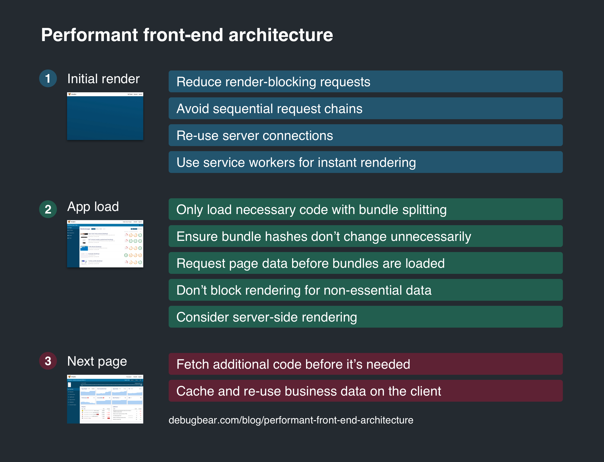

本文来介绍一些能够使 Web 应用加载更快，用户体验更好的技术。

从整个前端架构来看，如何能够第一时间加载最需要的资源，最大化利用已经缓存过的资源？

在此我们不会阐述过多如何优化渲染时间以及后端应如何分发资源。

### 概览

我们将应用的加载分为三个不同的阶段：

1. 初始化渲染 - 在用户看到任何画面之前需要加载多长时间？
2. 应用加载 - 在用户能够使用之前需要加载多长时间？
3. 下一页 - 在跳转到下一页时需要加载多长时间？

