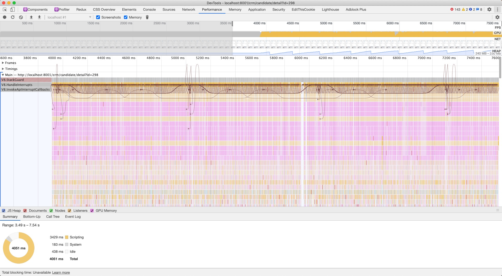
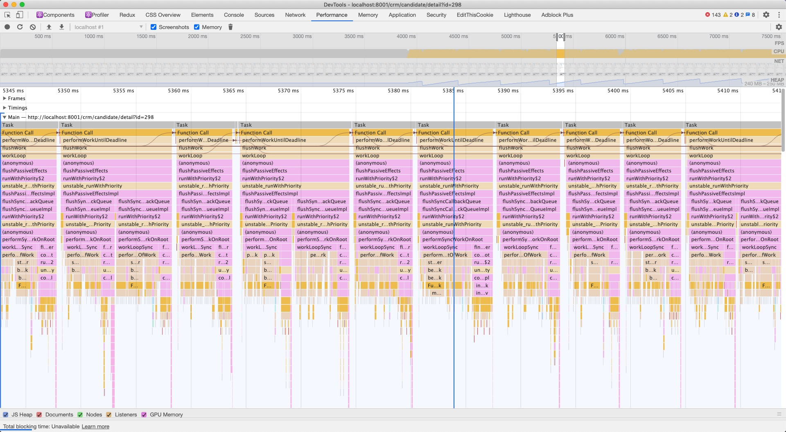
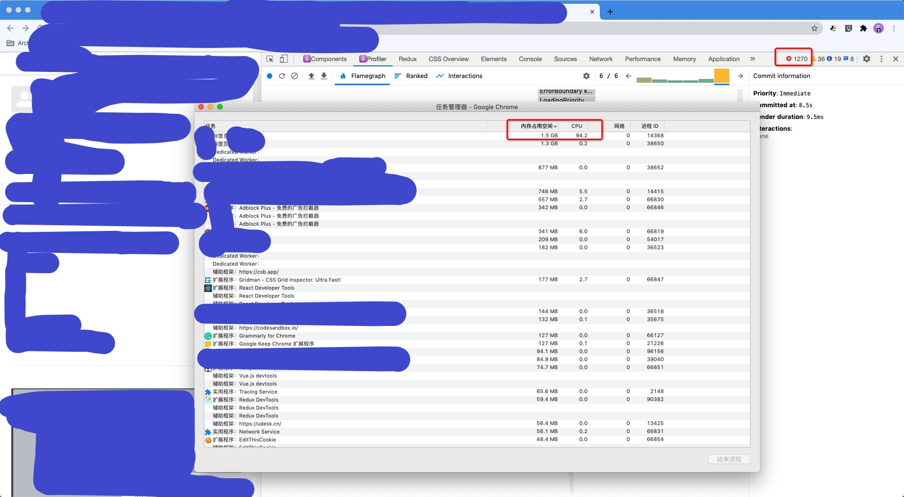

### 前言

前段时间测试同学找我看了一个问题，客户环境某详情页打开时，浏览器当前页就会卡住，控制台没有报错，无法进行任何操作，而只有该 id 的详情页有问题。遇到这种情况，首先想到的是某段代码出现了内存泄漏，但是线上环境代码是混淆后的，sourcemap 由于证书问题无法下载，只能硬着头皮去打断点一点点调试。

### 使用 performance 工具记录脚本运行过程



从上图可以看出脚本非常有规律的重复执行某段逻辑。



当放大到某段执行过程时，可以看到其中充斥着大量的 react 执行逻辑，而想要找到真正的我们代码中的逻辑还需要再进一步去发掘。

从 react 源码点进去看 `performWorkUntilDeadline` 这个函数，主要是取当前时间和产出间隔时间相加得到 deadline 然后再执行从调度器传入的回调函数。这里有个我感觉比较新的 API：[MessageChannel](https://developer.mozilla.org/en-US/docs/Web/API/MessageChannel)，感兴趣的可以了解下，生成两个端口进行通信。

### 本地重现

在通过 performance 工具进行检查之外，还有一种比较简单的方法是本地模拟。因为只有该 id 出现了问题，大概率是数据处理上没有做好兼容，那么根据线上数据可以构建本地环境方便调试。



在任务管理器中可以看到当前页面占用了 94%的 CUP 和 1.5G 的内存，而且控制台报错瞬间达上千条。


不得不说开发环境下，react 的提醒还是比较友好的，提示出现了死循环，useEffect 中执行了 setState 操作，然后触发了重渲染，然后又导致了 useEffect 的回调执行，但是生产环境没有提示确实有点头疼。根据组件渲染层级可以很快找到出问题的组件。


在这里不得不称赞一下，react devtool 中 profiler 非常好用的功能，它能记录组件渲染的变化情况，会指出是什么原因导致的某个组件重新渲染，帮我们快速定位问题，以及排查避免不必要的组件进行渲染。

### 罪魁祸首

在经过本地复现和查看对应源码时发现，某同事之前修改了一个较为底层的 custom hook，在这个 hook 中，原本在 useEffect 回调中创建了一个变量，默认值为 `[]`，被提到了外层作用域，然后把这个变量加入了 useEffect 的依赖数组中：

改之前：

```javascript
function useFetcher(props) {
  const { options } = props;
  useEffect(() => {
    const codes = options.map(_ => _.code) || [];
    // ...
    // setState()
  }, []);
  return {
    // ...
  };
}
```

改之后：

```javascript
function useFetcher(props) {
  const { options } = props;
  const codes = options.map(_ => _.code) || [];
  useEffect(() => {
    // ...
    // setState()
  }, [codes]);
  return {
    // ...
  };
}
```

问题发生在 props 中 options 是空数组时，codes 也是空数组，当组件调用 `useFetcher` 时，每次 codes 都会创建新的 `[]`，导致组件重复渲染，进而重复调用 `useFetcher` 。

### 解决方式

如果多个地方用到了某个变量，并且需要保持一致时，可以通过使用 `useMemo` 来缓存，这样就避免了每次生成新的对象。

```javascript
function useFetcher(props) {
  const { options } = props;
  const codes = useMemo(() => options.map(_ => _.code) || [], [options]);
  useEffect(() => {
    // ...
    // setState()
  }, [codes]);
  return {
    // ...
  };
}
```

### 反思

虽然这个问题解决起来非常简单，但是发现问题的过程并不是那么容易，所以但凡有趁手的工具就尽量利用起来。归根结底说起来还是要对 javascript 基础重视起来，常见的重渲染问题许多都是因为 props 的引用导致的，即没有将变量缓存起来。

推荐一篇博文：[A (Mostly) Complete Guide to React Rendering Behavior](https://blog.isquaredsoftware.com/2020/05/blogged-answers-a-mostly-complete-guide-to-react-rendering-behavior/)
