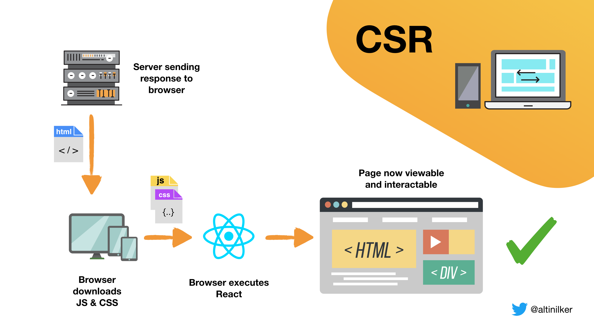
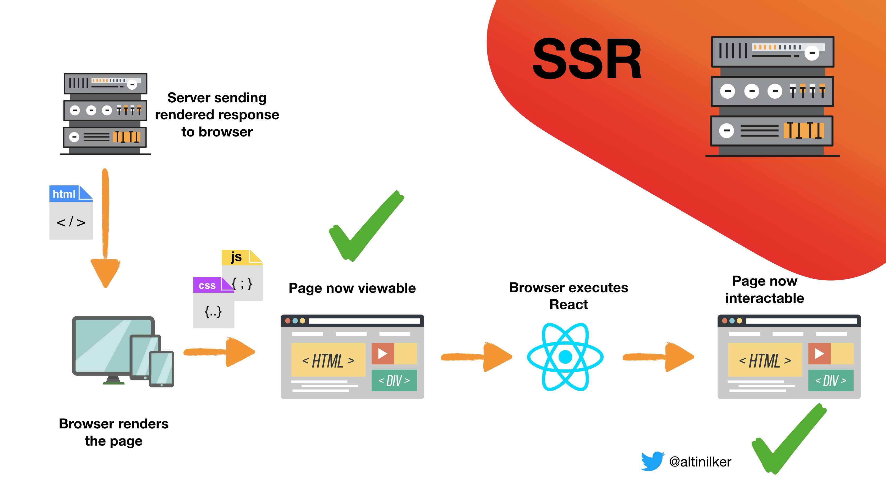
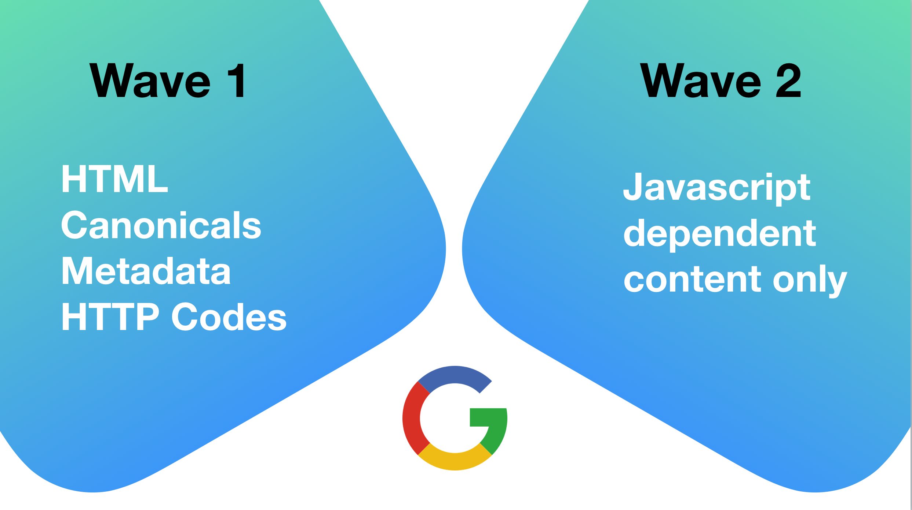
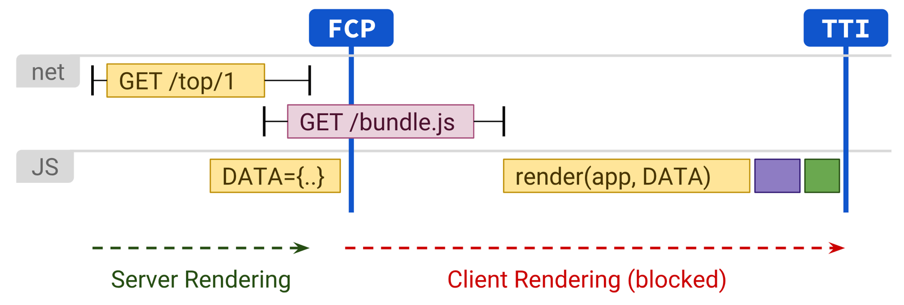

当前已经有很多的文章或会议中谈到了服务端渲染这种技术。而且社区中也出现了许多一站式的 React 框架，但是真正想要了解服务端渲染还是需要自己动手实现一下比较好。不过首先我们需要了解什么是服务端渲染和客户端渲染。

### JavaScript 革命

浏览器比 5-10 年之前更加先进，我们如今通过客户端 JavaScript 来创建整个网站和 web 应用。我们称之为 **“单页面应用（Single Page Application）”**。这可以使我们创建更加互动性的最新的 web 应用。

但这种方式存在一个问题，我们初始化的 HTML 不再含有与该 URL 相关的所有数据/内容。

```html
<!DOCTYPE html>
<html>
  <head>
    <title>My SPA APP Title</title>
  </head>
  <body>
    <div id="root"></div>
    <script type="text/javascript" src="/bundle.js"></script>
  </body>
</html>
```

### 什么是客户端渲染？（CSR）

在浏览器中渲染应用，通常使用 DOM。

服务器渲染的初始化 HTML 只是一个占位符，整个用户界面和数据都在浏览器的所有脚本加载完成之后渲染。

#### 客户端渲染是如何工作的？



<center>常见的客户端渲染模式</center>

**优势**

- 丰富的页面交互
- 初次加载后的快速渲染
- 分块实时更新
- 更有性价比的部署和扩展

**劣势**

- SEO 和索引问题
- bundle.js 加载时间问题
- 旧的设备/慢的网络会有性能问题
- 社交媒体爬虫和分享问题（SMO）

### 什么是服务端渲染？（SSR）

页面加载时服务端返回渲染过的一个页面的整个 HTML。

对于我们使用的 React 或其他任何 JavaScript 库/框架，服务端渲染是一种在服务器端渲染一个正常的客户端的单页面应用的技术，并返回一个完整的渲染过的页面到浏览器。

#### 服务端渲染是如何工作的？



<center>常见的服务端渲染模式</center>

**优势**

- SEO 一致性
- 性能更优，初始化页面加载更快
- 社交媒体爬虫和平台配合良好

**劣势**

- 频繁的请求
- 很慢的页面渲染（TTFB -- 获取第一个字节的时间）
- 复杂的架构（为了统一的方式）

### 谷歌是如何索引的？

我们之前提到了单页面应用存在 SEO 的问题。理解谷歌索引系统是如何通过服务端渲染解决此问题很重要，谷歌有两种索引的方式：



### 如何实现 SSR？

让我们来看一下 React 如何实现服务端渲染。

#### 方法

- 服务端初始化渲染
- 展示全内容 HTML
- JS 执行
- React 接管/重渲染

#### 挑战

- Node.js 中使用 JSX
- 服务端使用 Redux
- 路由
- 补水

> **补水**
> 在客户端启动 JavaScript 来复用服务端渲染的 HTML 的 DOM 树和数据。



### 总结

服务端渲染并不是魔法，需要根据商业逻辑来决定要不要采用。

#### 什么时候使用单页面应用？

- 网站丰富的交互
- 网络很快
- 最小服务端资源
- 主代码量比较小或采用懒加载
- 实时/分部更新

#### 什么时候使用服务端渲染？

- SEO 很重要
- 网络比较慢
- 足够的服务器资源
- 主代码庞大，加载慢
- 社交分享比较重要

### 更多

[Rendering on the Web | Web | Google Developers](https://developers.google.com/web/updates/2019/02/rendering-on-the-web)

[A Netflix Web Performance Case Study](https://medium.com/dev-channel/a-netflix-web-performance-case-study-c0bcde26a9d9)

[awesome universal rendering](https://github.com/brillout/awesome-universal-rendering)

### 参考

<https://itnext.io/server-side-rendering-with-react-redux-and-react-router-fa5b67d4965e?_branch_match_id=755024804793509077&gi=cd56fb5a4621>
