写了这么久的 React，你或许对虚拟 DOM 是怎么工作的感到好奇，本文将通过解读部分 `React` 和 `React DOM` 源码来尝试作详细的解释。在开始前，你是否考虑过为什么我们不是直接对 DOM 进行修改？


接下来的章节将总结一下 DOM 是如何被创建的，并给出为什么 React 首先会创建虚拟 DOM 的原因。

## 理解 DOM 是如何构建的

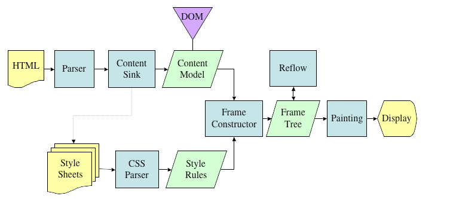

来自 Mozilla: [Basic Data Flow](https://developer.mozilla.org/en-US/docs/Mozilla/Introduction_to_Layout_in_Mozilla)

我们不会详细介绍 DOM 是如何创建并在屏幕上打印的，可以通过[这篇](https://developer.mozilla.org/en-US/docs/Introduction_to_Layout_in_Mozilla)和[这篇](http://taligarsiel.com/Projects/howbrowserswork1.htm#Parsing_general)了解从 HTML 转换成 DOM 并打印到屏幕上的全流程。

DOM 是一种树形结构，每次对 DOM 操作都是很快的，但是被改变的部分，和它的子代元素需要执行**重绘/重排**（**Reflow/Layou**）步骤，改变的部分需要重新渲染，这个过程是比较慢的。所以越多的元素重绘/重排，你的应用就会越慢。

虚拟 DOM 是减少这两个步骤，为大型复杂应用提供更好的性能表现。

## 理解虚拟 DOM

现在了解了 DOM 是如何构建的，我们来看一下虚拟 DOM。我们将通过一个简单的应用来解释虚拟 DOM 是如何工作的。通过视觉化会比较容易理解。

> 我们不会对首次渲染进行过多解释，会专注于重新渲染，这会帮助我们理解虚拟 DOM 和 diff 的工作原理。一旦了解了这部分内容，首次渲染的理解就会非常容易。

下面是一个简单的计算器

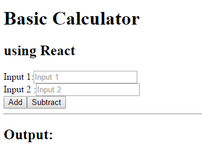

```jsx
import React from 'react';
import ReactDOM from 'react-dom';

export default class Calculator extends React.Component {
  constructor(props) {
    super(props);
    this.state = { output: '' };
  }

  render() {
    let IntegerA, IntegerB, IntegerC;

    return (
      <div className="container">
        <h2>using React</h2>
        <div>
          Input 1:
          <input type="text" placeholder="Input 1" ref="input1"></input>
        </div>
        <div>
          Input 2 :<input type="text" placeholder="Input 2" ref="input2"></input>
        </div>
        <div>
          <button
            id="add"
            onClick={() => {
              IntegerA = parseInt(ReactDOM.findDOMNode(this.refs.input1).value);
              IntegerB = parseInt(ReactDOM.findDOMNode(this.refs.input2).value);
              IntegerC = IntegerA + IntegerB;
              this.setState({ output: IntegerC });
            }}
          >
            Add
          </button>

          <button
            id="subtract"
            onClick={() => {
              IntegerA = parseInt(ReactDOM.findDOMNode(this.refs.input1).value);
              IntegerB = parseInt(ReactDOM.findDOMNode(this.refs.input2).value);
              IntegerC = IntegerA - IntegerB;
              this.setState({ output: IntegerC });
            }}
          >
            Subtract
          </button>
        </div>
        <div>
          <hr />
          <h2>Output: {this.state.output}</h2>
        </div>
      </div>
    );
  }
}
```

Calculator.js

```jsx
import React from 'react';
import Calculator from './Calculator';

export default class Layout extends React.Component {
  render() {
    return (
      <div>
        <h1>Basic Calculator</h1>
        <Calculator />
      </div>
    );
  }
}
```

Main.js

初次渲染后 DOM 的结构：

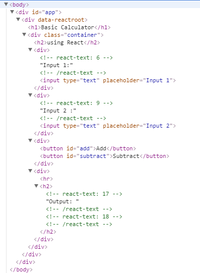

React 内部构建组件树的方式：

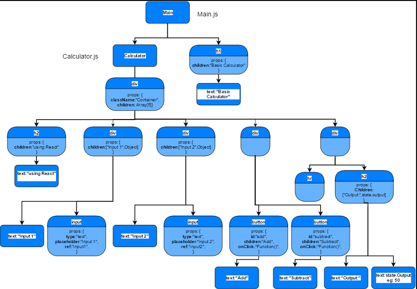

### 当按下 Add 按钮时发生了什么

我们在两个输入框中输入 100 和 50 并按下 **Add** 按钮。

```txt
Input 1: 100
Input 2: 50

Output: 150
```

当按下 **Add** 按钮时，我们对 <strong>_State_</strong> 设置了新的值：150。

```jsx
//Calculator.js
<button
  id="add"
  onClick={() => {
    IntegerA = parseInt(ReactDOM.findDOMNode(this.refs.input1).value);
    IntegerB = parseInt(ReactDOM.findDOMNode(this.refs.input2).value);
    IntegerC = IntegerA + IntegerB;
    this.setState({ output: IntegerC });
  }}
>
  Add
</button>
```

### 将组件标记为脏值

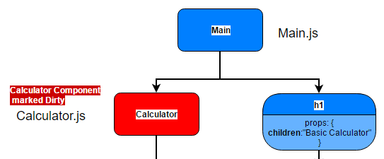

首先我们来了解第一步，组件是如何被标记为脏值的。

1. 所有 DOM 的事件监听器都被 React 自定义的事件监听器所包装。所以当按下 <strong>_Add_</strong> 时，事件被发送到 react 的事件监听器，所以会执行上面的匿名函数。
2. 在匿名函数中，我们调用了 <strong>_this.setState()_</strong> 函数并传入了新值。
3. <strong>_setState()_</strong> 函数会将该组件标记为脏值。

```javascript
// ReactUpdate.js - enqueueUpdate(component) function
dirtyComponents.push(component);
```

> 你可能会好奇，为什么 React 不直接将按钮标记为脏值，而是整个组件，那是因为，在调用 setState 时，通过 **this.setState()** 调用的，**this** 在这里指向的是 **Calculator** 组件实例。

4. 现在，**Calculator** 组件被标记为脏值。

### 遍历组件的生命周期

现在组件被标记为脏值，下一步是更新虚拟 DOM 并使用 diff 算法来做协调（reconciliation），最终更新真正的 DOM。

在 React 中，我们的 Calculator 组件的数据格式：

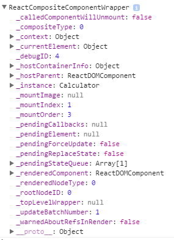

下一步更新组件：

1. 这是通过 React 执行批量更新来完成的。
2. 在批量更新时，它会检查哪些组件被标记为脏值并开始更新。

```javascript
var flushBatchedUpdates = function() {
  while (dirtyComponents.length || asapEnqueued) {
    if (dirtyComponents.length) {
      var transaction = ReactUpdatesFlushTransaction.getPooled();
      transaction.perform(runBatchedUpdate, null, transaction);
    }
  }
};
```

3. 下一步，它会检查是否存在进行中的需要更新的状态，或者有一个 **_forceUpdate_** 被调用。

```javascript
if (this._pendingStateQueue !== null || this._pendingForceUpdate) {
  this.updateComponent(
    transaction,
    this._currentElement,
    this._currentElement,
    this._context,
    this._context
  );
}
```

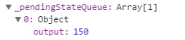

在我们的例子中， **_this.\_pendingStateQueue_** 持有我们新的 output 值。

4. 首先它会检查我们是否声明了 [`componentWillReceiveProps()`](https://facebook.github.io/react/docs/react-component.html#componentwillreceiveprops)，如果声明了，那么可以通过传入的新的 **props** 来更新 **state**。

5. 下一步检查是否声明了 [`shouldComponentUpdate()`](https://facebook.github.io/react/docs/react-component.html#shouldcomponentupdate)，我们可以检查 **state** 或 **props** 是否变化了来决定组件是否需要重新渲染。

> 当你知道什么情况下不需要组件重新渲染时使用，可以提高组件的性能。

6.下一步是执行 [`componentWillUpdate()`](https://facebook.github.io/react/docs/react-component.html#componentwillupdate)， [`render()`](https://facebook.github.io/react/docs/react-component.html#render) 和 [`componentDidUpdate`](https://facebook.github.io/react/docs/react-component.html#componentdidupdate)。

7. 我们来详细看一下 **_render()_** 内部的执行：

render 是虚拟 DOM 重新构建和 diff 执行的地方。
在我们的例子中，所有在当前组件内部的元素在虚拟 DOM 中都会重新构建。

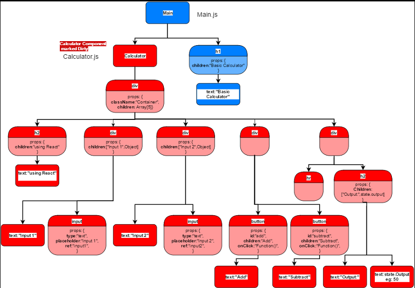

它会检查前一个和下一个渲染过的元素是同一类型和 key，随后对类型和 key 的匹配进行协调。

```javascript
var prevRenderedElement = this._renderedComponent._currentElement;
var nextRenderedElement = this._instance.render();
// Calculator.render() 方法被调用
```

> 这就是我们组件的 render 方法被调用的地方。即 `Calculator.render()`

和解的过程通常是经历如下步骤：

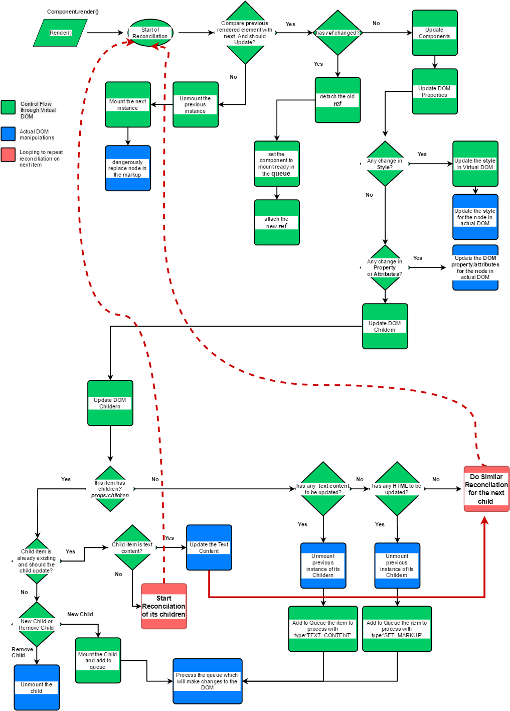

> 红色的虚线表示对于下一个子组件或子组件的后代都重复执行这些协调步骤

上面的流程图就是通过虚拟 DOM 更新真实 DOM 的过程。

所以在我们的例子中，协调的结果如下：

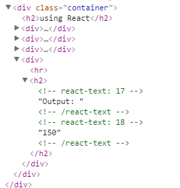

我们将步骤分解来看一下：

- 协调开始于组件的主 `<div class="container">` 节点。
- 它的子节点中包含 **Output**，所以 react 会对子节点协调。
- 现在子节点有了自己的子节点 `<hr>` 和 `<h2>`。
- react 开始协调 `<hr>`
- 下一步 react 协调 `<h2>`，由于它的子节点是 **Output**：来自 **state** 的文本内容，所以它会对两者进行协调。
- 首次 **Output**：文本开始协调，由于没有变化，所以 DOM 不需要更新
- 后来来自 **state** 的 **output** 得到了一个新值，react 开始协调并更新真实的 DOM。

### 渲染真实 DOM

在协调过程中，只有我们的 **Output** 部分如在页面上闪烁绘制的一样发生了变化。

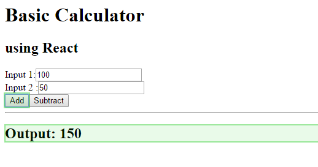

<center>只有output被重新绘制</center>

在真实 DOM 中的更新：

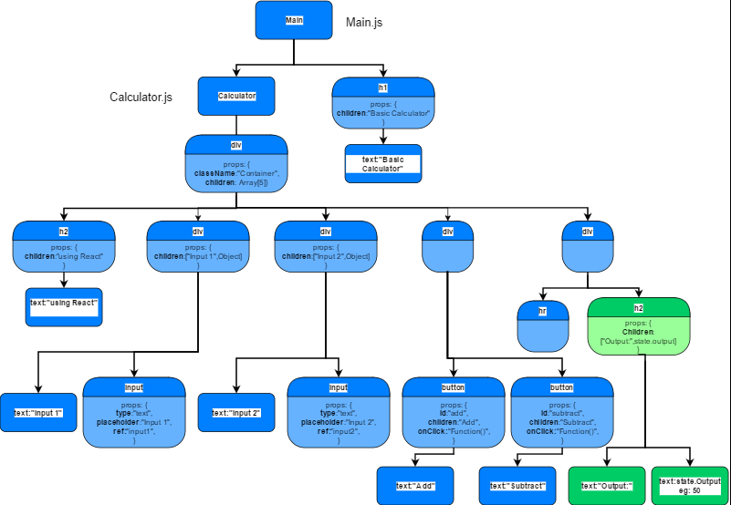

## 总结

尽管例子比较简单，希望它能够给到我们一个基本的对于 react 底层执行的理解。

React 的协调过程：

- 将前一个内部实例和下一个内部实例作比较
- 更新实质是 JavaScript 对象的组件树结构的内部实例
- 只有当前组件以及子代组件真正发生变化才会更新真实的 DOM

## 参考

<https://medium.com/@gethylgeorge/how-virtual-dom-and-diffing-works-in-react-6fc805f9f84e>
