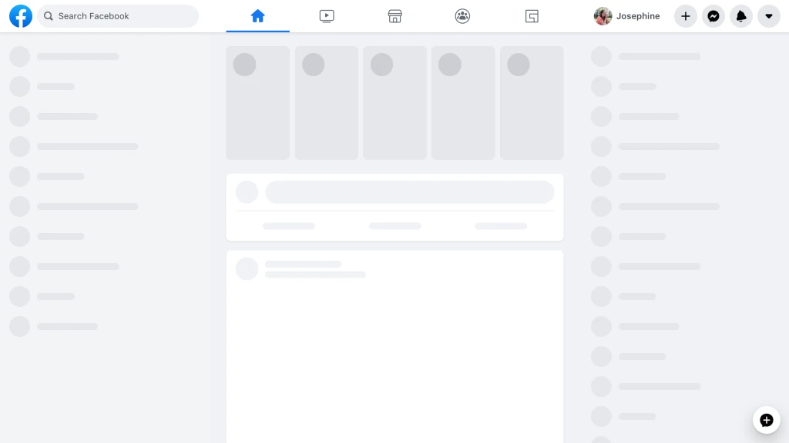

## 前言

Facebook.com 在 2004 年发布时还是简单的服务端渲染的 PHP 网站。随着时间的发展，陆续增加了许多新的技术来提供更好的体验：每个新的功能都使得网站变慢而且变得更难维护。后来就难以增加新的功能了。像黑暗模式、保存信息流的位置，没有直接的技术方案来实现。

当开始思考如何为现代浏览器构建新的 web 应用，同时带来用户期待的新功能时，之前的技术栈不能够带来类 APP 的体验和性能。Facebook 的团队开始采用 [React](https://reactjs.org/) 和 [Relay](https://relay.dev/) 来重新设计架构。

## 开始

虽然之前通过服务端渲染来呈现给用户更快的响应时间，但是可能不会带来更具交互的体验。Facebook 团队着手开始采用客户端渲染并且致力于保证更快的启动时间。

开始构建客户端应用时，需要找出合适的方式方法：

1. **越小越好，越早越好。** 应该只发布需要的资源，应该在需要之前就准备就绪。
2. **工程经验服务于用户体验。** 开发的最终目的是为了用户使用网站。通过思考 UX 的挑战，可以采纳这些经验来指导工程师做正确的事情。

基于以上原则来对网站的：CSS, JavaScript,data 和 导航进行改进。

## 重新思考 CSS 解锁新能力

通过改变如何编写和构建样式，减少了首页 80%的 CSS 代码。在新网站上，CSS 呈现的并不是代码所写的那样。通过在组件内编写类 CSS 的 JavaScript 代码，并采用构建工具将这些样式分割为独立的、优化过的文件。最终，新的网站部署了更少的 CSS，还支持了黑暗模式，动态显示字体大小，并且提高了图片的渲染性能。同时开发体验也得到了提高。

### 生成原子 CSS 减少了首页 80%的 CSS

旧的首页网站上加载了压缩过的超过 400KB 的 CSS 代码（未压缩有 2MB），但首页初始渲染时真正用到的只有 10%。

在编译时生成原子 CSS 来解决此问题。原子 CSS 只需要增加特殊的样式声明，而不需要实现新功能时都增加重复的样式代码。通过组合生成过的原子 CSS，可以使网站加载单个更少的可共享的样式文件。作为结果，新的首页 CSS 下载文件大小比之前少了 20%。

### 搭配样式减少未使用的 CSS 并使其更易维护

CSS 持续增长的另一个原因是随着时间的推移，很难去检测哪些 CSS 是仍然在使用的。原子 CSS 帮助迁移性能受影响的部分，但是一些唯一的样式仍然占了非必需的字节。通过与组件的搭配，可以放心将未使用的样式删除，而在编译时再分离。

另一个面临的问题是：CSS 优先级依赖顺序，在自动化打包时很难去管理。在一个文件中改动了样式很可能不可预见的破环了另一处地方的样式。该团队采用了 React Native 样式 API 的类似方式：保证样式在一个稳定的顺序，并且不支持 CSS 后代选择器。

### 改变字体大小来获取更好的可访问性

离线构建步骤也促使了可访问性的更新。在许多现代网站，用户通过使用浏览器的放大功能来缩放字体，这可能意外触发了平板或手机的重新布局，或增加了一些他们并不想要的元素的大小，如图片。

通过使用 rem,可以根据用户设备的尺寸来获取特定的字体大小。并能够提供控制自定义字体大小的功能而不需要更改样式文件。通常设计稿都是以 CSS 像素为单位，如果手动转换为 rem 可能会出错，并且还会增加额外的负担，所以需要构建工具来进行自动转换。

### 构建时的处理

源码实例：

```jsx
const styles = stylex.create({
  emphasis: {
    fontWeight: 'bold',
  },
  text: {
    fontSize: '16px',
    fontWeight: 'normal',
  },
});

function MyComponent(props) {
  return <span className={styles('text', props.isEmphasized && 'emphasis')} />;
}
```

构建生成的 CSS：

```css
.c0 {
  font-weight: bold;
}
.c1 {
  font-weight: normal;
}
.c2 {
  font-size: 0.9rem;
}
```

构建生成的 JavaScript：

```javascript
function MyComponent(props) {
  return <span className={(props.isEmphasized ? 'c0 ' : 'c1 ') + 'c2 '} />;
}
```

### CSS 变量支持主题（黑暗模式）

在旧的网站，应用主题的方式是在 body 元素上增加一个 class 名称，然后使用该名称去覆写现有的样式规则来获得更高的优先级。这种方式存在一些问题，并且不适合当前的 CSS-in-JavaScript 的方式，所以采用了[CSS 变量](https://developer.mozilla.org/en-US/docs/Web/CSS/Using_CSS_custom_properties)的方式来实现主题。

CSS 变量在一个 class 内部定义，当该 class 应用到 DOM 元素时，它的值会在当前节点及子节点上应用这些样式规则。这可以使得将主题组合到一个单个的样式文件中，切换不同的主题不需要重新加载页面，不同的页面也可以有不同的主题而且不需要下载额外的 CSS。

```css
.light-theme {
  --card-bg: #eee;
}
.dark-theme {
  --card-bg: #111;
}
.card {
  background-color: var(--card-bg);
}
```

### SVGs 在 JavaScript 中提供快速的渲染性能

为了防止图标在内容加载完后可能会闪烁一下，现在将 SVGs 内联到 HTML 节点上而不是将 SVG 文件传到标签中。因为现在 SVGs 在 JavaScript 中非常高效，可以被使用到的组件一次性加载出。与 JavaScript 同时加载的好处要大于 SVG 绘制性能的损耗。通过内联的方式，不会存在图标闪烁的问题。

```jsx
function MyIcon(props) {
  return (
    <svg
      {...props}
      className={styles({
        /*...*/
      })}
    >
      <path d="M17.5 ... 25.479Z" />
    </svg>
  );
}
```

此外这些图标可以丝滑改变颜色不需要额外的下载资源。可以通过 props 来对图标进行样式的更新，通过结合 CSS 变量可以对特定的图标进行主题化的显示，尤其是那些单色的图标。


### JavaScript 代码分割提高性能

单页面应用中 JavaScript 代码大小是最需要衡量的指标之一，它对于页面加载的性能起着非常大的作用。

### 当需要时再发布所需的增量代码

当用户等待页面加载时，首先立即反馈给用户一个当前渲染页面的骨架屏。骨架屏只需要非常少的资源，但是如果将代码都打包到一个单文件中，那就没有办法提前渲染了。需要根据该页面显示的内容顺序将代码分割到多个文件中。但是，如果真的简单这么做（即通过渲染时[动态加载](https://github.com/tc39/proposal-dynamic-import)代码），这可能会损失而不是提高性能。Facebook 团队对于 JavaScript 加载定义了优先级：通过声明式的、静态分析的 API 将 JavaScript 代码的加载分为 3 个等级。

一级是最基本的开屏画面的布局，包括初次加载中状态的 UI 骨架屏：



一级使用标准的 `import` 语法：

```javascript
import ModuleA from 'ModuleA';
```

二级包含页面渲染所需的所有 JavaScript。经过二级加载，当前页面上应该没有任何代码加载导致的视觉变化。


```javascript
importForDisplay ModuleBDeferred from 'ModuleB';
```

一旦遇到 `importForDisplay` ，它和它的依赖被移到等级 2。当它加载完会返回一个 promise 包装的结果提供模块的访问。

三级包含任何不需要影响当前渲染结果的代码，如日志代码、实时更新数据的订阅。

```javascript
importForAfterDisplay ModuleCDeferred from 'ModuleC';

// ...

function onClick(e) {
  ModuleCDeferred.onReady(ModuleC => {
    ModuleC.log('Click happened! ', e);
  });
}
```

同样当遇到 `importForAfterDisplay` 时，它和它的依赖被移到等级 3。当它加载完会返回一个 promise 包装的结果提供模块的访问。

一个 500KB 的 JavaScript 页面可能会有 50KB 在一级，150KB 在二级，300KB 在三级。通过这种方式的代码分割，可以提高首屏渲染的时间。

### 只在需要时加载实验性的依赖

有时会需要渲染相同 UI 的两个版本，如在 A/B 测试中。最简单的方式是为所有用户提供两种版本的代码下载，但这意味着会下载一些从不会执行的代码。一个稍微好一点的方式是在渲染时动态加载，但这可能会变慢。

根据越小越好，越早越好的原则，Facebook 团队开发了声明式的 API 来警示开发者尽早做出决定并且将这些代码编码到依赖图中。一旦页面加载时，服务器去检测实验性的功能并只响应对应版本的代码。

```javascript
const Composer = importCond('NewComposerExperiment', {
  true: 'NewComposer',
  false: 'OldComposer',
});
```

这对如 A/B 测试、国际化或者不同设备对不同的用户加载页面时是非常有效的。

### 只在需要时加载数据所需的依赖

某些不是静态文件的代码应该如何加载呢？例如，为所有不同的类型去请求所有的渲染代码然后在结合信息流卡片组件渲染可能会使页面的 JavaScript 代码爆炸。

这些依赖取决于运行时后端返回的数据。通过[Relay](https://github.com/facebook/relay)的功能来根据返回的数据决定哪些渲染代码是必要的。如果某条数据有特殊的附件，如图片，那么就需要 PhotoComponent 来渲染该图片。

```graphql
... on Post {
  ... on PhotoPost {
    @module('PhotoComponent.js')
    photo_data
  }
  ... on VideoPost {
    @module('VideoComponent.js')
    video_data
  }
}
```

## 原文

<https://engineering.fb.com/web/facebook-redesign/>
