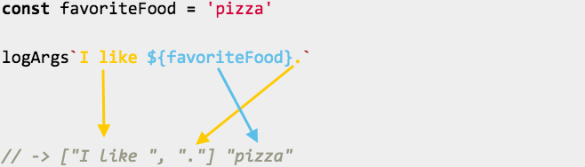

## 背景

最近在个人博客中采用了[styled-components](https://www.styled-components.com/)库来写组件的样式，在翻看文档时，发现用法：

```jsx
import styled from 'styled-components';

const Title = styled.h1`
  color: palevioletred;
  font-size: 18px;
`;

const App = () => <Title>Hello World!</Title>;
```

这个用法引起了我的兴趣，这是如何 work 起来的？

## 带标签的模板字符串（Tagged Template Literals）

`styled.h1` 符号其实是模板字符串的一种高级用法，本质上它只是调用了一个函数即 ` styled.h1``\ ` 和 `styled.h1()` 功能是同样的。不过差异在于两种写法的传参方式。

我们来看下面简单的例子：

```javascript
const logArgs = (...args) => console.log(args);

logArgs('a', 'b');
// -> a b
```

作为标签模板字符串来调用：

```javascript
logArgs``;
// -> ['']

logArgs`I like pizza`;
// -> ['I like pizza']
```

可以看出，模板字符串方式会把传入的参数以数组来包一层。

### 插值（Interpolations）

模板字符串中可以存在插值，如：

```javascript
const favoriteFood = 'pizza';

logArgs(`I like ${favoriteFood}.`);
// -> I like pizza.
```

可以看到，JavaScript 执行时会把变量插入到传入函数参数的字符串中。那在带有标签的模板字符串中使用时有什么表现：

```javascript
const favoriteFood = 'pizza';

logArgs`I like ${favoriteFood}.`;
// -> ['I like ', '.'] 'pizza'
```

我们从结果中看到第一个结果还是字符串的数组，里面的元素在插值处分割而插值的内容则作为第二个参数被传递。



纯文本的字符串都被存放在第一个参数数组内，随后为插值内容。

当多于一个插值时：

```javascript
const favoriteFood = 'pizza';
const favoriteDrink = 'cola';

logArgs`I like ${favoriteFood} and ${favoriteDrink}.`;
// -> ['I like ', ' and ', '.'] 'pizza' 'cola'
```

每个插值都成为函数调用的下一个参数，我们可以有任意多个插值参数。

与正常的函数调用相比：

```javascript
const favoriteFood = 'pizza';
const favoriteDrink = 'cola';

logArgs(`I like ${favoriteFood} and ${favoriteDrink}.`);
// -> I like pizza and cola.
```

所有的插值都混为了一个大字符串。

## 优势

这种方式开启了新的探索。以 `styled-components` 为例，我们有一个 `<Button />` 组件，当 props 传入 `primary` 时期望按钮看起来更大，`<Button primary />`。
我们可以如下来实现：

```javascript
const Button = styled.button`
  font-size: ${props => (props.primary ? '2em' : '1em')};
`;
```

得到的结果：

```javascript
// font-size: 2em;
<Button primary />

// font-size: 1em;
<Button />
```

让我们再回过来看 `logArgs` 函数。

```javascript
logArgs(`Test ${() => console.log('test')}`);
// -> Test () => console.log('test');
```

这里注意得到的结果为整个字符串，而没有真正的函数。

当以带标签的模板字符串调用时：

```javascript
logArgs`Test ${() => console.log('test')}`;
// ['Test', ''] () => console.log('test')
```

从结果上可能看不出，但这里得到了真正的函数（而不是字符串）。

这意味着我们可以得到这个函数并且执行它。我们来看一个新的可以执行函数类型参数的函数：

```javascript
const execFuncArgs = (...args) =>
  args.forEach(arg => {
    if (typeof arg === 'function') {
      arg();
    }
  });
```

这个函数执行时会执行类型为函数的参数：

```javascript
execFuncArgs('a', 'b');
// -> undefined

execFuncArgs(() => {
  console.log('this is a function');
});
// -> this is a function

execFuncArgs('a', () => {
  console.log('another one');
});
// -> another one
```

我们再来看：

```javascript
execFuncArgs(
  `Hi, ${() => {
    console.log('Executed!');
  }}`
);
// -> undefined

execFuncArgs`Hi, ${() => console.log('Executed!')}`;
// -> 'Executed!'
```

在带标签的模板字符串中 execFuncArgs 的第二个参数传递的是实际函数，然后继续执行该函数。`styled-components` 底层的实现就是依赖这个特性，在渲染时传入插值函数的 props 可以帮用户来动态更新样式。

## 总结

可以看到，JavaScript 的一个新特性就可以实现一个强大的库，为我们的开发带来更好的体验，我们需要不断去探索去总结去实践 JavaScript 实现更多新的能力。

## 参考

https://mxstbr.blog/2016/11/styled-components-magic-explained/