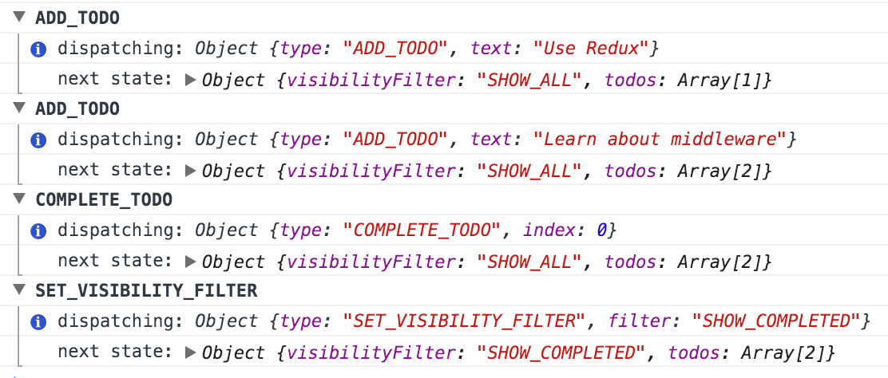

最近在看 Redux 文档，了解了 redux 的工作原理，发现 action 只能同步被 dispatch，那有没有办法执行异步调用呢？答案是通过中间件来实现。之前简单了解过 Node.js 服务端框架 [Express](http://expressjs.com/) 和 [Koa](http://koajs.com/)，它们的机制也依赖中间件这一概念，通过在接受请求和发送响应之间增加代码做额外的处理工作。比如，Express 和 Koa 中间件可以增加 CORS 头，记录日志，压缩等等。中间件最重要的特点是它可以链式组合。可以在一个项目中使用多个独立的第三方中间件。

Redux 中间件解决了不同于 Express 和 Koa 的问题，但从概念上讲是相似的。它在分发 action 和抵达 reducer 之间提供了一个第三方切入点。我们可以用 Redux 中间件记录日志，上报崩溃异常，请求异步 API，路由切换等等。

## 理解中间件

中间件可以做很多事情，包括执行异步 API 请求，但理解它是如何演进而来的非常重要。我们将以记录日志和上报异常为例来思考使用中间件的过程。

### 问题：记录日志

Redux 的一个优势是它改变状态是可预测的、透明的。每次 action 被分发，新的 state 被计算、存储。state 不能改变它自身，只能通过特定的 action 来更新。

如果我们记录每次 action 的发生和计算后的 state，在发生错误时，回过头看我们的日志，找出哪个 action 破坏了 state：



Redux 应该如何来实现呢？

### 尝试 1：手动记录

最原始的方式是每次调用 [`store.dispatch(action)`](https://redux.js.org/api/store#dispatchaction) 时记录 action 和下一个 state。这并不是真正的方案，但是可以首先助于理解这个问题。

> #### 注意：
>
> 当使用 [react-redux](https://github.com/reduxjs/react-redux) 或其他类似的绑定工具时，我们不需要直接访问组件的 store 实例。在接下来的内容中，我们假定直接向下传递 store。

当我们创建一个 todo 并记录日志时：

```javascript
const action = addTodo('Use Redux');

console.log('dispatching', action);
store.dispatch(action);
console.log('next state', store.getState());
```

这实现了我们想要的，但我们不想每次都要加这种样板代码。

### 尝试 2：包裹 Dispatch

我们将记录的代码抽成一个函数：

```javascript
function dispatchAndLog(store, action) {
  console.log('dispatching', aciton);
  store.dispatch(action);
  console.log('next state', store.getState());
}
```

可以在任何地方替换 `store.dispatch()`：

```javascript
dispatchAndLog(store, addTodo('Use Redux'));
```

到这里差不多了，但是每次都引入这个特殊的函数还是不够方便。

### 尝试 3：猴子补丁 Dispatch

如果我们把 store 实例中的 `dispatch` 函数替换掉呢？Redux 的 store 只是有[一些方法](https://redux.js.org/api/store/)的普通对象，我们可以使用猴子补丁方式来实现 `dispatch`：

```javascript
const next = store.dispatch;
store.dispatch = function dispatchAndLog(action) {
  console.log('dispatching', action);
  let result = next(action);
  console.log('next state', store.getState());
  return result;
};
```

这快要达到我们想要的了，无论在哪里分发 action，总会保证记录日志。猴子补丁虽然不推荐，但在此实现了我们的目的。

### 问题：上报异常

如果我们想应用更多的这种转换后的 `dispatch` 怎么办？

一个不同的有用的转换是在生产环境上报 JavaScript 异常。全局的 `window.onerror` 事件不是可靠的，因为它在某些旧的浏览器上不能提供堆栈信息，这对找出发生报错的位置是非常关键的。

如果我们在分发任何 action 时遇到了异常，我们将堆栈信息，触发异常的 action，当前的 state 发送到异常搜集服务商如 [Sentry](https://getsentry.com/welcome/) 岂不是非常有用？这种方式在开发过程中就可以重现。

然而，将日志记录和报错上报分别处理是非常重要的。理想情况下，我们希望它们是在不同 package 下的不同模块。否则我们无法拥有此类工具的生态系统。

如果日志记录和异常上报是单独处理的，可能的代码如下：

```javascript
function patchStoreToAddLogging(store) {
  const next = store.dispatch;

  store.dispatch = function dispatchAndLog(action) {
    console.log('dispatching', action);
    let result = next(action);
    console.log('next state', store.getState());
    return result;
  };
}

function patchStoreToAddCrashReporting(store) {
  const next = store.dispatch;
  store.dispatch = function dispatchAndReportErrors(action) {
    try {
      return next(action);
    } catch (err) {
      console.error('Caught an exception!', err);
      Raven.captureException(err, {
        extra: {
          action,
          state: store.getState(),
        },
      });
      throw err;
    }
  };
}
```

如果这些函数是作为独立模块发布的，我们可以这样来为 store 打补丁：

```javascript
patchStoreToAddLogging(store);
patchStoreToAddCrashReporting(store);
```

到目前为止，还是不够好。

### 尝试 4：隐藏猴子补丁

猴子补丁是一种 hack 方式。在之前我们有新的函数替换了 `store.dispatch`。如果它们*返回*新的 `dispatch` 函数呢？

```javascript
function logger(store) {
  const next = store.dispatch;

  // Previously:
  // store.dispatch = function dispatchAndLog(action) {}

  return function dispatchAndLog(action) {
    console.log('dispatching', action);
    let result = next(action);
    console.log('next state', store.getState());
    return result;
  };
}
```

我们可以在 Redux 内部提供一个帮助函数来应用真正的猴子补丁的具体实现细节：

```javascript
function applyMiddlewareByMonkeypatching(store, middlewares) {
  middlewares = middlewares.slice();
  middlewares.reverse();

  // 每个中间件转换dispatch函数
  middlewares.forEach(middleware => (store.dispatch = middleware(store)));
}
```

我们可以应用多个中间件：

```javascript
applyMiddlewareByMonkeypatching(store, [logger, crashReporter]);
```

然而，这仍然是猴子补丁，我们内部隐藏了实现并没有改变这个事实。

### 尝试 5：移除猴子补丁

为什么我们要覆写 `dispatch`？当然可以延后执行，但另一个原因是：每个中间件可以访问并调用前一个包装过的 `store.dispatch`：

```javascript
function logger(store) {
  // 必须指向前一个中间件返回的函数
  const next = store.dispatch;

  return function dispatchAndLog(action) {
    console.log('dispatching', action);
    let result = next(action);
    console.log('next state', store.getState());
    return result;
  };
}
```

这本质就是链式中间件！

如果 `applyMiddlewareByMonkeypatching` 没有在处理完第一个中间件后立即赋值 `store.dispatch`，`store.dispatch` 会保持指向原始的 `dispatch` 函数。那么第二个中间件也会绑定原始的 `dispatch` 函数。

但是也有不同的链式调用方式。中间件可以接受 `next()` dispatch 函数作为参数，而不是从 `store` 实例中读取。

```javascript
function logger(store) {
  return function wrapDispatchToAddLogging(next) {
    return function dispatchAndLog(action) {
      console.log('dispatching', action);
      let result = next(action);
      console.log('next state', store.getState());
      return result;
    };
  };
}
```

这个层级看起来比较深，ES6 的箭头函数看起来更清爽：

```javascript
const logger = store => next => action => {
  console.log('dispatching', action);
  let result = next(action);
  console.log('next state', store.getState());
  return result;
};

const crashReporter = store => next => action => {
  try {
    return next(action);
  } catch (err) {
    console.error('Caught an exception!', err);
    Raven.captureException(err, {
      extra: {
        action,
        state: store.getState(),
      },
    });
    throw err;
  }
};
```

这就是 Redux 中间件的真实形态。

现在中间件接收 `next()` dispatch 函数，并返回一个 dispatch 函数，该函数又充当左侧中间件 `next()`，以此类推。它仍然可以访问某些 store 的方法，如 `getState()`，因此 `store` 作为顶级参数仍然可用。

### 尝试 6：简单使用中间件

我们可以将 `applyMiddleware()` 替换 `applyMiddlewareByMonkeypatching()`，它包装了 `dispatch()` 函数，并返回 store 的副本：

```javascript
// 注意：这不是Redux 真实的实现
function applyMiddleware(store, middlewares) {
  middlewares = middlewares.slice();
  middlewares.reverse();
  let dispatch = store.dispatch;
  middlewares.forEach(middleware => (dispatch = middleware(store)(dispatch)));
  return Object.assign({}, store, { dispatch });
}
```

### 最终版本

```javascript
const logger = store => next => action => {
  console.log('dispatching', action);
  let result = next(action);
  console.log('next state', store.getState());
  return result;
};

const crashReporter = store => next => action => {
  try {
    return next(action);
  } catch (err) {
    console.error('Caught an exception!', err);
    Raven.captureException(err, {
      extra: {
        action,
        state: store.getState(),
      },
    });
    throw err;
  }
};
```

以下是我们如何在Redux store中应用：

```javascript
import {createStore, combineReducers, applyMiddleware} from 'redux'

const todoApp = combineReducers(reducers)
const store = createStore(
  todoApp,
  // applyMiddleware() 告诉 createStore() 如何处理中间件
  applyMiddleware(logger, crashReporter)
)
```

现在任何被分发的action都会经过 `logger` 和 `crashReporter` 处理：

```
store.dispatch(addTodo('Use Redux'))
```

## 参考

<https://redux.js.org/advanced/middleware/>