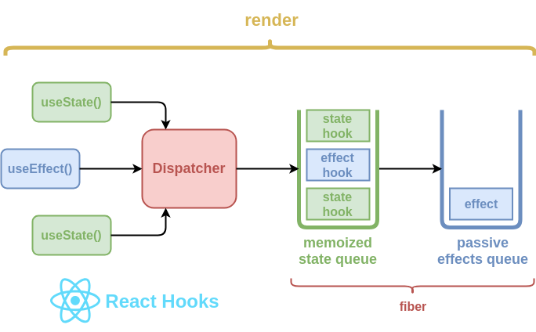

React Hooks 在 React 16.7 版本发布后，在社区掀起了一股新的浪潮，真的是谁用谁都说真香。刚使用 Hooks 时难免会对该机制的原理感到神奇，在遇到问题时，由于它背后复杂的调用栈我们很难进行调试，所以有必要更深层次了解 React Hooks 系统，这样我们遇到问题可以快速定位甚至提前避免。今天我们就来看一下 React 是如何实现的？



<center>React hooks 粗略概要</center>

首先让我们来了解一下确保 hooks 在 React 作用域内被调用的机制，因为如果没有在正确的上下文执行 hooks 是没有意义的：

### The dispatcher

dispatcher 是一个包含 hooks 函数的共享的对象。它在 ReactDOM 渲染的时期动态地被分配或被清除，并保证用户在 React 组件外不能访问 hooks（[源码实现](https://github.com/facebook/react/blob/master/packages/react-reconciler/src/ReactFiberHooks.js#L62)）。

dispatcher 在每个和每次 hook 调用时通过 `resolveDispatcher()` 函数来处理（[源码实现](https://github.com/facebook/react/blob/19f6fe170ce920d7183a5620f4e218334c8bac62/packages/react/src/ReactHooks.js#L21)）。

```javascript
let currentDispatcher;

const dispatcherWithHooks = {
  /* ... */
};

function resolveDispatcher() {
  if (currentDispatcher) return currentDispatcher;
  throw Error("Hooks can't be called");
}

function useXXX(...args) {
  const dispatcher = resolveDispatcher();
  return dispatcher.useXXX(...args);
}

function renderRoot() {
  currentDispatcher = dispatcherWithHooks;
  performWork();
  currentDispatcher = null;
}
```

<center>Dispatcher 简单实现</center>

我们有了初步认识，现在正式来了解 hooks。首先介绍一个新概念：

### The hooks queue

在底层，hooks 在它们调用顺序中作为 node 节点链接在一起。它们如此表现是因为 hooks 并不是简单地创建和销毁。它们通过一种机制来实现。每个 hook 有多个属性：

- 在初始渲染时创建它的初始状态
- 它们的状态随时可以更新
- React 在将来的渲染时能够记住 hook 的状态
- React 能够基于调用顺序提供正确的状态
- React 知道 hook 属于哪个 fiber

相应的，我们需要重新思考我们看待组件状态的方式。目前为止我们理解的是简单的对象：

```javascript
{
  foo: 'foo',
  bar: 'bar',
  baz: 'baz',
}
```

但是当处理 hooks 时，它们应该被当作队列来看待，每个节点代表了状态中的每个 model：

```javascript
{
  memoizedState: 'foo',
  next: {
    memoizedState: 'bar',
    next: {
      memoizedState: 'baz',
      next: null
    }
  }
}
```

每个 hook 节点的 schema 的[实现](https://github.com/facebook/react/blob/5f06576f51ece88d846d01abd2ddd575827c6127/packages/react-reconciler/src/ReactFiberHooks.js#L243)，hook 上这些属性重点关注 `memoizedState` 和 `next`，其他的属性专门用于 `useReducer()` hook 来缓存 dispatched actions 和 基础状态来保证在大多数情况下 reduction 过程可以作为 fallback 重复执行：

- `baseState` - 传入 reducer 的 state 对象
- `baseUpdate` - 创建 `baseState` 的最新 dispatched action
- `queue` - dispatched actions 的最新队列，等待传入 reducer

回到 hooks，在每个及每次函数组件调用前，`prepareHooks()` 函数会先调用，当前的 fiber 和在 hooks 队列中的的第一个节点被保存在全局的变量中。通过这种方式，每次我们调用 hook 函数（`useXXX()`）它都知道要在哪个上下文执行。

```javascript
let currentlyRenderingFiber;
let workInProgressQueue;
let currentHook;

function prepareHooks(recentFiber) {
  currentlyRenderingFiber = workInProgressFiber;
  currentHook = recentFiber.memoizedState;
}

function finishHooks() {
  currentlyRenderingFiber.memoizedState = workInProgressHook;
  currentlyRenderingFiber = null;
  workInProgressHook = null;
  currentHook = null;
}

function resolveCurrentlyRenderingFiber() {
  if (currentlyRenderingFiber) return currentlyRenderingFiber;
  throw Error("Hooks can't be called");
}

function createWorkInProgressHook() {
  workInProgressHook = currentHook ? cloneHook(currentHook) : createNewHook();
  currentHook = currentHook.next;
}

function useXXX() {
  const fiber = resolveCurrentlyRenderingFiber();
  const hook = createWorkInProgressHook();
  // ...
}

function updateFunctionComponent(
  recentFiber,
  workInProgressFiber,
  Component,
  props
) {
  prepareHooks(recentFiber, workInProgressFiber);
  Component(props);
  finishHooks();
}
```

一旦更新结束，`finishHooks()` 函数会被调用，在 hooks 队列中的第一个节点的引用会存储在渲染过的 fiber 的 `memoizedState` 属性中。这意味着 hooks 队列和它的状态可以在外部被定位：

```jsx
const ChildComponent = () => {
  useState('foo');
  useState('bar');
  useState('baz');

  return null;
};

const ParentComponent = () => {
  const childFiberRef = useRef();

  useEffect(() => {
    let hookNode = childFiberRef.current.memoizedState;

    assert(hookNode.memoizedState, 'foo');
    hookNode = hooksNode.next;
    assert(hookNode.memoizedState, 'bar');
    hookNode = hooksNode.next;
    assert(hookNode.memoizedState, 'baz');
  });

  return <ChildComponent ref={childFiberRef} />;
};
```

<center>外部读取组件记忆的状态</center>

我们来看一下更详细的独立的 hooks，首先看一下常见的 state hook：

### State hooks

或许会感到奇怪，但是 `useState` hook 在底层使用了 `useReducer` hook 并简单提供了一个预定义的 reducer（[查看实现](https://github.com/facebook/react/blob/5f06576f51ece88d846d01abd2ddd575827c6127/packages/react-reconciler/src/ReactFiberHooks.js#L339)）。这就是说 `useState` 返回的结果实际是一个 reducer state 和一个 action dispatcher。

```javascript
function basicStateReducer(state, action) {
  return typeof action === 'function' ? action(state) : action;
}
```

state setter 还可以基于父组件当前的状态执行变更，而不需要传入不同的 prop：

```jsx
const ParentComponent = () => {
  const [name, setName] = useState();

  return <ChildComponent toUpperCase={setName} />;
};

const ChildComponent = props => {
  useEffect(() => {
    props.toUpperCase(state => state.toUpperCase());
  }, [true]);

  return null;
};
```

最后我们来看一下 effect hook，在组件生命周期起了什么主要作用和如何工作的：

### Effect hooks

Effect hook 表现有些不同，并且有个额外的逻辑层：

- 在渲染时创建，但是在绘制结束时执行
- 如果提供了，它们会在下次绘制前被销毁
- 它们的调用根据定义时的顺序执行

每个 fiber 的 hooks 队列中保存了 effect 节点。每个 effect 的类型不同，应在合适的阶段执行：

- 在更新前执行 `getSnapshotBeforeUpdate()`（[实现](https://github.com/facebook/react/blob/5f06576f51ece88d846d01abd2ddd575827c6127/packages/react-reconciler/src/ReactFiberScheduler.js#L646)）
- 执行所有的插入，更新，删除和卸载（[实现](https://github.com/facebook/react/blob/5f06576f51ece88d846d01abd2ddd575827c6127/packages/react-reconciler/src/ReactFiberScheduler.js#L687)）
- 执行所有生命周期函数和 ref 回调函数。生命周期的函数单独执行，在整棵树的所有插入，更新删除都已被执行。该执行也触发了渲染器特定的初始 effects。（[实现](https://github.com/facebook/react/blob/5f06576f51ece88d846d01abd2ddd575827c6127/packages/react-reconciler/src/ReactFiberScheduler.js#L732)）
- Effects 是通过 `useEffect()` hook 调度（[实现](https://github.com/facebook/react/blob/5f06576f51ece88d846d01abd2ddd575827c6127/packages/react-reconciler/src/ReactFiberScheduler.js#L779)）

当执行到 effect hooks 时，它们被存在 fiber 的 `udpateQueue` 属性中，每个 effect 节点有以下 schema（[实现](https://github.com/facebook/react/blob/5f06576f51ece88d846d01abd2ddd575827c6127/packages/react-reconciler/src/ReactFiberHooks.js#L477)）：

- `tag` - 二级制数指定了 effect 的行为
- `create` - 绘制结束后应该执行的回调
- `destory` - `create()` 返回的回调函数，应该在初次渲染后执行
- `inputs` - 一些值得集合决定 effect 应该销毁和重建
- `next` - 在函数组件中定义的下一个 effect 的引用

除了 `tag` 属性之外，其他属性比较直接和易懂。 `tag` 是一些二级制值的组合：

```javascript
const NoEffect = /*             */ 0b00000000;
const UnmountSnapshot = /*      */ 0b00000010;
const UnmountMutation = /*      */ 0b00000100;
const MountMutation = /*        */ 0b00001000;
const UnmountLayout = /*        */ 0b00010000;
const MountLayout = /*          */ 0b00100000;
const MountPassive = /*         */ 0b01000000;
const UnmountPassive = /*       */ 0b10000000;
```

对于这些二进制值常用的有管道符（`|`）并按位添加到单个值。然后通过连字符（`&`）来检测 tag 是否实现了某中类型。如果结果非 0，意味着 tag 指定了具体的行为。

```javascript
const effectTag = MountPassive | UnmountPassive;
assert(effectTag, 0b11000000);
assert(effectTag & MountPassive, 0b10000000);
```

以下是 React 支持的 effect hook 类型：

- Default effect -- `UnmountPassive | MountPassive`
- Mutation effect -- `UnmountSnapshot | MountMutation`
- Layout effect -- `UnmountMutation | MountLayout`

以下是 React 如何检测表现实现的：

```javascript
if ((effect.tag & unmountTag) !== NoHookEffect) {
  // Unmount
}

if ((effect.tag & mountTag) !== NoHookEffect) {
  // Mount
}
```

基于我们已经了解的 effect hooks，我们可以从外部注入 effect 到一个确切的 fiber：

```jsx
function injectEffect(fiber) {
  const lastEffect = fiber.updateQueue.lastEffect

  const destroyEffect = () => {
    console.log('on destroy')
  }

  const createEffect = () => {
    console.log('on create')
    return destroy
  }

  const injectedEffect = {
    tag: 0b11000000,
    next: lastEffect.next,
    create: createEffect,
    destroy: destroyEffect,
    inputs: [createEffect],
  }

  lastEffect.next = injectedEffect
}

const ParentComponent = <ChildComponent ref={injectEffect}>
```

### 参考

<https://medium.com/the-guild/under-the-hood-of-reacts-hooks-system-eb59638c9dba>
