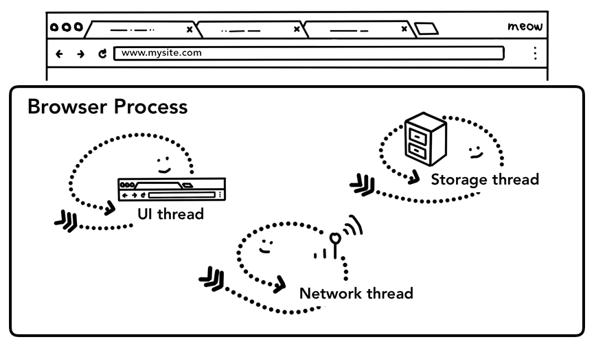

## 前言

我们知道现在市场上大多数浏览器是[多进程多线程的方式来处理不同的任务](https://developers.google.com/web/updates/2018/09/inside-browser-part1)。我们今天来看一下进程和线程是如何合作来呈现一个网站的。

我们以简单的浏览网页为例：从地址栏中输入 URL 开始，浏览器从网络请求数据并展示内容。我们重点关注用户请求网站数据和浏览器准备渲染一个页面。（如无特殊说明，以下均以 Chrome 浏览器为例）

## 从浏览器一个进程开始

浏览器选项卡之外的任何事情都是由浏览器进程来处理的。浏览器进程由绘制按钮和输入框的 UI 线程，处理从浏览器请求数据的网络线程，控制文件访问的存储线程等组成。当向地址栏输入 URL 时，首先会由浏览器进程的 UI 线程来处理输入内容。

### 简单的导航

#### 第一步：处理输入

当用户向地址栏输入时，UI 线程首先会考虑这是“搜索还是 URL？”。Chrome 浏览器地址栏同时也是搜索栏，所以 UI 线程需要解析并决定是把内容发送给搜索引擎还是真的请求一个网站。

#### 第二步：开始导航

当用户按下回车键，UI 线程开始发起网络请求获取网站内容。首先在 Tab 左边会出现加载的标识，网络线程开始通过 DNS 查找并建立 TLS 连接。

在此时，网络线程或许会收到服务器重定向的头信息，如 HTTP301。在这种情况下，网络线程会通知 UI 线程服务器请求重定向。随后另一个 URL 请求会被初始化。

#### 第三步：读取响应

一旦收到响应体（数据载荷），网络线程会首先查看数据流的前几个字节。响应的 Content-Type 头信息会返回数据的类型，但是这个信息有可能会丢失或错误，所以[MIME 类型嗅探](https://developer.mozilla.org/en-US/docs/Web/HTTP/Basics_of_HTTP/MIME_types)会帮助识别数据类型。

如果返回的是 HTML 文件，下一步就是把文件传递给渲染器进程。如果是 zip 文件或其他的需要下载的文件，那么这些数据就会被传到下载管理器。

#### 第四步：找到渲染器进程

一旦确认所有的检查，网络线程确定浏览器可以跳转到请求的网站，该线程就会通知 UI 线程数据已经准备就绪。UI 线程会找到渲染器进程来渲染网页。

由于网络线程可能会花费数百毫秒去请求响应，UI 线程会平行地尝试主动找到或开启一个渲染器进程。如果一切按预料的，当网络线程获取到数据时，渲染器进程就已经准备就绪。

#### 第五步：准备跳转

一旦数据和渲染器进程准备好，一个 IPC（interprocess communication）会从浏览器进程发送到渲染器进程来提交导航。同时也会把数据流传送到渲染器进程保持继续接收 HTML 数据。一旦浏览器进程接收到渲染器进程跳转开始的信息，导航完成，开始文档加载的阶段。

#### 额外步骤：初始加载完成

当跳转后，渲染器进程会加载资源并渲染页面。一旦渲染器进程结束渲染，它会向浏览器进程返回一个 IPC（当前网站的所有页面 `onload` 事件已经触发并执行完成），UI 线程停止 Tab 上的加载标识。

### 跳转至其他网站

当用户再次输入不同的 URL 时会发生什么？浏览器进程实际会按之前的步骤执行。不过在此之前，需要确认渲染好的页面是否绑定了 [`beforeunload`](https://developer.mozilla.org/en-US/docs/Web/Events/beforeunload) 事件。Tab 下的任何事情和 JavaScript 代码都由渲染器进程来处理，所以当新的跳转请求时浏览器进程需要检查渲染器进程。

当新的导航与当前渲染的站点不在同一个站点上时，将调用一个单独的渲染进程来处理新的导航，而当前的渲染进程将保留下来以处理诸如卸载之类的事件。

## 参考

<https://developers.google.com/web/updates/2018/09/inside-browser-part2>
