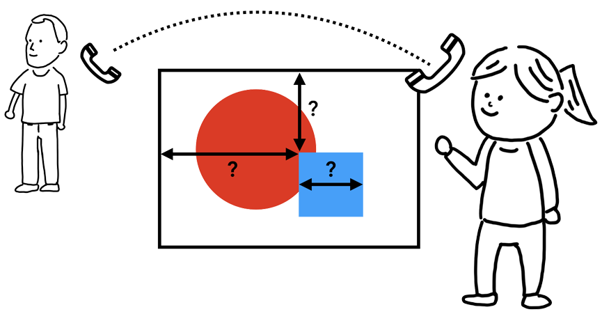
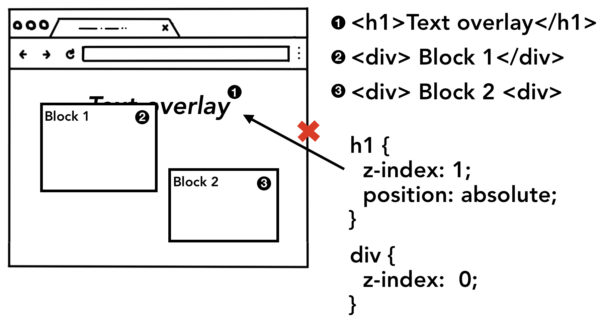

## 简介

前一节我们介绍了[浏览器从地址栏输入 URL](/web-browser-happen-in-navigation) 开始内部是如何工作的。本文来看一下渲染器进程内部是如何工作的，由于该部分涉及到了 web 优化的众多方面，本文尽量以高度概括的方式进行讲解，如需进一步学习可访问 [Web 基础之性能优化](https://developers.google.com/web/fundamentals/performance/why-performance-matters/)。

## 渲染器进程处理 web 内容

渲染器进程负责任何发生在一个 tab 下的事件。在一个渲染器进程中，主线程处理了大部分发送给用户的代码。如果有 JavaScript 代码是 web worker 或 service worker，那么会由 worker 线程来处理该部分代码。合成器线程和栅格线程也在一个渲染器进程内部执行，来保证渲染页面平滑、高效。

渲染器进程的核心工作是把 HTML、CSS 和 JavaScript 加载至一个 web 页面中来供用户使用。

## 解析

### DOM 的构建

当渲染器进程接收到导航的信息并开始接收 HTML 数据时，主线程就会开始解析文本字符（HTML）并把它转换成文档对象模型（DOM）。

DOM 是一个页面在浏览器内部的表示形式，也是一种 web 开发者可以通过 JavaScript 来操作的数据结构。

解析 HTML 文档为 DOM 是 [HTML 标准](https://html.spec.whatwg.org/)定义的。你或许发现 HTML 传递到浏览器时从不会产生异常。例如丢失一个 `
` 标签是有效的 HTML 文档。再比如 `Hi! <b>I'm <i>Chrome</b>!</i>` (b 标签先于 i 标签关闭) 会被处理为 `Hi! <b>I'm <i>Chrome</i></b><i>!</i>`。这是因为 HTML 规范专门有对这些错误设计了兼容。如果好奇这部分是如何实现的，可通过 HTML 规范中的[在解析器中处理异常和特殊场景](https://html.spec.whatwg.org/multipage/parsing.html#an-introduction-to-error-handling-and-strange-cases-in-the-parser)部分来了解。

### 子资源加载

一个网站通常会加载外部资源，如图片、CSS 和 JavaScript。这些文件需要从网络或缓存中读取。主线程在解析构建 DOM 时会在发现这些资源时一个个去请求，同时为了加快速度，“预加载扫描器”会并行运行。如果在 HTML 文档中有 `` 或 `<link>` 存在，预加载扫描器会查看在 HTML 解析器生成的令牌，并向浏览器进程中的网络线程发出请求。

### JavaScript 会阻塞解析

当 HTML 解析器遇到 `<script>` 标签时，它会暂停解析 HTML 文档并开始加载，解析，执行 JavaScript 代码。为什么呢？因为 JavaScript 能够通过 `document.write()` （该方法会改变整个 DOM 树结构，如下图）等方式来改变文档的内容。这就是 HTML 解析器为什么暂停并等待 JavaScript 执行后再恢复解析文档。如果对 JavaScript 执行过程好奇，可查看[JavaScript 引擎基础：Shapes 和 Inline Caches](/V8-shapes-and-inline-cache)。

## 提示浏览器如何加载资源

目前有许多方法帮助开发者提示浏览器如何加载资源更优雅。如果 JavaScript 代码中没有使用 `document.write()`，可以在 `<script>` 标签中添加 [`async`](https://developer.mozilla.org/en-US/docs/Web/HTML/Element/script#attr-async) 或 [`defer`](https://developer.mozilla.org/en-US/docs/Web/HTML/Element/script#attr-defer) 属性。浏览器会异步去加载、执行 Javscript 代码而不会阻塞解析 HTML。如果合适还可以使用 [JavaScript module](https://developers.google.com/web/fundamentals/primers/modules)。`<link rel="preload">` 会告诉浏览器这个资源在当前页面是绝对需要的，最好尽快下载下来。更多信息可查看[资源优先级加载](https://developers.google.com/web/fundamentals/performance/resource-prioritization)。

## 样式计算

只有 DOM 是不够知道页面究竟展示的样子的，因为我们可以对页面元素通过 CSS 来修饰。
主线程解析 CSS 并确定每一个 DOM 节点计算后的样式。每个节点的样式是通过 CSS 选择器来确定的。可以在开发者工具 `computed` 一栏查看每个节点的样式。

即使没有提供任何的 CSS，每个 DOM 节点还是会有一个计算过的样式。`<h1>` 标签会显示地比`<h2>` 标签更大，每个元素地 margin 也有定义。这是因为浏览器本身有一套默认地样式表。

## 布局

现在渲染器进程知道文档的结构和每个节点的样式，但是仍然不够渲染出一个页面。想象一下通过给朋友打电话描述一幅画。“有一个大的红色圆形和一个小的蓝色方形”并不能够准确描述这幅画究竟长什么样子。

布局是寻找元素几何的过程。主线程遍历 DOM 树和样式来创建一个包含 x,y 轴和边框尺寸的布局树。布局树或许和 DOM 树很像，但是只包含在页面上显示的元素。如果有 `display: none` 的元素，那么不会存在于布局树（但 `visibility: hidden` 的元素会存在）。同样，如果有伪类如 `p::before{content: 'Hi!'}` 会出现在布局树中，尽管它不存在于 DOM 树。

决定页面的布局是一件很有挑战性的任务。尽管最简单的页面如一个块结构从上至下布局仍然需要考虑字体大小，从哪里断行因为这会影响段落的大小和形状，进而影响接下来的段落的布局。

CSS 可以使元素浮动至一侧，遮盖溢出的元素，改变文档的方向。可以想象布局过程有着大量的工作。

## 绘制

有了 DOM，样式，布局还是不能渲染一个页面。让我们来尝试创建一副画，我们知道了尺寸，形状和元素的位置，但是仍然需要知道以何种顺序来绘制它们。

例如，`z-index` 可能在某些元素上被设置，如果按元素在 HTML 中的顺序来绘制会导致不正确的渲染。

在绘制这一步，主线程遍历布局树来生成绘制记录。绘制记录时绘制过程的记录如“先绘制背景，接着文本，然后是矩形”。如果有使用 JavaScript 在 `<canvas>` 元素上绘制过，这个过程会比较熟悉。

### 更新渲染流的开销很大

在渲染流中最重要的是要知道每一步都会使用前一步操作的结果来生成新的数据。例如，如果在布局树上有一些变更，在文档流中被影响到的部分的绘制顺序需要重新生成。

## 合成

### 如何绘制一个页面

在浏览器知道了文档结构，每个元素的样式，页面的坐标，绘制顺序，那么是如何生成一个页面呢？将这些信息生成屏幕上的像素被称为光栅化（rasterizing）。

### 什么是合成

合成是将一个页面分为许多层级，每层独立进行栅格化、再合成的技术。合成再合成器线程中执行。

### 分成多层

为了找到哪些元素需要位于哪些层，主线程遍历布局树来创建层级树。如果页面的某部分应该是单独层（像抽屉菜单），可以通过 CSS `will-change` 属性告知浏览器。

### 主线程的栅格化和合成

一旦层级数创建好，绘制顺序也已确定，主线程就会提交信息到合成器线程。合成器线程对每层做栅格化操作。一个层可能像整个页面那么大，所以合成器线程会把每层都切分成方块，并把每块都发送至光栅线程。光栅线程栅格化每块方块并把它们存放在 GPU 内存中。

合成器线程可以对不同的栅格线程定义优先级，所以在视窗中（或靠近视窗）的部分可以先进行栅格化。

一旦方块都被栅格化，合成器线程收集称为 **draw quads** 的方块信息来创建一个 **Compositor frame**（合成帧）。

|                  |                                                                                        |
| ---------------- | -------------------------------------------------------------------------------------- |
| Draw quads       | 包含诸如方块在内存中的位置以及在考虑页面合成的情况下在页面中绘制方块的位置之类的信息。 |
| Compositor frame | 表示页面框架的四边形的集合。                                                           |

一个合成帧随后通过 IPC 被提交至浏览器进程。此时，另一个合成帧可能由于浏览器 UI 的改变从 UI 线程被添加或从扩展的其他渲染器进程中添加。这些合成帧被发送至 GPU 来呈现到屏幕上。如果触发了一个滚动事件，合成器线程会创建另一个合成帧至 GPU。

合成的好处是不需要涉及到主线程。合成器线程不需要等待样式计算或 JavaScript 执行。如果布局或绘制需要重新计算就会涉及到主进程。

## 总结

本文主要了解了渲染的流程，从解析到合成的过程。希望在阅读更深入的性能优化时能够有一些帮助。

## 参考

<https://developers.google.com/web/updates/2018/09/inside-browser-part3>
