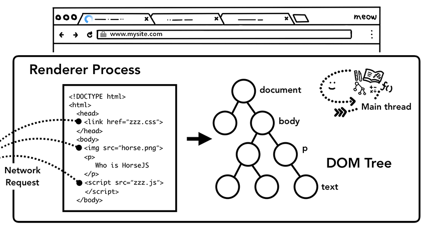

## 简介

前一节我们介绍了[浏览器从地址栏输入 URL](/web-browser-happen-in-navigation) 开始内部是如何工作的。本文来看一下渲染器进程内部是如何工作的，由于该部分涉及到了 web 优化的众多方面，本文尽量以高度概括的方式进行讲解，如需进一步学习可访问 [Web 基础之性能优化](https://developers.google.com/web/fundamentals/performance/why-performance-matters/)。

## 渲染器进程处理 web 内容

渲染器进程负责任何发生在一个 tab 下的事件。在一个渲染器进程中，主线程处理了大部分发送给用户的代码。如果有 JavaScript 代码是 web worker 或 service worker，那么会由 worker 线程来处理该部分代码。合成器线程和栅格线程也在一个渲染器进程内部执行，来保证渲染页面平滑、高效。

渲染器进程的核心工作是把 HTML、CSS 和 JavaScript 加载至一个 web 页面中来供用户使用。

## 解析

### DOM 的构建

当渲染器进程接收到导航的信息并开始接收 HTML 数据时，主线程就会开始解析文本字符（HTML）并把它转换成文档对象模型（DOM）。

DOM 是一个页面在浏览器内部的表示形式，也是一种 web 开发者可以通过 JavaScript 来操作的数据结构。

解析 HTML 文档为 DOM 是 [HTML 标准](https://html.spec.whatwg.org/)定义的。你或许发现 HTML 传递到浏览器时从不会产生异常。例如丢失一个 `
` 标签是有效的 HTML 文档。再比如 `Hi! <b>I'm <i>Chrome</b>!</i>` (b 标签先于 i 标签关闭) 会被处理为 `Hi! <b>I'm <i>Chrome</i></b><i>!</i>`。这是因为 HTML 规范专门有对这些错误设计了兼容。如果好奇这部分是如何实现的，可通过 HTML 规范中的[在解析器中处理异常和特殊场景](https://html.spec.whatwg.org/multipage/parsing.html#an-introduction-to-error-handling-and-strange-cases-in-the-parser)部分来了解。

### 子资源加载

一个网站通常会加载外部资源，如图片、CSS 和 JavaScript。这些文件需要从网络或缓存中读取。主线程在解析构建 DOM 时会在发现这些资源时一个个去请求，同时为了加快速度，“预加载扫描器”会并行运行。如果在 HTML 文档中有 `` 或 `<link>` 存在，预加载扫描器会查看在 HTML 解析器生成的令牌，并向浏览器进程中的网络线程发出请求。

### JavaScript 会阻塞解析

当 HTML 解析器遇到 `<script>` 标签时，它会暂停解析 HTML 文档并开始加载，解析，执行 JavaScript 代码。为什么呢？因为 JavaScript 能够通过 `document.write()` （该方法会改变整个 DOM 树结构，如下图）等方式来改变文档的内容。这就是 HTML 解析器为什么暂停并等待 JavaScript 执行后再恢复解析文档。如果对 JavaScript 执行过程好奇，可查看[JavaScript 引擎基础：Shapes 和 Inline Caches](/web-browser-happen-in-navigation)。

## 提示浏览器如何加载资源

目前有许多方法帮助开发者提示浏览器如何加载资源更优雅。如果 JavaScript 代码中没有使用 `document.write()`，可以在 `<script>` 标签中添加 [`async`](https://developer.mozilla.org/en-US/docs/Web/HTML/Element/script#attr-async) 或 [`defer`](https://developer.mozilla.org/en-US/docs/Web/HTML/Element/script#attr-defer) 属性。浏览器会异步去加载、执行 Javscript 代码而不会阻塞解析 HTML。如果合适还可以使用 [JavaScript module](https://developers.google.com/web/fundamentals/primers/modules)。`<link rel="preload">` 会告诉浏览器这个资源在当前页面是绝对需要的，最好尽快下载下来。更多信息可查看[资源优先级加载](https://developers.google.com/web/fundamentals/performance/resource-prioritization)。

## 样式计算

只有 DOM 是不够知道页面究竟展示的样子的，因为我们可以对页面元素通过 CSS 来修饰。
主线程解析 CSS 并确定每一个 DOM 节点计算后的样式。每个节点的样式是通过 CSS 选择器来确定的。可以在开发者工具 `computed` 一栏查看每个节点的样式。

即使没有提供任何的 CSS，每个 DOM 节点还是会有一个计算过的样式。`<h1>` 标签会显示地比`<h2>` 标签更大，每个元素地 margin 也有定义。这是因为浏览器本身有一套默认地样式表。

## 布局
