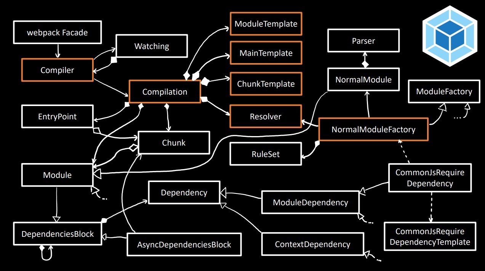
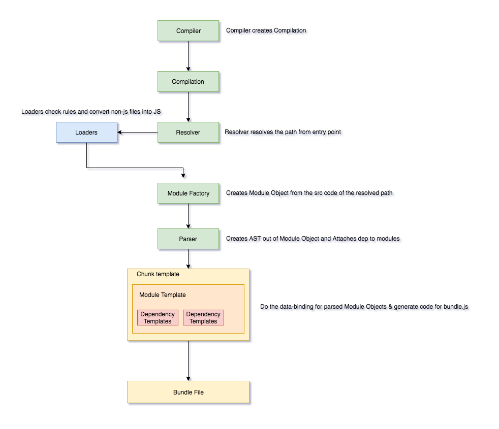

## 简介

现代化的前端应用离不开打包工具，从早期人们所熟知的 Grunt, Gulp 到现在炙手可热的 webpack, rollup 等，这些工具的崛起使得我们的代码构建更加方便，通过 Loader，插件等机制我们可以应用最新的技术，如新语法，预处理 CSS（Scss, Less），热更新方便了开发体验，摇树（Tree Shaking）减少打包体积等。

今天主要以 webpack 为例来了解打包工具发展至今是如何工作的，又通过哪些方式为我们提供了更多能力。以下图片简单描述了 webpack 的整个构建流程。



## 工作原理

webpack 按其官方介绍，是一款静态资源打包器。在 webpack 的世界，所有的资源（JavaScript，图片，CSS，字体文件等）都是模块（module），在执行时，webpack 从[入口](https://webpack.js.org/concepts/entry-points/)开始分析所依赖的模块，然后递归处理依赖模块的依赖，最终生成一个[依赖图](https://webpack.js.org/concepts/dependency-graph/)。

webpack 的 80%是由其插件组成，它自身也是事件驱动的架构。在 webpack 生态中，插件是关键的要素，并且为社区提供了强大的能力来进入 webpack 的编译过程中。插件通过 `hook` 方式对每次编译发出的事件做出响应。

webpack 中一个核心模块是 `Tapable`，许多对象继承了 `Tapable` 类。该类暴露了 `tap`，`tapAsync`，`tapPromise` 方法，插件可以使用这些方法注入将在整个编译过程中触发的自定义构建过程。

首先来看张图：



简而言之，当 webpack 载入一个模块时，`compiler` 把模块放入称为 `chunk` 的容器内，并在渲染到浏览器之前在它上面执行大量的插件逻辑。

我们来根据上图一步步来详解：

### 1.编译器（Compiler）

当 webpack 载入一个新模块时，Compiler 会第一时间执行（在 webpack.js 中 `compiler.run()`），它本身为 `tapable` 的一个实例。它处于调用栈的最高层，为 webpack 分发事件。它支持注册 [`Hooks`](https://webpack.js.org/api/compiler-hooks)，可以控制 webpack 开始、停止、处理资源文件、监听模式等。

```javascript
// node_modules/webpack/lib/webpack.js

/**
 * @param {WebpackOptions} options options object
 * @param {function(Error=, Stats=): void=} callback callback
 * @returns {Compiler | MultiCompiler} the compiler object
 */
const webpack = (options, callback) => {
  const webpackOptionsValidationErrors = validateSchema(
    webpackOptionsSchema,
    options
  );
  if (webpackOptionsValidationErrors.length) {
    throw new WebpackOptionsValidationError(webpackOptionsValidationErrors);
  }
  let compiler;
  if (Array.isArray(options)) {
    compiler = new MultiCompiler(
      Array.from(options).map(options => webpack(options))
    );
  } else if (typeof options === 'object') {
    options = new WebpackOptionsDefaulter().process(options);

    compiler = new Compiler(options.context);
    compiler.options = options;
    new NodeEnvironmentPlugin({
      infrastructureLogging: options.infrastructureLogging,
    }).apply(compiler);
    if (options.plugins && Array.isArray(options.plugins)) {
      for (const plugin of options.plugins) {
        if (typeof plugin === 'function') {
          plugin.call(compiler, compiler);
        } else {
          plugin.apply(compiler);
        }
      }
    }
    compiler.hooks.environment.call();
    compiler.hooks.afterEnvironment.call();
    compiler.options = new WebpackOptionsApply().process(options, compiler);
  } else {
    throw new Error('Invalid argument: options');
  }
  if (callback) {
    if (typeof callback !== 'function') {
      throw new Error('Invalid argument: callback');
    }
    if (
      options.watch === true ||
      (Array.isArray(options) && options.some(o => o.watch))
    ) {
      const watchOptions = Array.isArray(options)
        ? options.map(o => o.watchOptions || {})
        : options.watchOptions || {};
      return compiler.watch(watchOptions, callback);
    }
    compiler.run(callback);
  }
  return compiler;
};
```

```javascript
// node_modules/webpack/lib/Compiler.js

class Compiler extends Tapable {
  constructor(context) {
    super();
    this.hooks = {
      /** @type {SyncBailHook<Compilation>} */
      shouldEmit: new SyncBailHook(["compilation"]),
      /** @type {AsyncSeriesHook<Stats>} */
      done: new AsyncSeriesHook(["stats"]),
      /** @type {AsyncSeriesHook<>} */
      additionalPass: new AsyncSeriesHook([]),
      /** @type {AsyncSeriesHook<Compiler>} */
      beforeRun: new AsyncSeriesHook(["compiler"]),
      /** @type {AsyncSeriesHook<Compiler>} */
      run: new AsyncSeriesHook(["compiler"]),
      /** @type {AsyncSeriesHook<Compilation>} */
      emit: new AsyncSeriesHook(["compilation"]),
      /** @type {AsyncSeriesHook<string, Buffer>} */
      assetEmitted: new AsyncSeriesHook(["file", "content"]),
      /** @type {AsyncSeriesHook<Compilation>} */
      afterEmit: new AsyncSeriesHook(["compilation"]),

      /** @type {SyncHook<Compilation, CompilationParams>} */
      thisCompilation: new SyncHook(["compilation", "params"]),
      /** @type {SyncHook<Compilation, CompilationParams>} */
      compilation: new SyncHook(["compilation", "params"]),
      // ...
    };
    //...
  };
```

### 2.编译/依赖图 （Compilation/Dependency Graph）

编译器接下来会创建编译对象（Compilation），`Compilation` 是 webpack 的核心，从编译对象开始构建依赖图，提升树并渲染成束（编译器和编译对象都继承自 Tapable 类）。

```javascript
// node_modules/webpack/lib/Compilation.js

class Compilation extends Tapable {
 /**
   * Creates an instance of Compilation.
   * @param {Compiler} compiler the compiler which created the compilation
   */
  constructor(compiler) {
    super();
    this.hooks = {
      /** @type {SyncHook<Module>} */
      buildModule: new SyncHook(["module"]),
      /** @type {SyncHook<Module>} */
      rebuildModule: new SyncHook(["module"]),
      /** @type {SyncHook<Module, Error>} */
      failedModule: new SyncHook(["module", "error"]),
      /** @type {SyncHook<Module>} */
      succeedModule: new SyncHook(["module"]),

      /** @type {SyncHook<Dependency, string>} */
      addEntry: new SyncHook(["entry", "name"]),
      /** @type {SyncHook<Dependency, string, Error>} */
      failedEntry: new SyncHook(["entry", "name", "error"]),
      /** @type {SyncHook<Dependency, string, Module>} */
      succeedEntry: new SyncHook(["entry", "name", "module"]),

      /** @type {SyncWaterfallHook<DependencyReference, Dependency, Module>} */
      dependencyReference: new SyncWaterfallHook([
        "dependencyReference",
        "dependency",
        "module"
      ]),
      // ...
    }
    // ...
  }
```

### 3.分析器（Resolver）

当把入口文件传递给 webpack 时，会分发给解析器。解析器会判断给到的相对路径是否存在，并返回绝对路径和其他如上下文、请求、调用等额外信息。如，在 `node` 中 require 一个声明，它会被传入模块解析器来判断是否存在。（`ResolverFactory.js`）

### 4.模块工厂（Module Factories）

工厂方法通常用来创建对象或实例。webpack 中，模块工厂用来创建模块实例。模块工厂拿到从解析器正确解析返回的路径，去该路径的文件收集源码，然后创建一个模块对象/实例（`NormalModuleFactory.js` & `ContextModuleFactory.js`）。

### 5.解析器（Parser）

解析器是把传入的字符串源码转换成[ATS（抽象语法树）](https://astexplorer.net/)。webpack 解析器类使用了 `acron` 解析器，接收模块对象（包含源码）参数，并返回 AST 对象。webpack 遍历整棵树找到所有的 require 和 import，并生成依赖图。解析器会把依赖附在模块上。注意我们会通过 `loaders` 注册一些 `rules`，当满足规则时对应的 loader 会转换代码至 JavaScript 中，然后解析器解析这些代码到 ATS 中。

### 6.模板（Templates ）

模板随后会把解析过的模块对象和生成的代码进行数据绑定。生成一个包含模块的 chunk 数组。整个模块可以分为三部分：

- 块模板（Chunk Template）
- 模块模板（Module Template）
- 依赖模板（Dependency Templates）

这个处理过程会重复执行直到处理完所有的依赖。webpack 的核心工作是解析文件并将所有内容捆绑到一个依赖图中。这使得 webpack 可以增量编译。

## 小结

webpack 的出现使前端工程化迈向了新的台阶，使我们开发更便捷。webpack 提供的能力也促进了社区的发展来完善构建流程。

## 参考

<https://medium.com/@imranhsayed/webpack-behind-the-scenes-85333a23c0f6>
